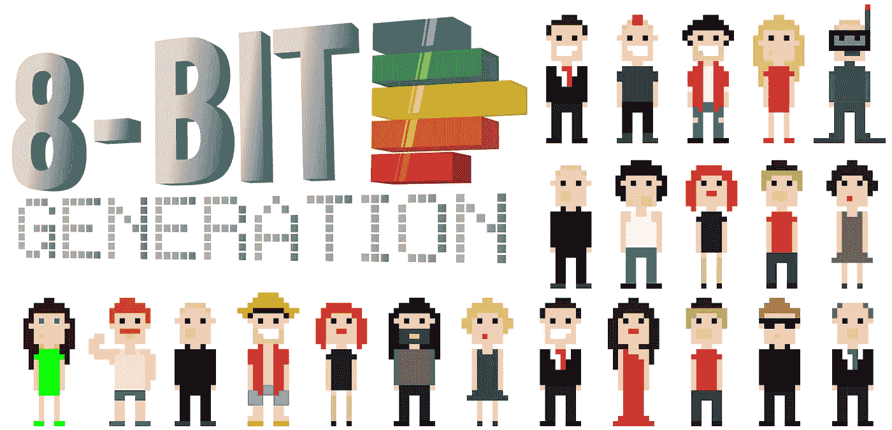
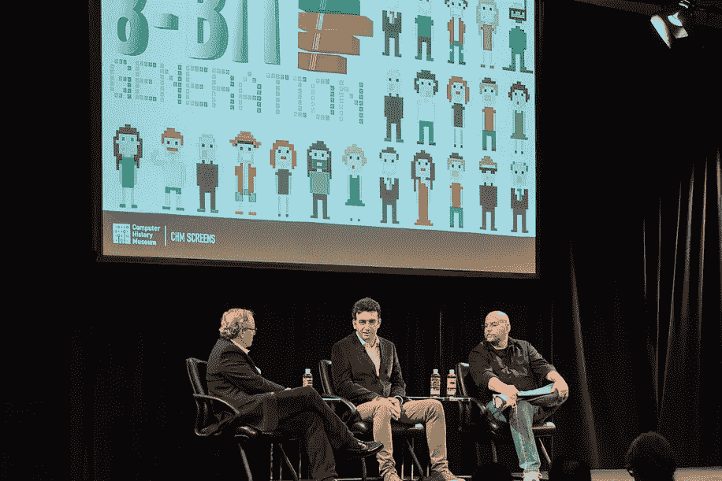
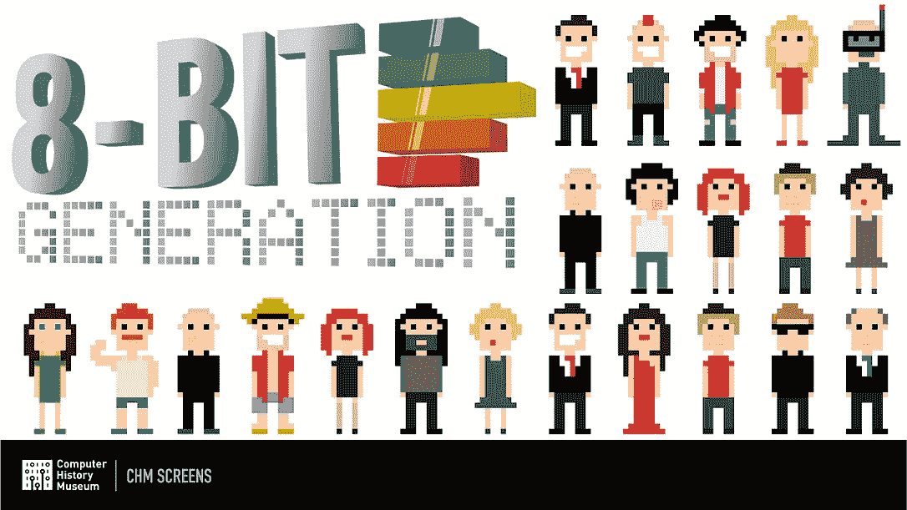
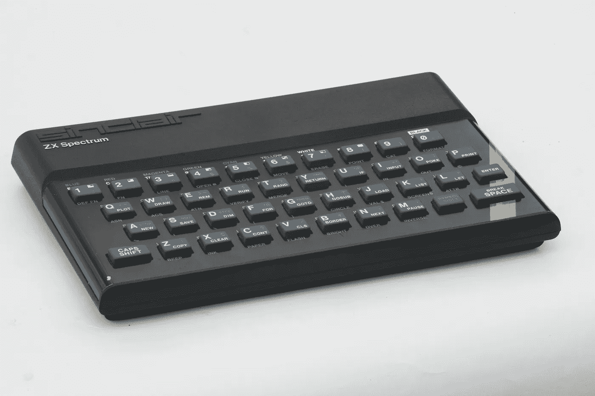
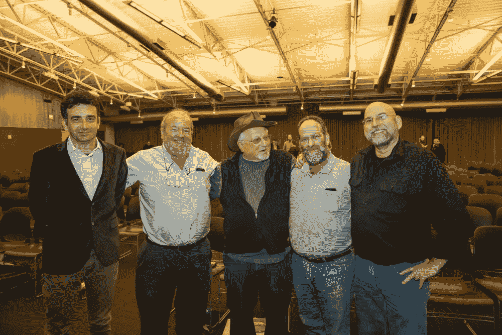
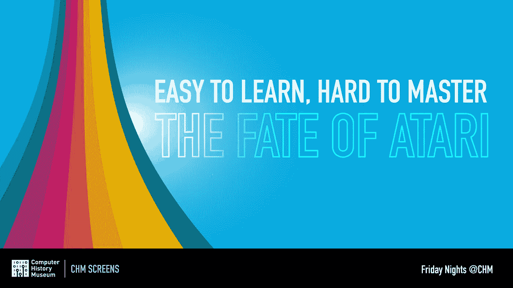

# 记录 8 位一代及以后

> 原文：<https://medium.com/hackernoon/documenting-the-8-bit-generation-beyond-e9367a3c09a7>

Embedded in each of our devices is the spirit of an entire generation. “Documenting the 8-bit Generation & Beyond: An Interview with Filmmakers Tomaso Walliser and Bruno Grampa.”

## 詹妮弗·德拉·克鲁兹

个人电脑革命的全球影响已经不是秘密。它的突破现在被紧紧地抓在我们的手中，并被整合到全球的各个行业中。嵌入在这些设备中的是整整一代人的精神。

四十多年来，[计算机历史博物馆(CHM)](http://www.computerhistory.org/) 记录并分享了先驱、创造者、团队和个人的故事，他们突破了障碍，敢于以不同的方式思考，共同改变了世界。探索人类科技的还有[垃圾食品电影](http://www.junkfoodfilms.com/)，这是一家专注于高科技的电影制作公司，以“为人类提供内容”为使命

> *“我们坚信，我们讲述的故事中人性的一面在我们的工作中发挥着关键作用。我们的主要目标是在谈论技术的同时，不要忘记参与其中的人们所做出的极其重要的贡献。技术改变了世界，但这之所以成为可能，是因为有一定数量的人将他们的创造力、独特性、爱和激情投入到他们所做的事情中，我们希望继续向我们的观众传递这些信息。”*
> 
> *—托马斯·沃利斯尔，2016*

垃圾食品电影公司由 Tomaso Walliser 和 Bruno Grampa 于 2008 年创立，其 2012 年的项目[“8 位一代”](http://www.8bitgeneration.com/)在纪录片电影行业留下了印记，该项目导致了两部纪录片*成长为 8 位一代:《准将战争》*和*易学难精:雅达利的命运*。两者都在计算机历史博物馆放映，作为我们的 [CHM Live](http://www.computerhistory.org/chmlive/) [节目](https://hackernoon.com/tagged/programming)的一部分。

Bruno Grampa and Bil Herd take to the CHM Live stage after a screening of *Growing the 8-bit Generation*, March 30, 2016.

我们采访了垃圾食品电影公司的 Walliser 和 Grampa，谈论了他们的第一台电脑，他们是如何开始对 8 位一代感兴趣的，以及他们现在正在做什么。

你的第一台电脑是什么？

1983 年，我们来自意大利，基本上是在 Commodore VIC-20(或 Commodore 64)和 Sinclair ZX 光谱之间进行选择。有一天，我父亲带着 ZX 光谱回家。在当时，12 岁的孩子很少涉足个人电脑领域。这就像把科幻世界带进了你的卧室。令人着迷的是，这台机器真的对你做出了反应，它让你觉得你真的在做一些事情。ZX 真的很容易编程，用户手册提供了大量信息，基本的界面很舒适，所以这是进入和了解数字世界的最佳方式。

**布鲁诺:**我的第一台电脑是辛克莱·ZX 光谱。这是一台多么奇妙的机器啊！它让我有机会学习什么是计算机，如何编程，以及如何构建电子电路。我对计算机的热情始于它，25 年后，我开始对逆向计算感兴趣——我想向我的孩子展示 ZX 光谱是如何工作的，我很快发现我不是唯一的旧计算机爱好者。

Sinclair ZX Spectrum Microcomputer, 1982\. Collection of the Computer History Museum, [102626684](http://www.computerhistory.org/revolution/personal-computers/17/298/1164).

**你是如何进入电影制作的，尤其是纪录片？**

托马索:我对电影制作的热爱可以追溯到我父亲带我去电影院看《星球大战》的时候。我当时 8 岁。很快，我开始认为*星球大战*中最有趣的事情(除了很多很多 8 岁孩子会觉得有趣的事情之外)是制作*星球大战*。它看起来真的像一个巨大的玩具。我认为把自己关在加利福尼亚的某个农场里去创造梦幻世界是人生的方向。

纪录片后来成为一个职业机会。最近，我看了纪录片，以此向我职业生涯的两个主要灵感致敬:电影和电脑。我们在这里。

布鲁诺:作为一名记者，我喜欢讲故事。我们目睹了一场不可思议的革命。当我还是个孩子的时候，没有电脑，没有互联网，没有我们今天拥有的所有令人难以置信的技术。

但是我看到了世界的变化，我理解这些技术发现背后的人的重要性。这个故事必须被讲述，由于与托马索的合作，我不仅可以写这个故事，还可以创作纪录片。

垃圾食品电影是如何开始的？

**托马索&布鲁诺:**垃圾食品电影始于一个名为“8 比特一代”的项目我们想要报道的是大约从 20 世纪 70 年代初到 80 年代末这段时间，当时 8 位技术脱颖而出，被一代狂热分子所采用，他们将自己的梦想变成了一场革命。

是什么让你的纪录片有别于其他报道科技的纪录片？

**Tomaso & Bruno:** 在*成长 8 位一代*的制作阶段，我们遇到了 80 个人，我们拍摄了他们的采访和各种镜头。这些人，每个人都以自己的方式，成为正在发生的数字革命的主角和见证者，他们中的许多人直接负责将计算机的力量带给大众意识。

我们坚信，我们讲述的故事中人性的一面在我们的工作中发挥着关键作用。我们的主要目标是在谈论技术的同时，不要忘记参与其中的人们所做出的极其重要的贡献。技术改变了世界，但这之所以成为可能，是因为一定数量的人将他们的创造力、独特性、爱和激情投入到了他们所做的事情中。我们希望继续将这些信息传递给我们的观众。

陶醉于这些令人惊叹的成功故事，我们的目的是继续关注它们人性的一面，包括好的和坏的一面。我们喜欢这样的故事:专业和爱、天才和奉献与无情和贪婪、野心和背叛并存:这是一种爆炸性的混合物，往往是实现那种必将改变我们世界的伟大的必要基础。

你采访了一些非常令人惊讶的行业人物，包括 Commodore 创始人杰克·特拉米尔和前苹果 CEO 约翰·斯卡利。你是如何接触到这些科技巨头的？

布鲁诺:只是问问他们！我们用我们深奥的说英语的方式解释了这个项目，我们讲故事的方式，他们的回答是肯定的。

**CHM:你最难忘的采访是什么，为什么？**

对杰克·特拉米尔的采访真的很棒，但遗憾的是这是他最后一次采访了。这确实是一段历史。

*Commodore founder Jack Tramiel: “It took me 25 years to make the first million dollars.” Footage courtesy of Junk Food Films.*

对我们来说，和约翰·斯卡利谈话就像做梦一样。第一个问题之后，他是滔滔不绝的话语和情绪。我们认为，我们所记录的是他对苹果那段时期最完整的讲述。

*Former Apple CEO John Sculley shares how his door hinges caught the attention of Steve Jobs! Footage courtesy of Junk Food Films.*

**CHM:给我们介绍一下 8 位一代项目的纪录片吧。你从他们身上学到了什么？**

**托马索&布鲁诺:**作为这个项目的一部分，我们的第一部纪录片是*成长中的 8 位一代:准将战争*。2014 年 9 月，我们参加了俄勒冈州波特兰市的 XOXO 音乐节，并向观众预览了一些片段，获得了极大的好评。我们知道 Tramiel 和 Commodore 在早期的数字革命中发挥了重要作用，但我们在 XOXO 学到的是，Commodore 和计算爱好者从未听说过这个故事，以及它的历史和第一人称叙事的影响，我们正在讲述它。我们知道我们正在做一些特别的事情。

我们在 2016 年 2 月发布了*准将战争*。最后一部电影聚焦于家用电脑的爆炸和 Commodore 在个人电脑革命中的角色。这部电影包括之前未发布的对杰克和伦纳德·特拉米尔、查克·佩德尔、阿尔·查彭迪埃、比尔·赫德、迈克尔·汤姆奇克、戴夫·罗尔夫、理查·盖瑞特、杰夫·明特和安迪·芬克尔的采访，以及史蒂夫·沃兹尼亚克、奈杰尔·塞尔、约翰·格兰特、诺兰·布什内尔、阿尔·奥尔康、乔·德科尔和其他人的采访。

Pioneers of the 8-bit Generation attended the March 30, 2016, screening of *The Commodore Wars* at the Computer History Museum. Left to right: Bruno Grampa (filmmaker), Al Alcorn, Chuck Peddle, Leonard Tramiel, and Bil Herd.

*准将战争*是苹果 II、准将 VIC20、TI 99/4A、辛克莱 ZX 系列和准将 64 的真实故事，后者是 20 世纪销量最大的电脑。所有这些机器对几代孩子来说都是计算机的入门。但这也是杰克·特拉米尔用他不容置疑的坏脾气和精明的策略领导了许多战争的故事。

从这个故事中可以学到不同的东西:有些是关于商业的，有些是关于技术的，有些是关于我们自己和我们现在所处的位置的，但也许最重要的是关于雄心和人性的，以及我们如何选择在地球上度过我们的时间。

**CHM:那么第二部电影怎么样——*易学难精:雅达利的命运*？你能给我们介绍一下这部电影吗？**

**托马索&布鲁诺:***雅达利的命运*是我们作为 8bit 世代项目的一部分拍摄的第二部电影。在谷歌、雅虎甚至苹果之前，有一家公司为今天的高科技创意文化和强硬的商业风格铺平了道路:一家走出水瓶时代的公司是雅达利。这部 100 分钟长的纪录片由 Bil Herd 讲述，他是前 Commodore 高级工程师，也是我们 8 位时代的发言人，并提供了一系列未发布的关键人物采访，包括与华纳副总裁 Manny Gerard 的一次非常罕见的谈话，以及对雅达利首席执行官 Ray Kassar 的独特采访，他对雅达利的成功和视频游戏行业的崩溃负有责任。在此之前，卡萨尔从未出现在纪录片中。

*Atari president and CEO Ray Kassar talks about striking a balance when telling the Atari story. Footage courtesy of Junk Food Films.*

雅达利的故事有三分之二是创始人兼梦想家诺兰·布什内尔的故事，三分之一是第一次、甚至可能是最大一次科技经济繁荣与萧条的故事。雅达利向世界展示了，在个人电脑革命开始之前，技术是很酷的，并且用一种今天仍然很酷的产品吸引了越来越多的观众:视频游戏。我们相信雅达利先于苹果、康茂德、微软，甚至家酿电脑俱乐部，将大众观众引入了数字时代。

诺兰·布什内尔和雅达利拥有大量的第一:第一家成功的视频游戏公司，第一款投币式视频游戏，第一款赢得市场的通用游戏机，视频游戏和电影业的第一次联姻，历史上发展最快的公司，有史以来最大的行业崩盘，以及硅谷一些最离奇的轶事。这是一个有趣的故事，但也是一个教育和揭示早期硅谷公司文化和业务的故事。这是对硅谷的另一种独特的看法，与我们习惯听到的故事大不相同——少了天堂，多了人间，多了真实，多了迷人。

*Easy to Learn, Hard to Master: The Fate of Atari* is the second film to come out of the 8bit Generation Project. It was screened at the Computer History Museum on June 23, 2017.

你现在在做什么？

**托马索&布鲁诺:**我们正在制作一部关于史蒂夫·乔布斯的电影:*史蒂夫·乔布斯的选择* s。这是关于他职业生涯中一些最艰难、最艰难的决定中人性的一面。这部纪录片的核心是一系列令人难以置信、激动人心的采访，我们采访了约翰·斯卡利、迈克·马尔库拉、史蒂夫·沃兹尼亚克、安迪·赫兹菲尔德(以及更多人！).他们以一种我们从未听过的方式谈论工作。有许多关于乔布斯的电影和纪录片，但我们相信没有人能以如此深刻、感人、甚至令人上瘾的方式讲述这个故事。

我们开始寻找与史蒂夫·乔布斯一起工作的人，并请他们谈论他们在乔布斯生活和职业生涯的关键时刻的情绪、感受和故事。这些都是最难抉择的主角！

我们现在正在 Indiegogo 上进行众筹活动。点击了解更多[。](https://www.indiegogo.com/projects/steve-jobs-choices-apple-iphone#)

# 观看史蒂夫·乔布斯选择的预告片

*Steve Jobs’ unbelievable instinct, told by the people that were closer to him more than anybody else. The film includes interviews with John Sculley, Mike Markkula, Andy Hertzfeld, Alvy Ray Smith, Larry Tesler, and others.* [*Learn more.*](https://www.indiegogo.com/projects/steve-jobs-choices-apple-iphone#/)

## 关于作者

詹妮弗·德·拉·克鲁兹是计算机历史博物馆(CHM)的品牌和营销总监。Jenny 于 2011 年 9 月加入博物馆，负责撰写、编辑和项目管理在线和印刷材料，以支持博物馆的沟通、解释和整体营销战略。她拥有加州大学圣巴巴拉分校的英语和艺术史学士学位，以及圣何塞州立大学的艺术史硕士学位。

*原载于*[*www.computerhistory.org*](http://www.computerhistory.org/atchm/documenting-the-8-bit-generation-beyond/)*。*