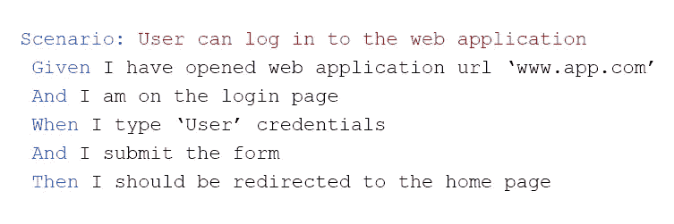
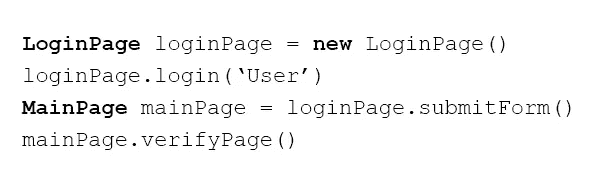
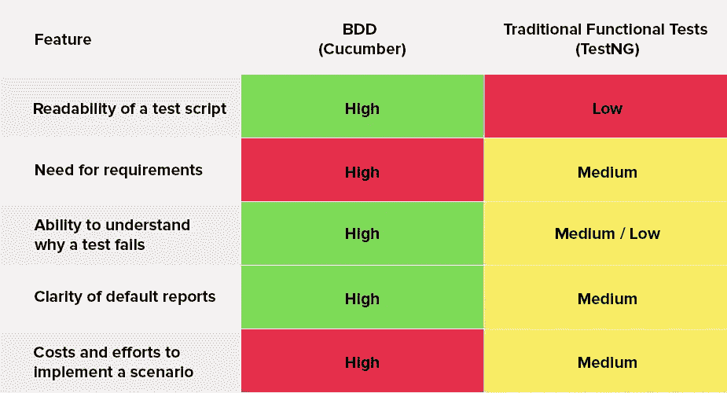

# BDD 测试是否名副其实？

> 原文：<https://medium.com/hackernoon/does-bdd-testing-live-up-to-its-hype-d66be1cb937a>

BDD，或者行为驱动开发，是最近的热门话题。简而言之，这种方法从自然语言短语中创建了可执行且易于理解的测试。本文将探讨 BDD 测试策略的优点和缺点。

BDD 的基本功能是通过使用直截了当的语言而不是难以阅读的代码，为涉众提供理解项目所有方面的机会。也就是说，这种 BDD 测试方法允许构建描述系统预期行为以及用户需求的测试。

下面你可以看到一个基本的 BBD 测试场景和一段用传统函数方法实现的代码。可读性的差别一眼就能看出来，不是吗？

A basic BDD test scenario.

Code that has been implemented with the traditional functional approach.

从这个例子中，很明显 BDD 测试更容易理解，并且允许团队的所有成员掌握正在测试的任何需求或功能。当谈到敏捷时，我们能够清楚地展示每个自动化脚本在验收标准、用户故事或特性方面所涵盖的内容。因此，产生 BDD 测试场景需要更多的努力。

# 传统功能测试与 BDD

让我们看一下在使用[cumber](https://cucumber.io/) 时传统方法与 BDD 的比较，cumber 是一种生成可执行规范的工具。

通常，行为驱动开发被用于 [UI 端到端测试](https://eleks.com/services/quality-assurance-and-testing-services/?utm_source=medium&utm_medium=refferal&utm_campaign=Republ-BDD-Blog)；然而，它也适用于单元测试，比如 Jasmine 或 cumber，性能测试和 API 测试。

# BDD 测试的好处

除了易于理解的脚本之外，BDD 还提供了项目清晰性的显著提升，以及减少花费在长期努力上的时间的机会。我最大的烦恼之一是只有执行项目测试的工程师才能理解他们的结果。BDD 将几页难以阅读的代码转换成每个人都能理解的文本，从经理和助理到分析师和客户。

当然，测试实现不是项目的核心活动；支持和测试执行通常比最初的测试编写需要更长的时间；然而，如果您看一看花费在调查问题和分析测试结果上的时间和精力，很容易看到能够快速排除失败的 BDD 场景的好处。

能够很容易地发现某个特定特性的哪一步失败了及其原因，以及能够识别业务需求和失败的测试之间的联系，这使您在以及时和可理解的方式提供利益相关者反馈时处于独特的位置。

# 一些限制

尽管 BDD 测试提供了很多潜在的好处，但是在为您的下一个项目选择使用 BDD 方法之前，有一些缺点需要考虑:

*   该守则将需要大量的时间和精力来实施。对于较小的快节奏项目，过于冗长的 BDD 方法并不适合。如果你的项目开发将涵盖复杂的用户交互和多种产品特性，并且需要超过六个月的时间来完成，那么 BDD 是值得你考虑的。
*   在建立有效的 BDD 工作流之前，你需要很好地定义你的项目需求，除非你想花额外的时间来阐明应用程序的工作流和行为。
*   有时，步骤定义(给定/何时/然后)可能看起来很难遍历。为了让您的生活更轻松，您可以使用 IDE 插件，比如 VSCode Cucumber，它可以打开步骤背后的代码，或者帮助自动完成这些步骤。

# 摘要

BDD 不是万灵药，但是像任何其他技术一样，当涉及到适当项目的成功时，它可以发挥作用。如果下面的陈述列表适用于您，BDD 实现应该是您的下一步:

*   我的项目有精确和定义良好的业务需求。
*   我需要定期与管理层、利益相关者和项目团队成员分享项目进展。
*   我的项目将持续六个多月。
*   我喜欢数据驱动的测试方法。

如果你想在你的 BDD 项目上得到一些帮助，或者你有一个关于 BDD 能为你提供什么的问题，[联系我们](https://eleks.com/contact-us/?utm_source=medium&utm_medium=refferal&utm_campaign=Republ-BDD-Blog)。

*原载于 2018 年 7 月 5 日*[*【eleks.com*](https://eleks.com/blog/does-bdd-testing-live-up-to-its-hype/?utm_source=medium&utm_medium=refferal&utm_campaign=Republ-BDD-Blog)*。*