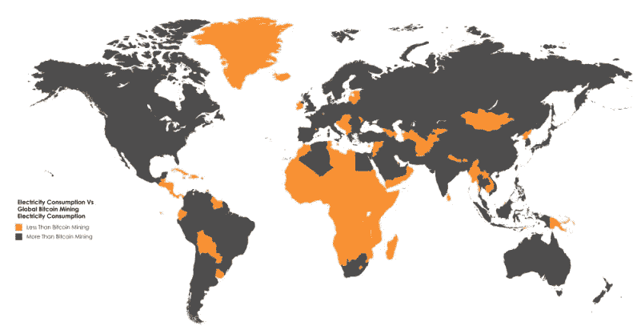
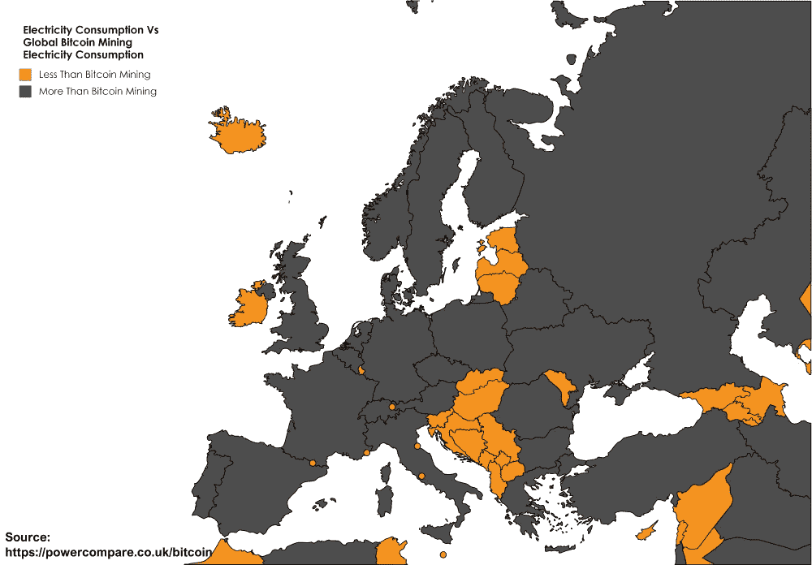
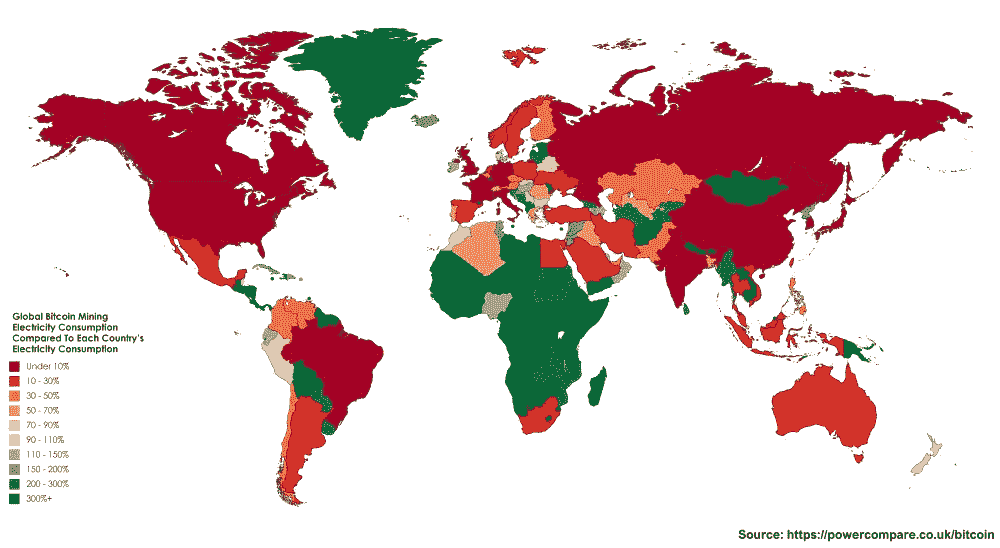

# 比特币挖矿真的比整个国家消耗更多电力吗？

> 原文：<https://medium.com/hackernoon/does-bitcoin-mining-really-consume-more-electricities-than-entire-countries-fde32e152941>

[powercompar.co.uk](https://powercompare.co.uk/bitcoin/)

随着比特币继续向主流采用迈进，事实证明，T2 飙升的价格并不是唯一经历突然上涨的东西。新的研究表明，流行的加密货币现在比欧洲 20 多个国家消耗更多的电力。

英国能源价格比较平台 Power Compare 的研究人员[发现](https://powercompare.co.uk/bitcoin/)开采比特币——保持区块链交易正常进行的计算过程——所需的电力总量现在比 159 个国家的消耗量还要多。

其中包括爱尔兰、克罗地亚、塞尔维亚、斯洛伐克和冰岛。

有趣的是，整个非洲大陆目前只有三个国家的耗电量超过比特币:南非、埃及和阿尔及利亚。

至于世界上的其他地方,《权力比较》提到了厄瓜多尔、波多黎各、朝鲜等等。

查看此图，了解更详细的分类:

Power Compare 进一步指出，比特币目前估计的年耗电量为 29.05 太瓦时——相当于世界总电力需求的 0.13%。

这意味着，如果比特币矿工建立自己的自治政府，其总耗电量将在全球排名第 61 位。这应该会让你更好地理解为什么比特币的采矿社区在可怕的 [Segwit2X](https://thenextweb.com/hardfork/2017/11/17/exchange-bitcoin-segwit2x-hard-fork/) 讨论中扮演了如此重要的角色。

根据 Power Compare 的数据，仅在过去 30 天，比特币挖矿的消费量就增长了近 30%。

奇怪的是，该研究指出，假设比特币的电力需求继续以这种速度增长，到明年 10 月，全球矿业消费可能会超过英国的全部电力供应。

如果你想知道所有这些电费加起来是多少，研究人员估计目前每年比特币采矿的电力成本为 15 亿美元。需要记住的一点是，该估算假设采矿发生在电价较低的地方。所以实际数字可能会更高。

*这个故事由* [*Mix*](https://thenextweb.com/author/dimitarmihov/) *撰写，最初发表在*[*Next Web 上。*](https://thenextweb.com/shareables/2017/12/07/smart-urinal-ads-toilet/)

*要阅读黑客正午的每周趋势 TNW 故事，请访问*[*Hackernoon.com/tnw*](http://hackernoon.com/tnw)*。*

*要阅读黑客正午的每周趋势 TNW 故事，请访问【Hackernoon.com/tnw】**。***