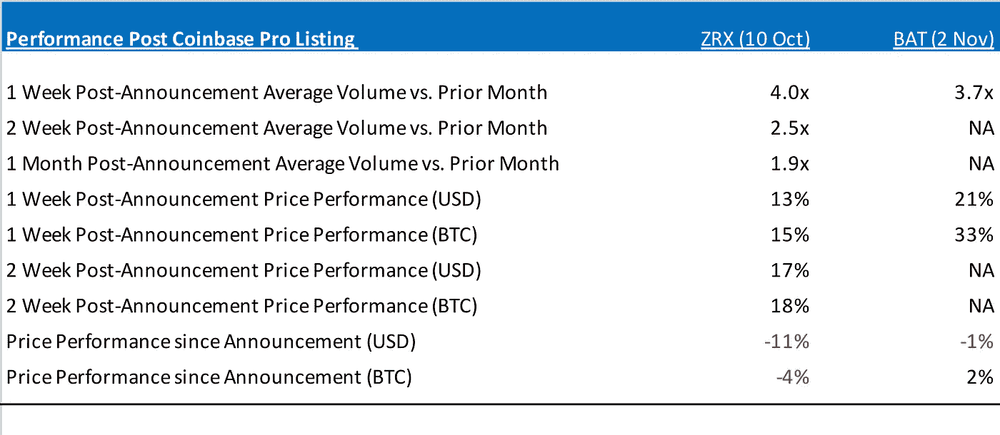
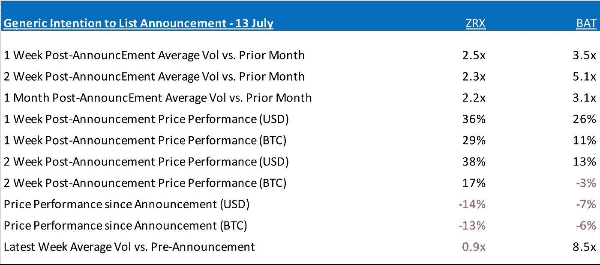

# “比特币基地溢价”真的存在吗？

> 原文：<https://medium.com/hackernoon/does-the-coinbase-premium-really-exist-d8bde1d07a54>

*许多密码交易员认为，一个***的上市可以为一个* [*的密码资产*](https://hackernoon.com/tagged/cryptoasset) *提供显著的推动力。我们深入研究这些数字，以找出这一理论是否有价值。**

*对于加密资产市场来说，过去的一周并不好过。大肆吹嘘的比特币现金硬分叉已经沦为闹剧，造成不确定性，导致前一周的涨势嘎然而止。更严重的是，它可能会让新进入市场的人停下来，他们有理由担心导致这种分歧的狭隘的党派争吵——坦率地说，更广泛的生态系统中更直言不讳的人物普遍缺乏成熟。*

*然而，最近的这一挫折只是加密资产自 2017 年 12 月以来面临的急剧下滑的又一次冲击。在这种时候，当只做多的#霍德勒正在组建特设的危机支持小组，在加密 Twitter 上交换智力空洞的观点时，专业投资者，甚至是稍微有点复杂的加密日内交易者，都更喜欢通过这个市场提供的独特机会产生阿尔法。**例子包括在其他市场不再存在的大规模跨交易所套利、价格剧烈波动，以及我们最喜欢的新交易所上市。***

*出于显而易见的原因，投资者在选择交易所和交易对手时需要谨慎。任何曾经与币安的客户支持打过交道的人，或者对大多数非美国加密交易所宣称的交易量报以哪怕是最温和的怀疑眼光的人，都可能点头表示同意。*

***这种对高质量交易场所的关注也意味着我们和许多其他人一样，密切关注任何有关新代币上市的公告。在美国，市场的焦点尤其指向比特币基地，在那里，对他们上市的炒作达到了自亚马逊发布 HQ2 入围名单以来从未有过的狂热程度。该交易所 Twitter 账户 2018 年 7 月的一篇帖子不带丝毫讽刺意味地表示，它“宣布(他们)正在探索增加”一个加密资产的短列表。***

*尽管这种言论可能看起来很浮夸，但加密投资者认真对待了它，并抬高了这些资产的价格——首先是在宣布的时候，然后是在它们上市的时候。这种现象催生了“**比特币基地溢价**”的概念，即在该平台上市的资产在公众舆论中被抬高，因为在比特币基地上市意味着获得批准，同时新的交易场所提供了额外的流动性。*

*但这样的溢价实际存在吗？*

***分解数字***

*比特币基地于 10 月 12 日将 ZRX 上市，英美烟草于 11 月 2 日上市。让我们回顾一下它们上市以来的资产价格表现和交易量。*

*考虑到比特币现金分叉带来的外部混乱，以及目前整个资产类别正在发生的更广泛的价格崩溃，我们将选择忽略前一周，并在 11 月 12 日 UTC 收盘时停止我们的分析:*

**

*Source: Coinbase.com market data (through 23:59 UTC on 12 November)*

*我们承认英美烟草数据集的局限性，因为它上市后只测量了 10 个交易日。然而，有几点非常突出:*

*   *在比特币基地上市会让交易量立即飙升。**不足为奇。***
*   *在比特币基地上市导致以美元和 BTC 计价的股票价格迅速升值。毫不奇怪。*
*   *以美元或 BTC 计算，上市的资产价格表现似乎不可持续。这不是我们所期望的。*

*再退一步，让我们看看这些资产在之前提到的 7 月份发布前后的表现:*

**

*Source: Coinbase.com market data (price data through 23:59 UTC on 12 November)*

*请注意比特币基地公告的直接影响是如何在更高的交易量上显著(短期)提高价格。这本身并不奇怪，因为在比特币基地事件曝光之前，这两种资产都普遍缺乏流动性。*

*然而，如果我们将 7 月 13 日之前的公告价格和数量视为“未受影响”的数字，那么在可持续的基础上，纳入比特币基地生态系统似乎并未导致 ZRX 或 BAT 的绝对或相对(至少与 BTC 相比)价格表现突出。*

*此外，尽管英美烟草的上市时间足够近，仍会对后续交易量产生影响，但 ZRX 在截至 11 月 12 日(含 11 月 12 日)的七天中的平均交易量实际上低于 7 月份公告之前的一个月。*

**注意:让我先发制人地指出(以减轻读者评论的需要),我们在 11 月 12 日停止分析的决定实际上为这些资产提供了更有利的结果，如果我们包括截至 11 月 19 日(本文的出版日期)的所有市场数据。我们选择排除最近的市场数据，是因为自那时以来，更广泛的市场出现了系统性衰退，因为 BTC 在那之前一直在相对狭窄的范围内交易，并提高了我们隔离和分析所谓的“比特币基地效应”的能力**

***结论***

*那么，这对加密资产投资者有什么启示呢？*

*   *新的比特币基地上市似乎对资产价值或流动性没有中期影响。*
*   *然而，上市创造了绝佳的短期机会，尤其是对在比特币基地机构或“专业”平台上交易的投资者而言，他们可以更早地接触到新上市的资产，并能迅速转手。*
*   *这引发了一种观点，即加密资产市场远没有创造一个公平的竞争环境，而是在走一条老路，偏向机构交易者而不是现在处于不利地位的个人“主街”投资者。*
*   ***简而言之，“比特币基地溢价”似乎确实存在。不幸的是，这个绰号非常合适，因为它只对交易所的“优质”客户开放，而且时间非常短。***

*========================================*

**感谢所有读过我最近一篇文章“* [*的人随着比特币达到一个重大里程碑，现在会发生什么？*T12”。那篇文章是几天来关于 Medium.com 的五篇阅读量最大的文章之一。我正在撰写一篇后续文章，我们将后退一步，看看加密资产能否在专业管理的投资组合中找到其他更成熟的资产类别。敬请关注……](https://hackernoon.com/as-bitcoin-hits-a-major-milestone-what-happens-now-21ddfd4f8b1f)*

*========================================*

***我在**[**Kosmos Capital Management**](http://www.kosmoscap.com)**工作，该公司积极交易新兴类别的数字资产。在推特上关注我**[**@ kvirgil**](http://twitter.com/kvirgil)*

*========================================*

*免责声明:本专栏的任何内容都不是投资建议，你绝对不应该这样理解。做投资决定时，不要依赖我的建议，也不要依赖任何人的建议。做自己的研究是在任何市场成功的关键。*

*========================================*