# 大声工作能激发创新吗？

> 原文：<https://medium.com/hackernoon/does-working-out-loud-inspire-innovation-74996083bbd6>

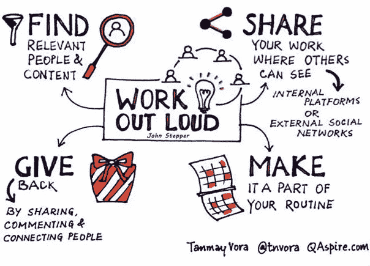

> “大声工作是一种建立人际关系的方法，在某种程度上可以帮助你。这是一种将传统的人际关系智慧与现代方式相结合的实践，以达到和吸引人们的目的。当你大声工作时，你会感觉很好，同时也充满力量。”

—约翰·斯戴普，2016 年

[大声工作](https://twitter.com/search?src=typd&q=%23workingoutloud)在许多企业中越来越受欢迎，这不仅是因为它们的人力资源是流动的，越来越多地跨越地理边界，也是对与志同道合的个人合作解决普遍问题的认可

。三个臭皮匠胜过一个诸葛亮，所以我们决定在这个月的 [#blabchat](https://twitter.com/search?q=%23blabchat&src=typd) 谈论什么更好的主题——鉴于这是我们迄今为止最忙的一次，似乎这是一个人们只渴望讨论的主题。

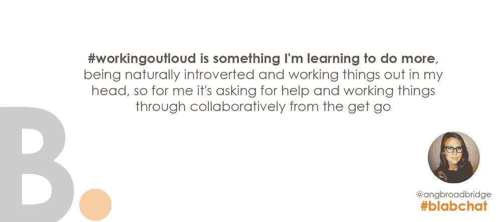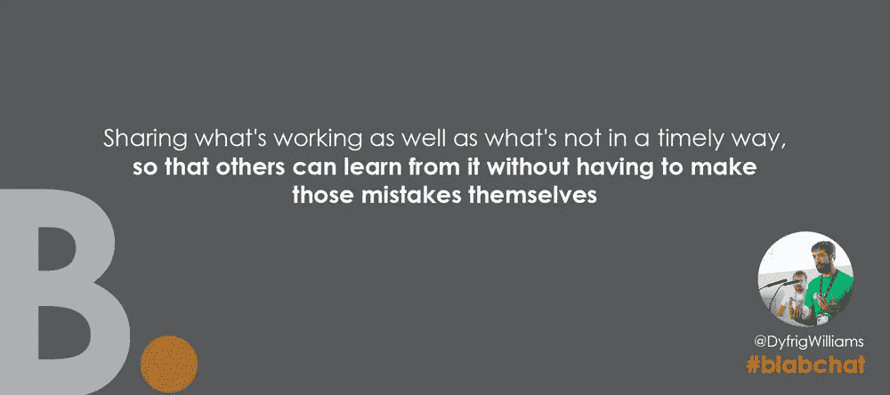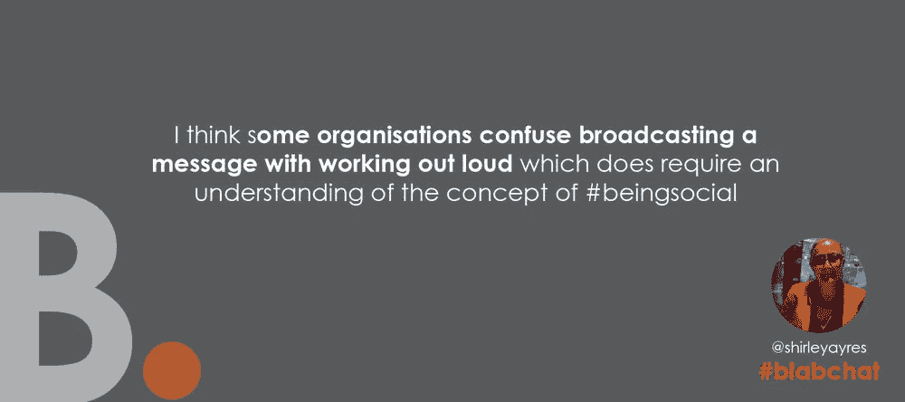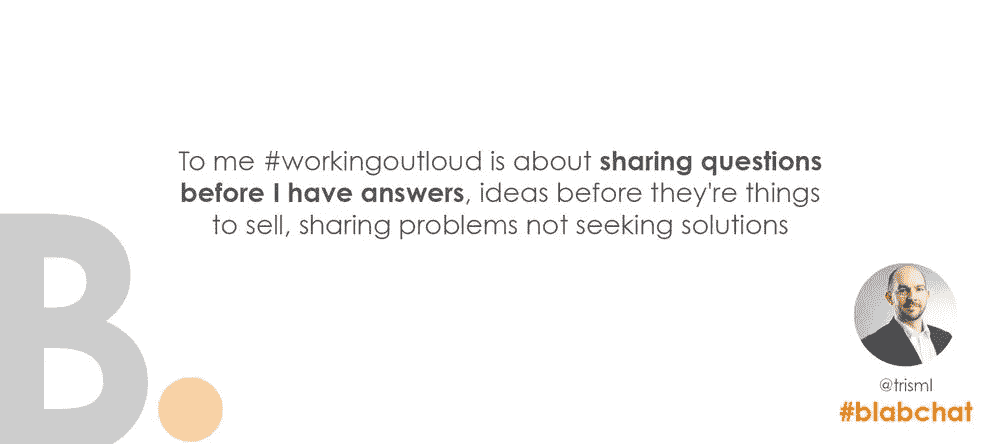

似乎我们中的许多人都同意 John Stepper 在建立关系以分享问题、解决问题和感觉检查方面的定义，但谈话也加入了一些考虑，这是一种很好的方式，让更多内向的人有一个挑战和合作的平台，而不会被外向的同事掩盖或吓倒(感谢 [@angbroadbridge](https://twitter.com/angbroadbridge) ！).

同样令人高兴的是，每个人似乎都认为这不仅仅是传播一个信息，雪莉说得完全正确，因为许多公司都对此感到困惑，所以人们意识到，在人们完全理解这个概念之前，可能还有一段路要走(参见敏捷工作、区块链等——这些概念已经存在很长时间了，但人们仍然以错误的方式使用它们！)

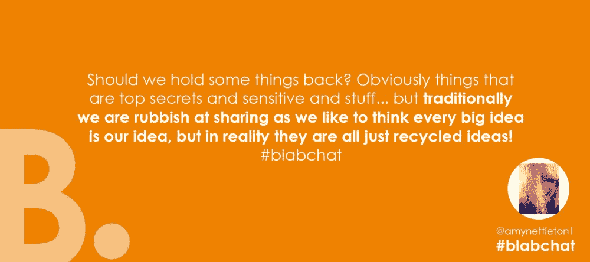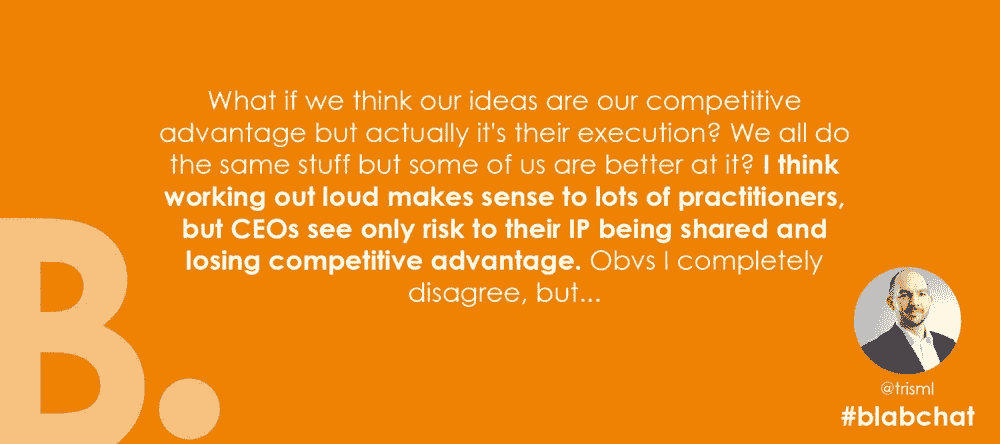

我的直率曾让我陷入困境，但似乎时代在变，人们认为诚实和开放在商业中的地位前所未有。我的座右铭一直是，我只会把我准备亲自对某人说的东西放在那里，你需要采取一种常识性的方法。

正如 Amy 所说，很少有人会产生一个全新的想法，因为我们只是在重复利用别人已经拥有的东西，而且真正的危险是，你藏得越多，就有越多的人自己去填补空白，我在以前的角色中目睹过，这比一开始就站在前面要危险得多。

显然有一些例外。谈论一些会导致潜在失业的事情？不要隐藏，但要审查你发布的内容。任何机密的，受 NDA 或非法的？不要把它放在第一位，甚至考虑一下就和自己说一句话！

这也可能取决于你所在的行业——正如 Tris 非常正确地指出的那样，对一些公司来说，大声工作等于公司自杀，因为他们竞争优势的来源是他们的产品设计、创新等。有时，有些事情需要被忽略，但对你的组织、利益相关者和行业的更多了解将确保你在这方面做出正确的决定，不会以破产告终。

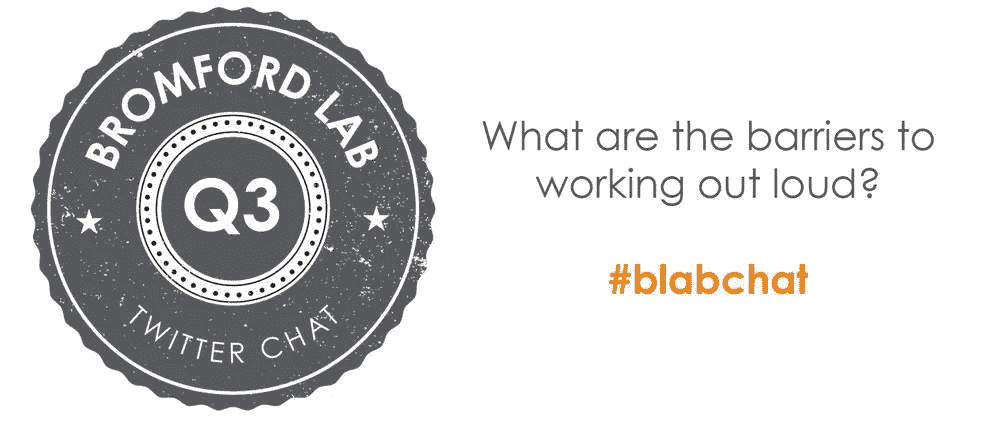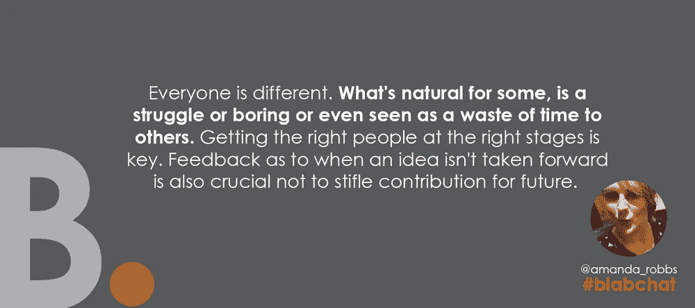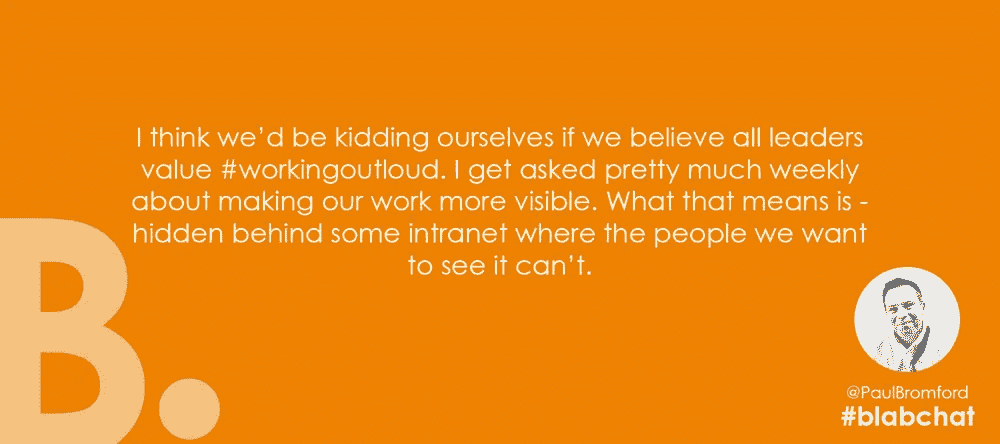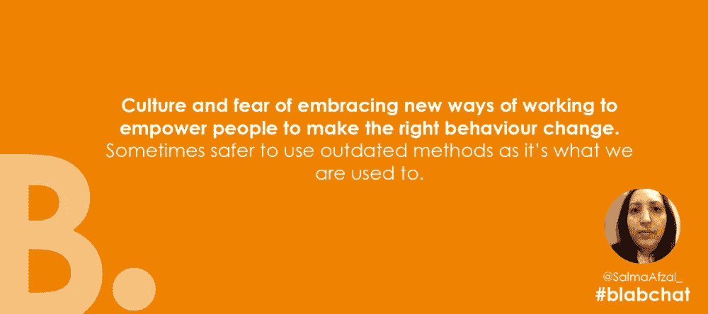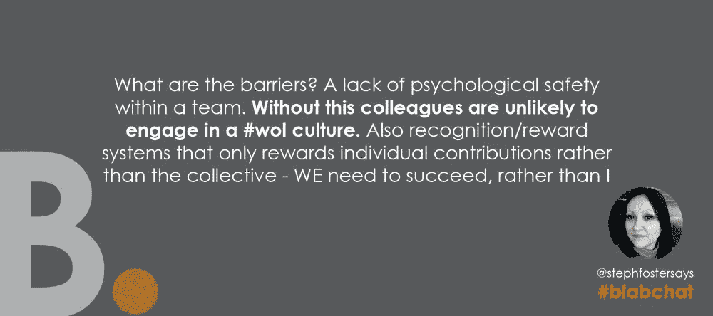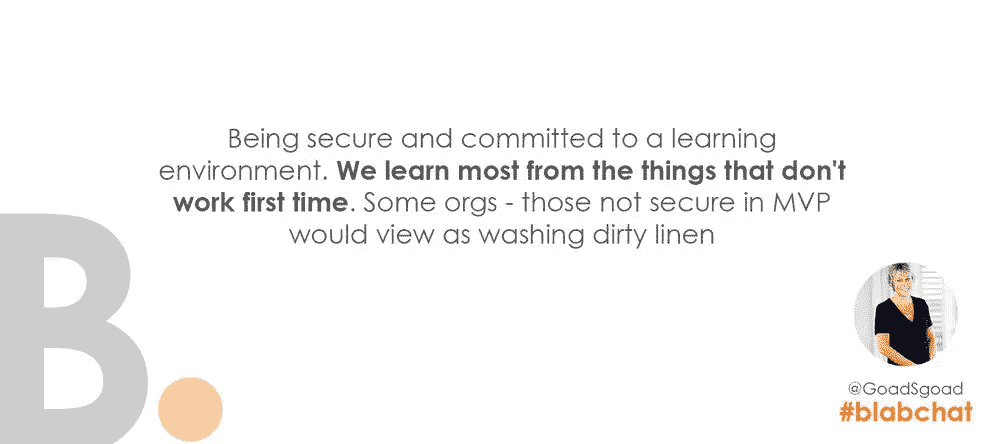

还需要我多说吗？重要的是在你自己的组织内认识到这些，挑战一些假设，但也要为同事提供一个安全的环境和支持，让他们适应这种工作方式。这并不适合所有人，组织文化在促进这一点上也发挥了一点作用。

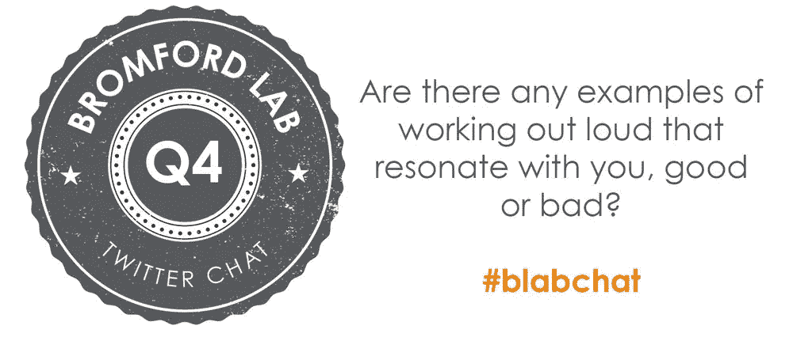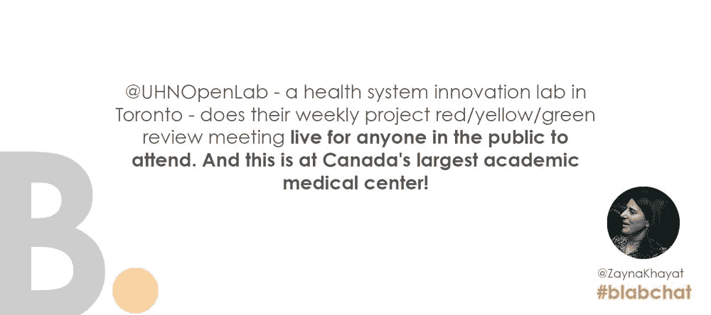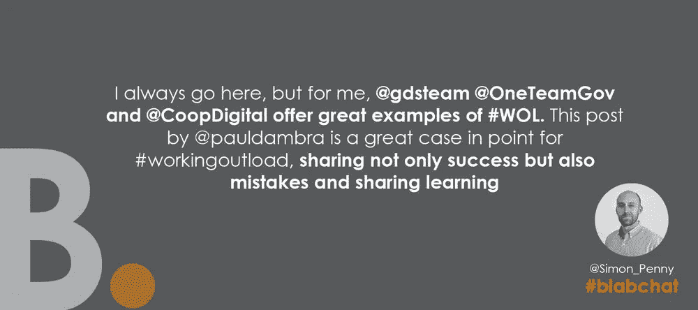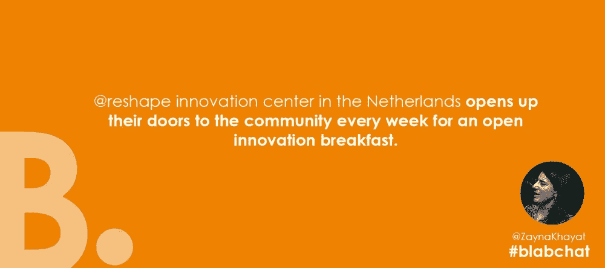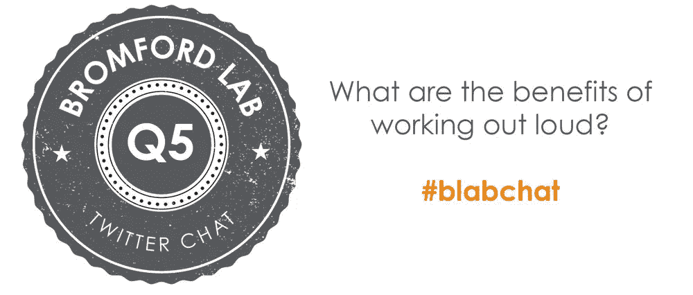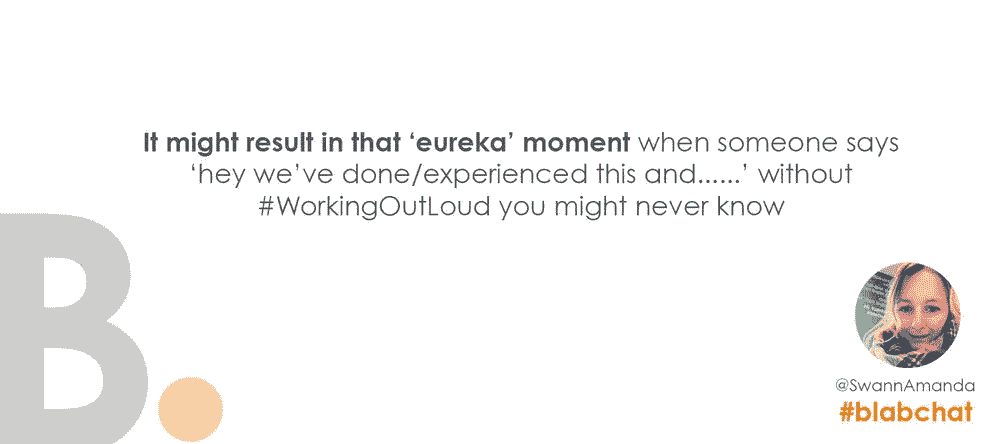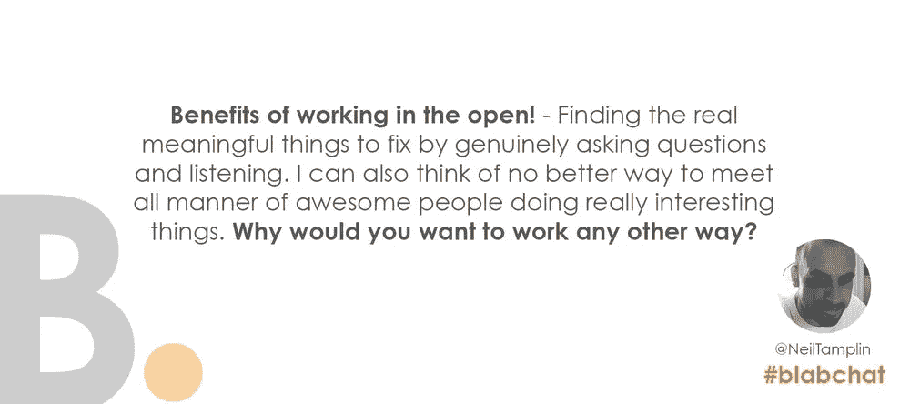

总之，普遍的共识是，当部署在正确的背景和正确的环境中时，大声工作是很好的，但它需要成为你工作文化的一部分，而不是事后的想法，因为它本身需要时间和纪律来确保你的 [#wol](https://twitter.com/search?q=%23wol&src=typd) 战略取得成功！

[@ChelleKButler](https://twitter.com/ChelleKButler)

[评论](http://www.bromfordlab.com/labblogcontent/2018/4/6/does-working-out-loud-inspire-innovation-a-blabchat-round-up#comments-outer-wrapper)

*最初发表于*[*www.bromfordlab.com*](http://www.bromfordlab.com/labblogcontent/2018/4/6/does-working-out-loud-inspire-innovation-a-blabchat-round-up)*。*