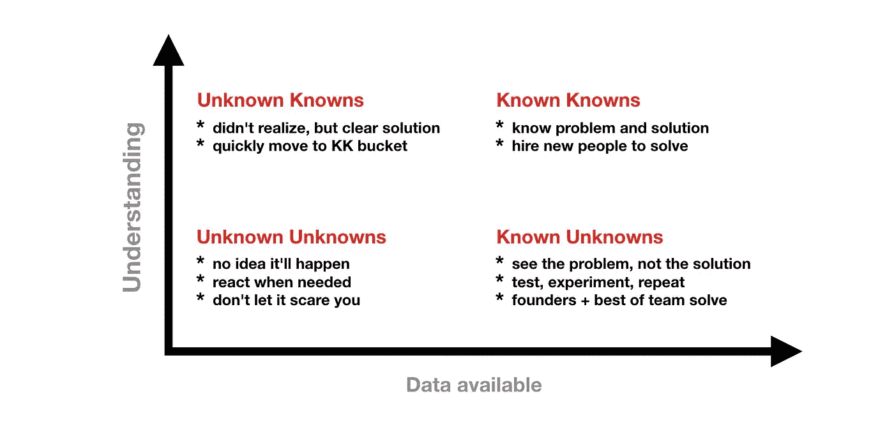
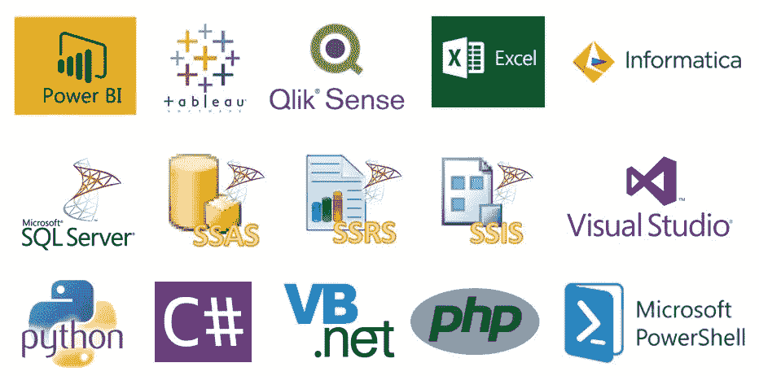

# 你的公司经营得聪明吗？

> 原文：<https://medium.com/hackernoon/does-your-company-operate-intelligently-dcaf4fc9ab84>

我一直认为自己很幸运，曾在 3 家不同规模的公司工作过；全球投资银行、斗志昂扬的初创公司和中型企业，它们希望在增长的同时吃掉市场份额，而不牺牲一些速度。

我喜欢研究产品/商业模式。它不断提醒我们，不管人们认为他们知道多少，我们的直觉往往是错误的；但是我们可以通过基于具体证据做出决策来最大化成功的机会。

## 我们都有成长的烦恼

在你的[公司](https://hackernoon.com/tagged/company)(定义你想要的增长方式:团队规模、收入、用户数量、付费客户数量等)的发展过程中，你会看到员工队伍发生变化，早期雇员抱怨他们不再知道每个人的名字，技术债务和决策速度变慢🤦。

毫不奇怪，紧密结盟的小团队开始传递混杂的信息( ***结帐*** [*谷歌如何与速度同步*](https://youtu.be/mJB83EZtAjc) *)！*)。

关键是，人们很难对各种沟通渠道中发生的事情保持一致的理解。

决策过程中存在很多偏见，许多有经验的人认为，一旦他们与决策者和关键人物接触，他们就能做出正确的决定。这完全没问题，但是当确认偏见可以满足你的自我时，它会让你在知道哪些变量在成功中起作用时感到困惑。

谢天谢地，我们可以用证据来验证我们的假设。

## 洞察力应该推动行动

> 我们在玩什么游戏，如何记分？

在最近的一个项目中，我被要求帮助某人从多个来源获得汇总的数据，我简单地问了一句，**你想用这个做什么决定？**

这真的击中了我们收集的洞察力需要驱动行动的事实，我还建议她**首先形成她的假设**。

虽然这是最难下咽的药丸，但我发现这迫使人们问自己，面对证据，他们是否愿意改变。

## 智力

对于我们中那些希望能够穿过噪音，超越人们的自我，避开政治的人来说，我们可以专注于帮助我们的团队做出基于具体证据的决策。

尽管人们对数据科学和其他形式的建模有着浓厚的兴趣，但我感觉，许多公司尚未准备好投资将其变为现实，也没有利用它的人才、基础设施和文化。此外，预测模型对你的业务类型有必要吗？

## 开始

> 如果你不衡量它，你就不能提高它

要做的第一件事是弄清楚你希望能够回答什么问题，并考虑你现在有哪些数据来源。如果你已经在交易了，那么这些信息是存在的——这都是关于以一种容易阅读的方式获取信息(我是一个视觉型的人，所以我喜欢有活力)

> 数据并不总是大数据

不幸的是，我不能开出具体的解决方案，因为每个公司的数据环境都不同，但我会从这 5 个步骤开始。

*   重申你的战略以及它如何与你的使命联系起来
*   确定您希望能够回答的问题
*   形成一个假设(给出过去发生的事情，什么是真的，我们如何利用这种洞察力来更好地了解我们的业务或产品)
*   查看当前可用的数据(更少的努力，更快的收获，帮助您识别**未知的已知的**和**已知的未知的**)

*   提取和分析原始数据(这是一门艺术而非科学)。考虑谁会阅读它，并以一种推动行动的方式呈现它

# 一些工具

这些工具经常出现在已经做出承诺一年或更长时间的大公司所使用的数据、报告和分析领域。

**推荐的其他基于订阅的工具通常由小公司使用**:

*   [混合面板](https://mixpanel.com/)
*   [应用软件](https://www.appsflyer.com/)
*   [堆](https://heapanalytics.com/)
*   [段](https://segment.com/)
*   [分支](https://branch.io/)
*   [LeanPlum](https://www.leanplum.com/)
*   [图表大亨](https://chartmogul.com/)

*拿到了客户和数据？打我一下* [***推特***](https://twitter.com/JayYoms)**或者**[***LinkedIn***](https://www.linkedin.com/in/jamesojo/)***让我们试着形成一个可检验的假设。*****

**如果这篇文章有助于思考开始收集数据是多么容易，如果你能让我知道，我会很高兴。按住就行了👏持续 10 秒或更长时间。**

**~祝福**