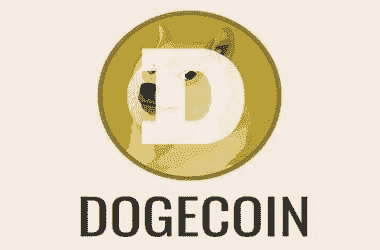
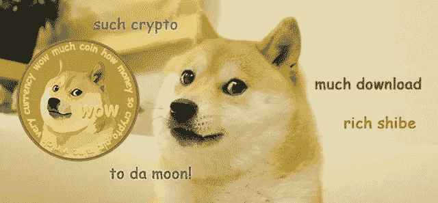
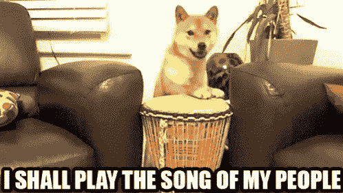
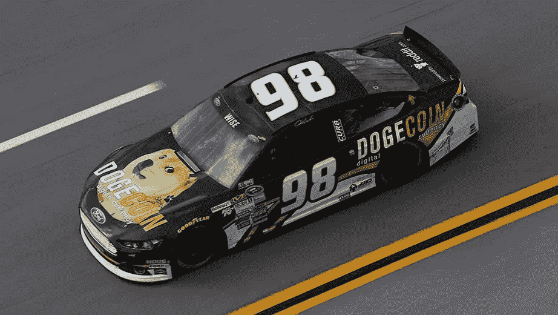
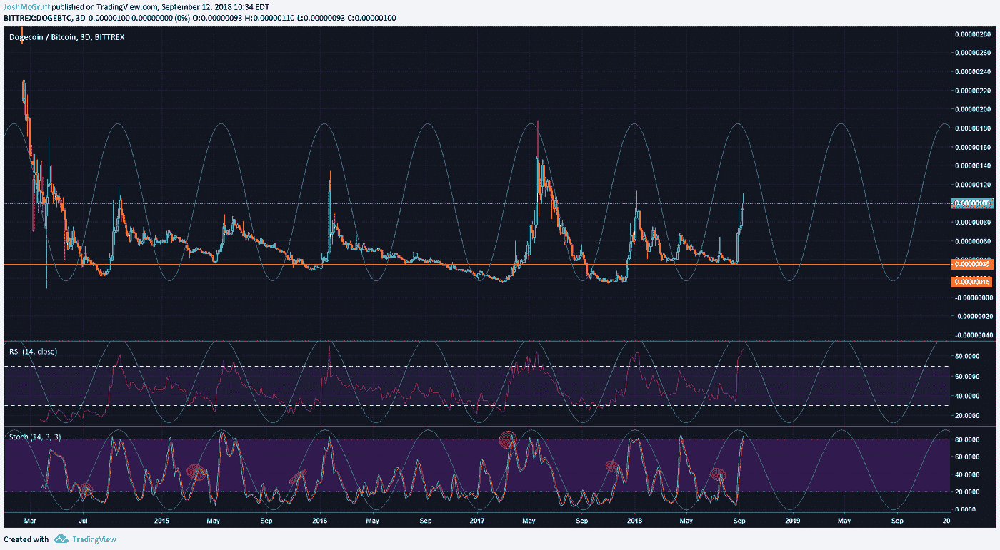
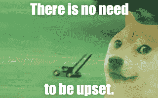
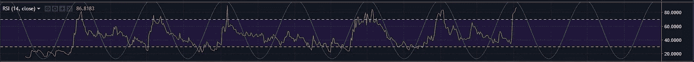
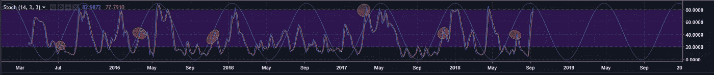
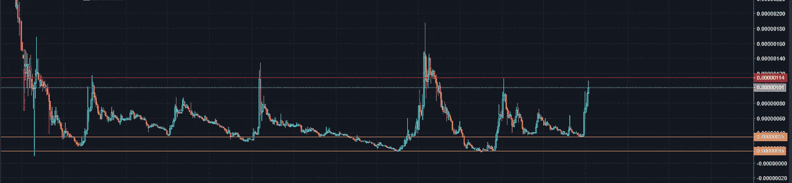
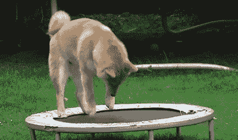

# Dogecoin:非常哇。多循环。

> 原文：<https://medium.com/hackernoon/dogecoin-very-wow-much-cycle-7b1d396ccec7>

在这篇文章中，我想给你介绍一种我最喜欢交易和观赏的硬币。就我个人而言，我不知道在这些可预测的波动中交易的更好的例子。简单地遵循这个策略，已经让我在交易生涯中获得了最大的持续收益。是的，这篇文章中也会有 Doge 迷因。

所以，让我们从$DOGE 的背景故事开始吧。

首先，我看到的关于$DOGE 最常见的误解是它是一个死项目。**这是假的**。$DOGE 和它的工作可以在 Twitter 上关注 [@Dogecoin_devs](https://twitter.com/dogecoin_devs) ，他们的 [Github 在这里](https://github.com/dogecoin/dogecoin/tree/1.14-dev)。

在我的交易生涯中，我被社区认为是“DOGE 的 CEO”虽然不存在这样的官方角色(我过去经常被问到这个问题)，但这枚硬币在我心中占有特殊的位置，因为交易它的周期是如此有利可图。我经常在 Twitter 上散布$DOGE 迷因，并在下一个周期开始时尖叫，这为我赢得了非官方的荣誉。硬币本身实际上也非常好用。它的费用很便宜，在下一个 Dogecoin 街区处理一笔交易平均需要 1 分钟左右。

这个社区也很棒。你会发现外面有许多喜欢$DOGE 的新奇事物以及它实际上是一个非常可靠的产品的人。我个人比较喜欢的有[@ sabot beats](https://twitter.com/sabotagebeats?lang=en)、 [@Noob_charts](https://twitter.com/Noob_Charts) 、 [@DavidLoveDoge](https://twitter.com/DavidLoveDoge) 和 [@YearOfDoge](https://twitter.com/YearOfDoge) 。

此外，让我们不要忘记$DOGE 有自己的纳斯卡。

Very Wow! Much Fast!

所以，进入这篇文章的主题。Dogecoin 交易周期。

当然，没有什么是 100%的事实上，我将展示的图表显示了这一点没有奏效的一次，所以在你用你的钱做任何愚蠢的事情之前，请记住这一点，并始终利用你的风险管理。我不是金融顾问，这样做的目的是展示我的一个交易策略。

看看下面的图表。这是 Bittrex 上$DOGE 的 3 天。

Such Cycle. Much Trade.

首先，让我们评估图表上的两条橙色线。对于 Bittrex 上的$DOGE 的历史，我们已经看到在 35 sat 阻力线或更低的位置开始反弹。截至发稿时，目前的历史最低水平是 15 分。

接下来，你可以看到蜡烛线、RSI 和 stoch 上显示的波形，除了 2016 年 9 月的一次之外，它们在 3 日图上每次都是如何表现的。正如我提到的，这不是 100%

我们还可以看到 RSI 在跟踪这些波动方面做得很好。

我真的认为这里的秘密成分是，Stoch。我的好朋友[加密核心🏆](https://medium.com/u/8b40889fd3b1?source=post_page-----7b1d396ccec7--------------------------------)(你也可以在这里找到他在 twitter 上)帮助我发现了这一点。

当观察 Stoch 时，我们可以看到每一次反弹在 Stoch 上有一个小的“前泵”,在波的 T5 里面。当积聚发生时，这作为下一个进入泵的“抬头”。

有一次，斯托克指数突破了前期的波动，我们看到$DOGE 大幅上涨至 187 sats。

应该注意的是，在大约 114 sats 处有一条长期阻力线，已经被 3 次反弹所尊重(如果当前的反弹在这里停止，可能是 4 次)。

Keep an eye out around this area for the rally to end.

总的来说，只要累积到 35 左右或更低就已经相当有利可图了。在这些水平，我开始建立我的包，并平均下来的价格。一旦我的包做好了，我就坐着等。真的就那么简单。你不会一夜之间赚 100 倍，但是你可以慢慢来，让这笔交易来找你，这样你就可以赚很多。

从 2015 年 6 月的最低 144%到 2017 年 5 月的超过 1100%,每个周期都非常有利可图。

$DOGE 乍一看可能是一个愚蠢的迷因硬币，但如果你花点时间去欣赏它的真实面目，它是一个从技术角度来看很棒的 [crypto](https://hackernoon.com/tagged/crypto) ，有一个专门的社区，它是趋势交易者的梦想。

如果你想与我讨论，请随时在[比特币共济会](https://discord.gg/5KpVGhE)找到我，这是我帮助一些伟大的人建立的不和谐交易社区。

您也可以在以下地方找到我:

**推特**:[https://twitter.com/JoshMcGruff](https://twitter.com/JoshMcGruff)
trading view:[https://www.tradingview.com/u/JoshMcGruff/](https://www.tradingview.com/u/JoshMcGruff/)
**insta gram**:[https://www.instagram.com/joshmcgruff/?hl=en](https://www.instagram.com/joshmcgruff/?hl=en)
**比特币共济会:**[https://bitcoinmasons.com](https://bitcoinmasons.com)

喜欢这个故事吗？学点什么？请我喝杯啤酒表示感谢！CashApp — $JoshMcGruff

See you on the Moon!