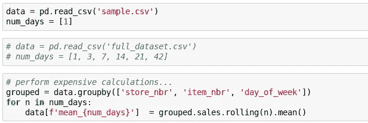
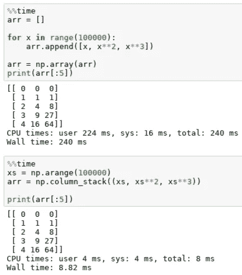

# 如何高效地进行机器学习

> 原文：<https://medium.com/hackernoon/doing-machine-learning-efficiently-8ba9d9bc679d>

我刚从一个项目中走出来，在这个项目进行到 80%的时候，我觉得我做得很少。我投入了大量的时间，最后完全失败了。

我知道或不知道的数学，我写代码的能力——所有这些都是次要的。我处理这个项目的方式就是问题所在。

我现在相信，构建机器学习工作是一门艺术，或者说是一门手艺，而我喜欢读的数学类书籍似乎都没有提到这一点。

我做了一点自我反省，回到了[杰瑞米·霍华德](https://medium.com/u/34ab754f8c5e?source=post_page-----8ba9d9bc679d--------------------------------)在[fast . ai](http://course.fast.ai/)的精彩【程序员实用深度学习】MOOC 中提到的内容，这就是这篇文章的由来。

## 10 秒规则

我们坐在电脑前做事。在宇宙中留下印记。降低我们预测的成本或减少我们模型的运行时间。

这里的关键词是做。这需要移动代码。重命名变量。可视化[数据](https://hackernoon.com/tagged/data)。敲击你的键盘。

但是盯着电脑屏幕发呆两分钟，让它执行计算，这样我们就可以一遍又一遍地运行它们，但只是稍微修改一下参数，这是不行的。

这也让我们面临机器学习工作的最大祸害——额外浏览器标签的诅咒。那么容易按 ctrl+t，那么容易忘记我们一直在做什么。

这个解决方案听起来可能很荒谬，但确实有效。当你在处理一个问题时，不要让计算超过 10 秒。

但是我如何调整我的参数呢？我怎样才能学到关于这个问题的任何有意义的东西？

所需要做的就是以一种能够创建代表性样本的方式对数据进行子集划分。这可以在任何领域进行，并且在大多数情况下只需要随机选择一定比例的例子来处理。

一旦您对数据进行了分组，您的数据工作就变成了交互式的。你进入一种不间断注意力的流动状态。你不断进行实验，找出什么有效，什么无效。你的手指从未离开过键盘。

时间在延伸，如果你让自己分心，你所做的工作时间并不等于你本来会做的工作时间，甚至不等于 5 个小时。

如何构建您的代码来促进这一工作流程？使切换到在完整数据集上运行变得非常简单。

当您要结束编码会话时，取消对单元格的注释并运行 all。

# 成为时间垃圾邮件制造者

这是对上面的补充。但它也是如此之多。

根据您构建代码的方式，可以获得数量级的性能提升。如果你做了这样或那样的改变，知道某事运行多长时间以及它将运行多长时间是很好的。然后你可以试着找出为什么会有不同，它会立刻让你成为一个更好的程序员。

最重要的是，这与绝不运行任何耗时超过 10 秒的任务的承诺是相辅相成的。

## 自我测试

一旦你在数据处理过程中犯了一个错误，并且没有被注意到，就几乎不可能恢复。在很大程度上，这也适用于模型构建(特别是如果您开发自己的组件，如层等)。

关键是在进行过程中检查数据。看改造前后。总结一下。如果您知道合并后应该没有 NAs，请检查是否确实没有。

测试一切。

从长远来看，保持理智的唯一方法是在短期内保持偏执。

## 奔向成功

解决问题时，你应该关注的第二件事是什么(我马上会谈到第一件要做的事)？创建任何模型，任何端到端的数据操作管道，这比随机机会要好。

它可以也应该是你能想到的最简单的模型。这通常意味着线性组合。但是你想开始对这个问题有个感觉。你想开始形成一个什么是可能的基线。

假设你花了 3 天时间构建了一个超级复杂的模型，但它根本不能工作，或者根本不能像你想象的那样工作。你是做什么的？

在这一点上你什么都不知道。你不知道你是否在处理数据时犯了错误，你不知道你的数据是否是垃圾。你不知道你的模型是否有问题。在没有可以依赖的组件的情况下，祝你好运解开这团乱麻。

此外，建立一个简单的模型可以让你鸟瞰整个情况。也许有缺失的数据？可能是班级不平衡？可能是数据标注不正确？

在开始处理更复杂的模型之前，最好有这些信息。否则，你就冒着构建一些非常复杂的东西的风险，这些东西可能客观上很棒，但同时却完全不适合手头的问题。

## 不要调参数，调架构

“哦，如果我只是添加这个单一的线性层，我相信模型会唱歌给我听”

“也许再增加 0.00000001 个辍学者会有所帮助，看起来我们在这里把我们的火车设置得有点太好了”

尤其是在早期，优化超参数绝对是适得其反的。然而，这不仅仅是一种诱惑。

它几乎不需要工作，很有趣。你看到电脑屏幕上的数字在变化，感觉你在学习一些东西并取得进步。

这是一个幻影。更糟糕的是，您可能会过度适应您的验证集。每次运行模型并根据验证损失进行更改时，模型的泛化能力都会受到影响。

你的时间最好投资在探索架构上。你学到更多。突然间，组装成为可能。

## 释放老鼠

你打算用这台电脑多久？即使我偶然变得富裕到一天都不用工作，我还是会每天使用电脑。

如果你打网球，你练习每一个动作。你甚至可以花钱请人告诉你如何在特定的镜头中调整手腕的位置！

但实际上，你只能打这么多小时的网球。为什么不同样意识到你如何使用电脑呢？

使用鼠标是不自然的。它是缓慢的。它需要复杂而精确的动作。在任何上下文中，您只能访问有限的一组操作。

使用键盘让你自由。老实说，我不知道为什么会有如此大的不同。但确实如此。

A person working on their computer without using the mouse.

## 最后但并不是最不重要的

除非你有一个好的验证集，否则你做的任何事情都没有意义。

我可以向你推荐这方面的终极资源吗？一篇没有攻击性的、以实践为基础的文章。

[如何(以及为什么)创建一个好的验证集](http://www.fast.ai/2017/11/13/validation-sets/)作者[瑞秋·托马斯](https://medium.com/u/ee56d0bac1b7?source=post_page-----8ba9d9bc679d--------------------------------)。

*如果你觉得这篇文章很有趣并且想保持联系，你可以在 Twitter 上找到我* [*这里*](https://twitter.com/radekosmulski) *。*