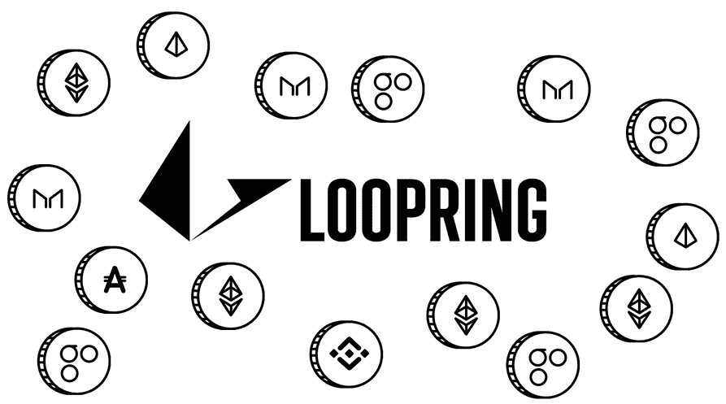

# 白云石分散交易所:通过 UX、安全性和流动性推动区块链经济

> 原文：<https://medium.com/hackernoon/dolomite-decentralized-exchange-powering-the-blockchain-economy-through-ux-security-and-a6fb4aa8bffa>

随着[加密货币](https://hackernoon.com/tagged/cryptocurrency)市场的成熟，数以千计的代币已经上线，创造了一个充满活力和快速发展的[区块链](https://hackernoon.com/tagged/blockchain)产业和全球数字资产市场。目前有数以千计的以太坊 ERC20 代币在交易，用户没有其他地方可去，只能通过有限的代币选项和令人不安的安全问题进行集中交易。

另一方面，分散式交易所提供了无与伦比的安全性，但缺乏简化的用户体验和集中式交易所的直观易用性。它们还要求用户在成功进行交易之前通过几个复杂的步骤，而且大多数交易对往往缺乏流动性。

白云石是一个令人兴奋的新的分散式交易所，它弥合了集中式交易所提供的易用性和流动性与分散式交易所令人难以置信的安全性和代币交易选项之间的差距。通过将用户体验放在发展的最前沿，白云石为用户提供了一个跨越众多 ERC20 令牌交易对的简化交易体验。一个例子是不再需要手动包装 ETH 进行交易。

在深入研究白云石分散交易所、投资组合管理门户和钱包的丰富功能细节之前，让我们首先更深入地了解一下当前的交易选项及其局限性。

# 当前选项的缺点

目前，加密货币交易商和投资者每天使用中央交易所买卖价值数十亿美元的代币。币安、比特币基地、Upbit、火币、Bitfinex 等集中式交易所为用户提供了更简单的用户界面和更高的流动性。然而，这种产品有一个巨大的代价——*安全性*。虽然以分散交易期权形式存在的更安全的期权，但它们远没有那么受欢迎，缺乏高流动性，并且最明显的是，提供的用户体验不直观并且不必要的复杂。

## 用户体验差

在试图提高当前交换的安全性时，一个主要方面被遗忘了:用户体验。似乎分散式交换背后的开发人员没有经历过与他们的 UI 交互是多么不必要的沮丧。乍一看当前分散的交易所，有几个问题变得非常明显。像标签不好的图表、不直观的市场搜索栏和不存在的密码到法定价值的转换等突出问题出现在大多数 dex 的首页。这些问题阻碍了用户做出快速、有洞察力的决策。在快节奏的加密交易世界里，每分钟的价格波动和最低限度的用户安全网，笨拙的界面会导致赔钱或把钱留在桌子上。

目前的 dex 不仅布局糟糕，还会迫使用户一直打开多个第三方应用。让 DEX 和其他工具(如 TradingView、CoinMarketCap 和其他资源)持续运行不仅让人感觉很麻烦，还会增加额外的耗时交易步骤。分散交易源于对交易安全性和匿名性的需求。然而，当当前的解决方案提供这种令人毛骨悚然的用户体验时，很容易理解为什么许多人宁愿自己承担后果，也不愿在分散的交易所交易。

## 安全性受损

Centralized exchanges expose your crypto and personal information to hackers

就其本质而言，集中式交换极易受到黑客攻击，导致用户名、密码、API 密钥和令牌本身被盗。近年来，集中交易损害了价值超过 10 亿美元的用户资金:

> 2014 年:Mt. Gox 以 4.37 亿美元被黑
> 
> 2016 年:Bitfinex 以 7200 万美元被黑
> 
> 2018 年:Coincheck 被黑 5.3 亿美元

由于大多数交易所实行严格的 KYC(了解你的客户)标准，集中式交易所的用户也有暴露其真实离线身份的风险。这意味着，要注册和使用中央交易所，用户必须上传护照、银行账户信息和家庭住址等敏感文件，并与中央交易所分享。中央交易所通常在海外运作，很少或根本没有监管。中央交易所的安全漏洞导致敏感文件被盗并在黑市交易的情况并不罕见。

## 低流动性

Low liquidity — lack of orders on the market — plague decentralized exchanges

发帖时，币安中央交易所 24 小时交易量排名第一，据报道交易价值为 11.4 亿美元。相比之下，2018 年上半年推出的分散式交换协议 Kyber Network 同期的 24 小时交易量仅为 161，364 美元。IDEX 是一个受欢迎的分散式交易所，在同一 24 小时窗口内仅报告了 303 万美元，仍然远远落后于其集中交易对手。

为什么全世界的交易者通常都涌向中央交易所？答案很简单:用户体验和流动性。希望交易特定加密货币的用户希望能够以有竞争力的价格轻松买卖资产。分散的交易所用户体验已经很差，界面笨拙，流动性低，对市场波动的反应慢得令人难以置信。这在很大程度上解释了为什么在白云石出现之前，分散交易所的使用率远低于预期。

开发白云石是为了解决集中式交易所的显著缺点，以及分散式交易所提供的糟糕的用户体验和流动性。白云石是一种直观的下一代解决方案，通过 Loopring 协议提供轻松安全的交易体验，以及最佳的长期流动性解决方案和订单结算机制。

# 白云石指数

白云石将如何解决用户体验、安全性和流动性的问题？先说用户体验。

# 用户体验

> 白云石是由加密交易员和投资者建立的，旨在使普通用户的过程尽可能简单和轻松。

## 易用性

Trade right from your wallet without ever manually wrapping ETH or manually approving tokens

白云石简化了加密货币交易，将分散式交易、投资组合管理、市场分析工具和安全钱包整合在一起。在你和市场之间只需点击几下鼠标，白云石直观的用户界面使交易变得轻而易举。目前的解决方案需要冗长的注册，潜在的无数认证应用，以及混乱的用户体验。当你能够交易的时候，已经过了很长时间，直接对市场条件做出反应的可能性已经被大大降低了。白云石从钱包到交易所的无缝过渡使你能够与市场同步，不会错过任何一个节拍。

## 功能丰富的钱包

Send and receive tokens from the feature-rich Dolomite wallet

白云石的分散交易所可以通过任何以太坊钱包直接访问，包括你可以在白云石上创建的钱包。这种安排比集中交易所采用的方法有巨大的优势，不容忽视。

## 内置文件夹

Track your portfolio with in-depth market data

白云石钱包具有实时投资组合，以图形显示您的投资组合相对于几种指标和法定货币的表现、您的交易历史(允许您准确跟踪您的交易和美元平均成本(DCA)价格)，以及令牌发现选项，允许您查看整个市场范围内交易所的令牌信息和定价数据。有了这个强大的工具，用户应该永远不会发现自己不得不离开白云石来研究他们的下一个投资或看看他们当前的投资组合表现如何。

白云石投资组合管理器目前跟踪 500 多个不同的以太坊标准 ERC20 令牌，最重要的是，该交易所不需要用户手动包装自己的以太网。相反，这个过程尽可能优雅地隐藏在流畅的用户体验背后。随着 Loopring 协议扩展到与其他区块链(如 NEO 和 QTUM)一起工作，白云石分散式交易所和投资组合管理器将发展为向用户提供跨链交易选项，并在多个钱包和不同区块链之间聚合投资组合。

# 安全性

With Dolomite your crypto and your personal information stays secure with you

与集中式交换形成鲜明对比的是，白云石不会存储你的私钥，也永远不会。作为集中式 exchange 用户，您*不*拥有您的私钥。交易所为您保存这些密钥，这意味着如果交易所被黑客入侵，您的私钥会被窃取，您的资金也会被盗。白云石用户保留对他们钱包的完全所有权和控制权，这意味着不存在不良行为者危害白云石网络的中心故障点。结果是为白云石用户提供了一个安全的环境。

# 通过 Loopring 实现更好的扩展/长期流动性

Loopring allows for secure liquid trading

白云石的 DEX 建立在 Loopring 之上，loop ring 是一种用于分散令牌交换的协议。本质上，Loopring 协议是一个区块链不可知的标准，白云石和许多其他 DEX 一起使用它来创建一个具有更高流动性的分散式交换网络。

为了形象化这一过程，首先想想交易所目前的运作方式。币安、Bitfinex、Huobi 和其他公司作为独立的筒仓存在——它们各自维护自己的订单簿，彼此之间没有通信。另一方面，白云石的基于 Loopring 协议的交易所通过使用一种叫做**环匹配**的订单匹配模型来匹配整个基于 Loopring 的交易所网络和以太坊区块链的订单。

## 环形匹配

环比匹配是一个过程，通过这个过程，交易对之间的几个不同订单可以被分解成片段，并以可用的最佳市场价格进行交换。例如，假设 Bob 想用 20 个 OMG 换 0.3 个 ETH，Alice 想用 10 个 REP 换 40 个 OMG，John 想用 1 个 ETH 换 20 个 REP。使用环匹配，所有三个订单将在一次交易中处理，交易的任何剩余部分将被分解并通过后续的环匹配进行结算。

## 边缘分割

利润分割是一个循环功能，在该功能中，找到并结算交易所的订单匹配器会因找到双方之间的最佳交易而获得奖励。例如，如果 Bob 希望用 5 ETH 交换 200 OMG，但是订单匹配者可以为 Bob 找到更好的 5 ETH 的 204 OMG 价格，那么 4 OMG 将在 Bob 和订单匹配者之间平分，从而允许 Bob 获得更好的交易，同时激励订单匹配者为用户找到更好的交易。

# 测试版

白云石分散交易所的 beta 测试版计划于 2018 年 9 月发布。初始白云石测试员的数量将被限制在 100 人以内。如果你有兴趣成为白云石测试用户，请在[白云石. io](http://dolomite.io) 注册你的兴趣。此外，你可以加入任何一个白云石的社交媒体渠道，了解白云石的最新新闻和讨论。

Watch for more information about Dolomite

*   **推特**:【https://twitter.com/Dolomite_io】T4
*   **电报**:[https://t.me/dolomite_io](https://t.me/dolomite_io)
*   **insta gram**:[https://www.instagram.com/dolomite_io/](https://www.instagram.com/dolomite_io/)
*   **https://www.facebook.com/DolomiteOfficial/**:[脸书](https://www.facebook.com/DolomiteOfficial/)
*   **领英**:[https://www.linkedin.com/company/dolomiteio/](https://www.linkedin.com/company/dolomiteio/)
*   **Reddit**:[https://www.reddit.com/user/DolomiteOfficial](https://www.reddit.com/user/DolomiteOfficial)
*   **不和**:[https://discord.gg/QaENmNV](https://discord.gg/QaENmNV)
*   **联系人:** [联系人@白云石. io](mailto:contact@dolomite.io)

## * *免责声明！所提供的信息不是投资建议**