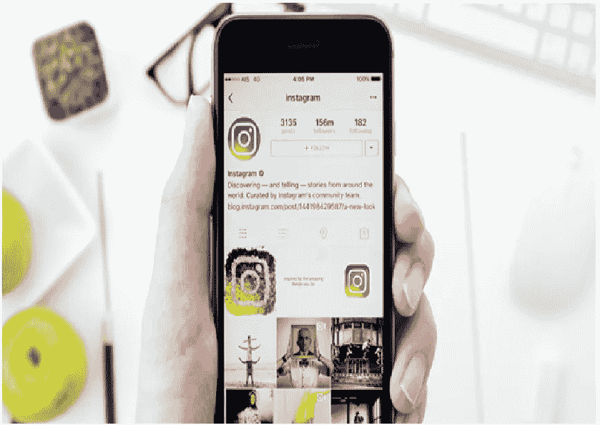
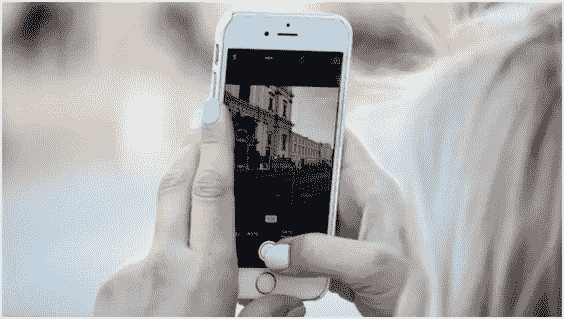

# 用这些技巧和窍门来设计你的图片，主宰 Instagram

> 原文：<https://medium.com/hackernoon/dominate-instagram-with-these-tips-and-tricks-to-style-your-pictures-ef7313a14b6>

这些天来，Instagram 用户，尤其是博主 ，有一些严肃的专业质量的照片让你羡慕，当你与他们相比时，你的反馈看起来很悲伤。随着每个人每天都在使用 Instagram，我们都在寻找让我们的粉丝保持兴趣的方法。

无论你是在拍摄午餐吃的牛油果吐司，还是当天的 choc 服装，你也可以像你最喜欢的博主那样做。以下是一些 Instagram 摄影技巧和窍门，你可以在下次拍照时使用:

# **组织至关重要**

当你拍照时，你需要确保照片的整个画面是完整的。如果你在拍一部电影，要确保所有的东西都是干净的。如果你拍摄一套服装，那么你需要确保你附近的地面上没有可见的垃圾或任何可能会分散注意力的东西。

照片的完美全在细节。此外，当你拍摄一套服装的照片时，选择简单的背景，使服装成为照片的主要吸引力。简单的背景使服装的细节流行起来。

# **不把所有细节都包含在框架里也没关系**

有时试图将所有东西都放入照片会让照片看起来支离破碎。因此，与其拍摄你想要正面捕捉的物品，并将整个物品固定在相框中，不如剪掉侧面，创造出一张更诱人、更吸引人的照片。确保你玩的时候有角度。

# **总能找到完美的照明**

合适的灯光可以拍出完美的照片。不是每个人都明白在创作图片时寻找好的照明的本质。最好的照片是在自然光下拍摄的。无论这意味着打开你房子里的百叶窗还是走到外面，确保你在自然光下拍摄。

# **使用明亮的颜色**

人们倾向于快速滚动他们的提要。所以如果你想抓住他们的注意力，你需要使用颜色，明亮的颜色。无论是你在城市里抓拍到的彩色涂鸦墙，还是协调漂亮的粉彩，鲜艳的色彩一定会为你赢得更多的喜欢。

# **总是添加纹理**

不要每次拍照都用白色背景，考虑用毛皮、毯子甚至小地毯这样的纹理。有趣的纹理往往会增加一种酷感，也有助于增加你想用照片讲述的故事。

# **创建主题**

展示放松的物品会给你的照片增加额外的完美元素，即使你关注的是你的一双鞋。例如，如果你想炫耀你的新霓虹绿运动鞋，你可以添加一点匹配的绿色网球，以创建所需的故事，并为你的照片添加一个流行的颜色。

# **玩鸟瞰图**

也就是众所周知的扁平人。说到 Instagram 照片，鸟瞰拍摄还有一个好处，因为它有助于消除讨厌的阴影。

# **如何在 Instagram 上获得更多的喜欢和关注？**

当有很多人关注你时，Instagram 会有趣得多！像任何其他社交媒体平台一样，你的关注者越多，你得到的喜欢就越多。社交媒体文化中的任何人都知道，在 Instagram 上出名其实是一件大事。

# **利用你的 Instagram 简历**

当人们看到你的页面时，首先看的是你的简历，尤其是如果你有私人账户的话。使用 bio 空间用简单的词语定义你自己，并添加到你的博客或其他社交媒体页面的链接。

# **及时发帖**

你需要考虑你的读者所在的时区，这样你才能知道大多数人什么时候会看到你的帖子。大多数 Instagram 用户在上班或上学的路上登录，这是在早上和晚上。

因此，你需要找出发布照片的最佳时机。最不利的时间是在半夜，因为当你的追随者看到它的时候，它已经被埋在他们的饲料里了。如果你足够活跃，你可以一整天都发帖子。

# **跳上标签马车**

使用[热门标签](https://www.tagblender.net/)会让你的照片和帖子更容易被不关注你的人看到。跟上#tbt #ootd #instagood 等时髦标签的潮流。如果你不知道哪些标签是流行的，就去谷歌。

然而，限制标签。太多的标签可能会影响你的关注。在你的标题下面放一段标签会让文章失去吸引力。将标签限制在 2-3 个相关标签。

# **托管一个 Instagram 内容**

这将是一个很好的方式来吸引你现有的追随者，并快速获得新的追随者。Instagram 是竞赛受欢迎的平台之一，利用这一点。

# **分享偷拍**

人们不喜欢总是看到修饰过的图像，他们也更喜欢编辑得更少、更有关联的图像。

# **使用照片说明提问**

保证你的照片获得更多赞的一个方法是使用[照片的标题](https://gramlike.com/instagram-captions/)来问一个有趣的问题。你的关注者会进入你的评论区，并喜欢这张照片。

# **向你的追随者示爱**

当一个追随者喜欢你的许多帖子时，大声喊出来表达你的爱。你可以抓取赞源，发布它，然后给它们添加赞赏信息。你会惊讶于一个感谢的行为会让你有更多的追随者。

# **使用 Instagram 视频**

视频已经成为吸引你的粉丝和追随者的最新和最受欢迎的手段。有了新的实时视频片段，您甚至可以直接与您的关注者互动。这让你和他们更亲密，也让他们更容易和你交往。

# **跟随回来**

人们喜欢跟踪那些跟踪他们的人！如果一些关注者注意到你没有关注他们，他们会在几天后不再关注你。因此，如果你想获得更多的关注者，并保持这种状态，你可能需要回头关注，除非你是名人，否则你真的不需要这么做。