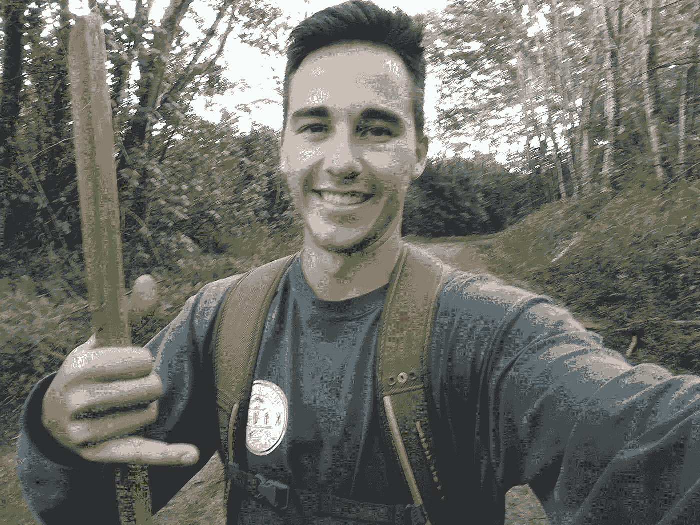

# 不要轻信沉没成本谬论

> 原文：<https://medium.com/hackernoon/dont-be-a-sucker-for-sunk-cost-fallacy-a4f5ffe9ce4f>

**沉没成本谬误**

沉没成本谬误是指你不基于未来价值做决定，而是基于你已经投资的东西。如果你处在同样的情况下，理性上你会改变，但是因为你已经投入了一些努力或价值去实现它，你会继续走这条路。

**我今天上当了**

今天早上我在考艾岛徒步旅行。我们的预定目的地是瓦里阿勒蓝洞。

Weeping Wall — [Hawaii Guide](https://www.hawaii-guide.com/kauai/hiking_trails/waialeale_blue_hole_hike)

我们在远足的早期拐错了一个弯，最后走上了一条很少人走的小路。由于断断续续的雨，小径泥泞不堪，由于缺少行人，小径杂草丛生。

There’s a trail there somewhere

我们没有看到小径描述中提到的任何地标，但我们开始为继续前行的决定寻找理由。也许我们要找的门是隐喻性的？我们已经走了 1.5 英里，也许如果我们再绕几个弯，我们就能看到地标了？

我们已经投入了努力，我们陷入了沉没成本谬论，即使我们知道我们可能没有走上正确的道路。我们又继续走了半英里，然后转身徒步往回走。

如果我们从一开始就怀疑这条路是错的，我们会立即掉头去检查邻近的路，但是因为我们已经投入了努力，我们做出了不理智的决定。

On The CORRECT Path

**将此应用于商业**

作为一家软件公司，Pivoting 在今天如此普遍，几乎被视为一种通行的权利。

过于关注你已经建立的或者你之前已经规划好的，会导致你继续走在错误的道路上。

当我第一次构建[云活动](https://cloudcampaign.io)时，它是一个完全围绕“触发器”构建的社交媒体发布工具。你可以根据特定的天气限制或者与你公司相关的术语是否有趋势，自动发布到社交媒体上。

当人们对这个想法感兴趣时，很明显最初的几百个用户不确定这个产品是否真的为他们解决了问题。

收到这个反馈后，我们很快决定[转向](https://blog.cloudcampaign.io/2017/09/01/august-month-in-review/)更多地关注帖子的安排和回收。

自从转向之后，我们开始创造收入和维系客户。