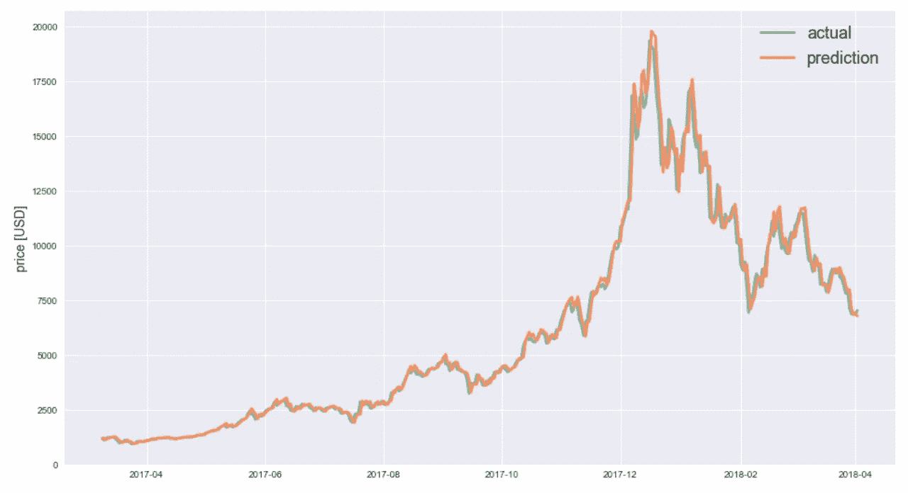
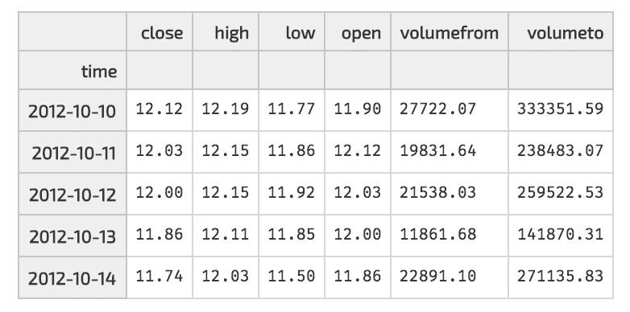
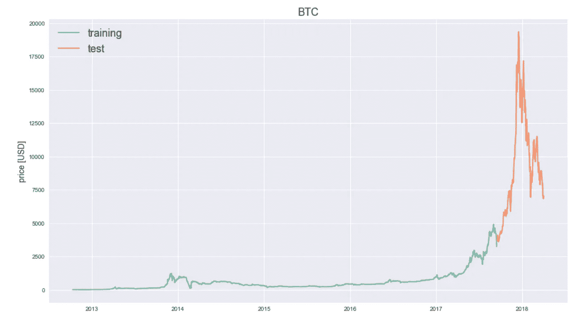
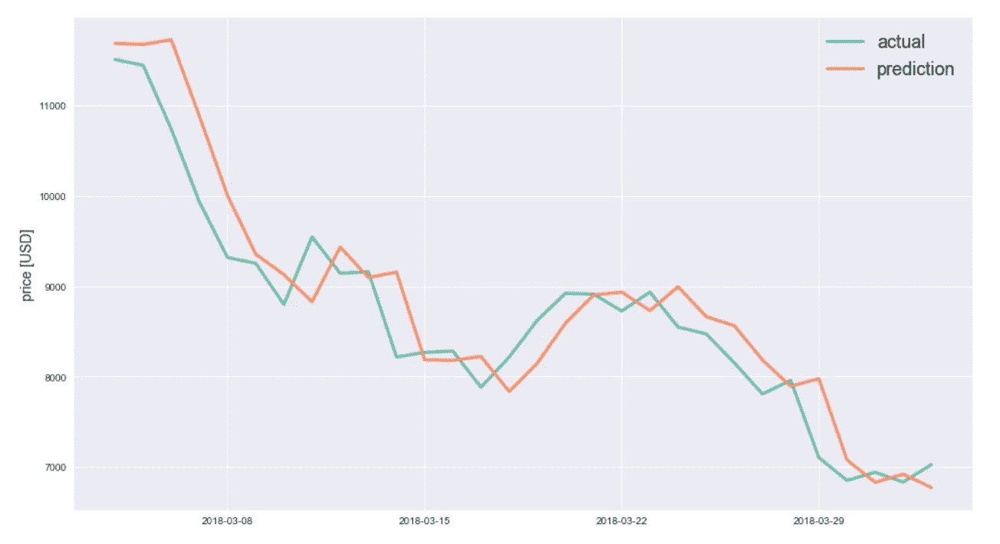
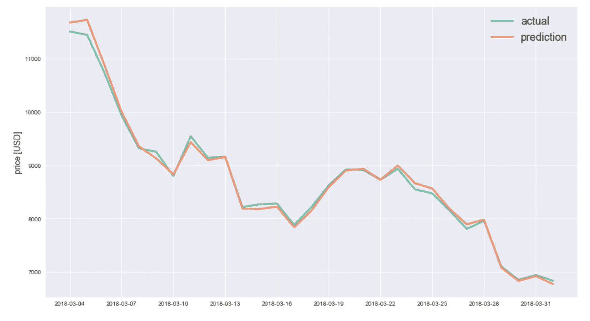
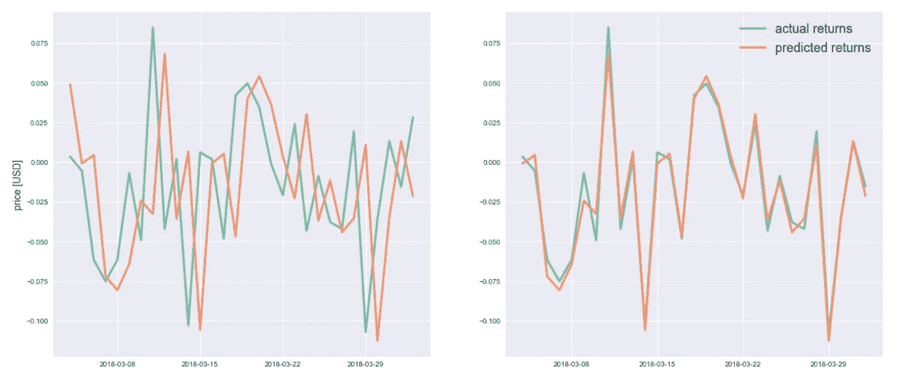
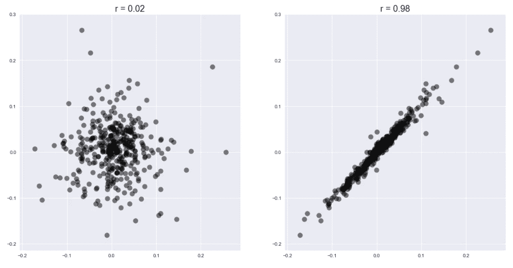

# 不要被愚弄-使用深度学习的欺骗性加密货币价格预测

> 原文：<https://medium.com/hackernoon/dont-be-fooled-deceptive-cryptocurrency-price-predictions-using-deep-learning-bf27e4837151>

## 为什么你应该谨慎对待神经网络交易

所以我建立了一个深度神经网络来预测比特币的价格——它惊人地准确。

好奇？

自己看预测结果。



看起来很准确，不是吗？

在你问之前:是的，上面的评估是在看不见的测试数据上执行的——只有先前的数据被用来训练模型(后面有更多细节)。

所以这是一台我可以用来致富的赚钱机器！

对吗？

事实上，我给你的是上述型号的[代码](https://github.com/neocortex/lstm-bitcoin-prediction)，这样你就可以自己使用了…

## 好的，*停在那里*。不要这样做。

我重复一遍:*不要做！*不要用来交易。

不要被骗了。

这些结果完全是骗人的。

让我解释一下。

# 好得难以令人相信

在过去的几周和几个月里，我遇到了许多文章，它们采取了与这里介绍的方法类似的方法，并显示了类似于上面的加密货币价格预测图。

价格预测看似惊人的准确性应该会立即敲响警钟。

这些结果显然好得令人难以置信。

> "当一件事看起来好得不真实时，它通常是真实的."—艾米·罗森

在下面，我想证明为什么会这样。

不要误解我——我的意图不是要破坏那些文章中的工作。他们是好的，应该得到掌声。事实上，这些方法中有许多是非常精确的——从技术上讲*。*

*本文的目的是揭示为什么这些模型在实践中是错误的，以及为什么它们的预测不一定适合在实际交易中使用。*

*那么到底为什么会这样呢？让我们仔细看看。*

# *使用 LSTMs 预测比特币的价格*

*为了解释，让我带你看一个例子，构建一个多维[长短期记忆(LSTM)](https://en.wikipedia.org/wiki/Long_short-term_memory) 神经网络来预测比特币的价格，产生你在上面看到的预测结果。*

*LSTMs 是一种特殊的[递归神经网络(RNN)](http://karpathy.github.io/2015/05/21/rnn-effectiveness/) ，特别适用于时间序列问题。因此，当试图预测加密货币价格和股票市场时，它们变得很受欢迎。*

> *对于 LSTMs 的深入介绍，我推荐[这篇](http://colah.github.io/posts/2015-08-Understanding-LSTMs/)和[这篇](http://blog.echen.me/2017/05/30/exploring-lstms/)文章。*

*对于 LSTM 的当前实现，我使用了 Python 和 Keras。*(在我的 Github* *上可以找到对应的 Jupyter 笔记本，代码完整* [*)。)*](https://github.com/neocortex/lstm-bitcoin-prediction)*

## *1.获取数据*

*首先，我获取了历史比特币价格数据(你也可以对任何其他加密货币这样做)。为此，我使用了来自 [cryptocompare](http://www.cryptocompare.com) 的 API:*

```
*import json
import requests
import pandas as pdendpoint = 'https://min-api.cryptocompare.com/data/histoday'
res = requests.get(endpoint + '?fsym=BTC&tsym=USD&limit=2000')
hist = pd.DataFrame(json.loads(res.content)['Data'])
hist = hist.set_index('time')
hist.index = pd.to_datetime(hist.index, unit='s')
hist.head()*
```

**

*A snapshot of historic Bitcoin price data.*

*瞧，过去 *2000* 天的历史每日 BTC 数据，从*2012–10–10*到*2018–04–04*。*

## *2.列车测试分离*

*然后，我将数据分成*训练*和*测试*组。我使用了数据的最后 *10%* 进行测试，将*2017–09–14 上的数据进行拆分。*此日期之前的所有数据用于训练，此日期之后的所有数据用于测试训练好的模型。下面，我绘制了我们数据框架的`close`列，这是我打算预测的每日收盘价。*

```
*def train_test_split(df, test_size=0.1):
    split_row = len(df) - int(test_size * len(df))
    train_data = df.iloc[:split_row]
    test_data = df.iloc[split_row:]
    return train_data, test_datadef line_plot(line1, line2, label1=None, label2=None, title=''):
    fig, ax = plt.subplots(1, figsize=(16, 9))
    ax.plot(line1, label=label1, linewidth=2)
    ax.plot(line2, label=label2, linewidth=2)
    ax.set_ylabel('price [USD]', fontsize=14)
    ax.set_title(title, fontsize=18)
    ax.legend(loc='best', fontsize=18)train, test = train_test_split(hist, test_size=0.1)
line_plot(train.close, test.close, 'training', 'test', 'BTC')*
```

**

*Train-test split of historic Bitcoin price data*

## *3.构建模型*

*为了训练 LSTM，数据被分成`7`天的窗口(这个数字是任意的，我在这里简单地选择了一周),并且在每个窗口内，我将数据归一化为*零基数*，即每个窗口的第一个条目是`0`,并且所有其他值表示相对于第一个值的变化。因此，我预测价格*变化*，而不是绝对价格。*

```
*def normalise_zero_base(df):
    """ Normalise dataframe column-wise to reflect changes with
        respect to first entry.
    """
    return df / df.iloc[0] - 1def extract_window_data(df, window=7, zero_base=True):
    """ Convert dataframe to overlapping sequences/windows of
        length `window`.
    """
    window_data = []
    for idx in range(len(df) - window):
        tmp = df[idx: (idx + window)].copy()
        if zero_base:
            tmp = normalise_zero_base(tmp)
        window_data.append(tmp.values)
    return np.array(window_data)def prepare_data(df, window=7, zero_base=True, test_size=0.1):
    """ Prepare data for LSTM. """
    # train test split
    train_data, test_data = train_test_split(df, test_size)

    # extract window data
    X_train = extract_window_data(train_data, window, zero_base)
    X_test = extract_window_data(test_data, window, zero_base)

    # extract targets
    y_train = train_data.close[window:].values
    y_test = test_data.close[window:].values
    if zero_base:
        y_train = y_train / train_data.close[:-window].values - 1
        y_test = y_test / test_data.close[:-window].values - 1 return train_data, test_data, X_train, X_test, y_train, y_testtrain, test, X_train, X_test, y_train, y_test = prepare_data(hist)*
```

*我使用了一个简单的神经网络，它有一个由`20`神经元组成的 LSTM 层，一个`0.25`的漏失因子，一个具有单个*线性*激活函数的密集层。此外，我使用*平均绝对误差(MAE)* 作为损失函数和 *Adam* 优化器。*

*我用批量大小为`4`的`50`个时期来训练网络。*

> *注意:网络架构和所有参数的选择是任意的，我没有对它们进行优化，因为这不是本文的重点。*

```
*def build_lstm_model(input_data, output_size, neurons=20,
                     activ_func='linear', dropout=0.25,
                     loss='mae', optimizer='adam'):
    model = Sequential() model.add(LSTM(neurons, input_shape=(
              input_data.shape[1], input_data.shape[2])))
    model.add(Dropout(dropout))
    model.add(Dense(units=output_size))
    model.add(Activation(activ_func)) model.compile(loss=loss, optimizer=optimizer)
    return modelmodel = build_lstm_model(X_train, output_size=1)
history = model.fit(X_train, y_train, epochs=50, batch_size=4)*
```

## *4.结果*

*使用经过训练的模型对遗漏的测试集进行预测，我们获得了本文开头所示的图表。*

**

*那么这些结果到底有什么问题呢？*

*为什么不应该用这个模型进行实际交易呢？*

*让我们仔细看看，放大到剧情的最后 *30* 天。*

```
*targets = test[target_col][window:]
preds = model.predict(X_test).squeeze()
# convert change predictions back to actual price
preds = test.close.values[:-window] * (preds + 1)
preds = pd.Series(index=targets.index, data=preds)n = 30line_plot(targets[-n:], preds[-n:], 'actual', 'prediction')*
```

**

*看到了吗？*

*你可能已经猜对了，这个模型的根本缺陷是*对于某一天的预测，它主要是使用前一天的值。**

***这条预测线似乎只不过是实际价格的一个变化版本。***

*事实上，如果我们调整预测，将它们移动一天，这个观察结果会变得更加明显。*

```
*line_plot(targets[-n:][:-1], preds[-n:].shift(-1))*
```

**

*如您所见，我们突然观察到实际数据和预测之间几乎完美匹配，这表明模型实际上是在学习前一天的价格。*

*这些结果正是我在许多使用 LSTMs 单点预测的例子中看到的。*

*为了使这一点更清楚，让我们计算模型预测的预期*回报*，并与实际回报进行比较。*

```
*actual_returns = targets.pct_change()[1:]
predicted_returns = preds.pct_change()[1:]*
```

*查看实际和预测的回报，无论是原始形式还是应用了 *1 个工作日的*后，我们都得到了相同的观察结果。*

**

*Actual and predicted returns. In the left plot predictions are adjusted by a day.*

*实际上，如果我们计算原始预测和按日调整的实际和预测收益之间的相关性，我们可以得出以下结论:*

```
*fig, (ax1, ax2) = plt.subplots(1, 2, figsize=(18, 9))# actual correlation
corr = np.corrcoef(actual_returns, predicted_returns)[0][1]
ax1.scatter(actual_returns, predicted_returns, color='k')
ax1.set_title('r = {:.2f}'.format(corr), fontsize=18)# shifted correlation
shifted_actual = actual_returns[:-1]
shifted_predicted = predicted_returns.shift(-1).dropna()
corr = np.corrcoef(shifted_actual, shifted_predicted)[0][1]
ax2.scatter(shifted_actual, shifted_predicted, color='k')
ax2.set_title('r = {:.2f}'.format(corr));*
```

**

*从上面的图中可以看出，实际回报和预测回报是不相关的。只有在对预测应用了 *1 天移位*之后，我们才能获得与实际比特币数据的回报高度相关的回报。*

# *摘要*

*这篇博文的目标是解决我在过去几个月中遇到的许多使用深度神经网络预测加密货币和股票市场价格的例子——这些例子采用了与这里使用的方法类似的方法:使用历史价格数据实现 LSTM 来预测未来的结果。我已经证明了为什么这些模型不一定适用于实际交易。*

*是的，网络能够有效地学习。但它最终使用了一种策略，在这种策略中，预测一个接近前一个值的值在最小化平均绝对误差方面被证明是成功的。*

*然而，无论预测在损失误差方面有多准确，在实践中，仅基于*历史价格数据*的单点预测模型的结果仍然很难实现，并且对交易不是特别有用。*

*不用说，实现价格预测有用的 LSTMs 的更复杂的方法可能确实存在。使用更多数据以及优化网络架构和超参数是一个开始。然而，在我看来，除了历史价格之外，整合数据和特征还有更大的潜力。毕竟，金融界早就知道“[过去的表现不是未来结果的指标](http://www.businessinsider.com/mutual-fund-performance-persistence-2014-7?IR=T)”。*

*加密货币可能也是如此。*

**免责声明:这不是财务建议。这篇文章和给出的模型仅用于教育目的。不要用它来交易或做投资决定。**