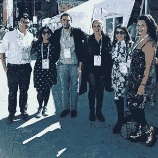
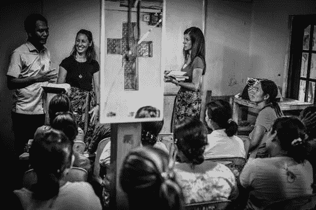

# 不要被误导大数据如何产生社会影响|与约翰·霍普斯金就可黑客项目的对话

> 原文：<https://medium.com/hackernoon/dont-be-misinformed-on-how-big-data-is-making-a-social-impact-conversation-with-john-hopkins-on-3d7c10471c24>

在福布斯 30 岁以下 30 人峰会上，我有幸见到了约翰·霍普金斯彭博公共卫生学院的生物统计学家凯文·奎奇。我们不仅能听到出色的会议发言人的声音并向他们学习，还能参与一些精彩的对话。我想写一篇关于我们谈论的主题之一的更详细的帖子:**大数据。**

Kevin Quach, Biostatistician at Johns Hopkins Bloomberg School of Public Health

作为公民黑客马拉松的组织者，我知道这个词经常被提起，我也目睹过人们在各种对话中谈论它时茫然的眼神。

所以我们来分解一下。

我知道你刚刚在谷歌上搜索了一下，所以这里有一个定义:*“可以通过计算分析来揭示模式、趋势和关联的极大数据集，尤其是与人类行为和互动相关的数据集。”*

Forbes 30 Under 30 2017

# 但是我通过例子和提问来学习，所以让我们向 Kevin 寻求一个更全面的答案来帮助我们所有人理解。

**凯文:**首先，本文表达的观点仅代表我个人，并不一定代表约翰·霍普金斯大学的观点。

对我们来说听起来很棒！那么首先，“大数据”到底是什么？我知道有各种各样的定义…

凯文:谢谢你邀请我投稿。我很高兴就这个话题提供我的想法。

**大数据**是近年来为公众创造的一个流行词，用来描述计算能力的革命，以收集和存储大型数据集，并筛选这些数据，及时为我们提供见解。数据收集方法也变得更加精细，我们可以获得关于单个观察的许多特征的信息。

从历史上看，我们可以做这样或那样的事情，但从来没有一起有效地做过。这让我们想到了下一点，我们也可以使用 Hadoop 和 Spark 等框架以低成本实现这种数据分析。此外，所有这些都可以根据您需要的规模进行扩展。小项目？出租一台服务器。大项目？多租出去就是了。

还有另一个数据类型的元素。我们通常认为数据是结构化的，即想象一下您在 Excel 表格中会看到什么。但是，我们也有很多非结构化形式的数据，例如来自 Twitter 的文本数据或来自心律的声音数据。

**Kevin:** 例如，亚马逊 Alexa 可以理解你的信息，因为它对英语中使用的单词和语法进行了大量的训练。

我们还可以通过使用卷积神经网络(深度学习技术)来分析心音来检测异常心律！

总之，我们现在可以收集数据、分析数据，并以经济高效的方式实施所有这些，以便更快地为您的问题提供解决方案。大型数据集的分析在盈利和非盈利领域变得越来越重要，因为今天的普通人都完全投入到可以存储和传输用户信息的移动设备中，以增加不断增长的数据世界。

# 通过使用大数据对社会产生积极影响，正在发生的 3 件新的酷事是什么？

总的来说，随着数据可用性的增加，我们可以做很多事情。案例研究表明，数据驱动的创新可以对以下方面产生积极的社会影响:

1.  改善患者护理
2.  更好的环境保护
3.  提高对改善公共效率低下的认识

**改善患者护理**

**凯文:**[个性化健康倡议](https://rising.jhu.edu/inhealth)旨在与科学家、工程师和医生合作，整合来自不同大型数据库的大数据，包括临床信息、基因和分子患者数据以及成像，以改变我们提供医疗保健的方式。

使用来自数千名健康状况相似的患者的比较数据，医生可以清楚地了解治疗方案和预后的风险，以提供适当的治疗或预防措施。这是一次真正的跨学科合作，参与者来自约翰·霍普金斯医学院、公共卫生学院、工程学院、艺术与科学学院以及护理学院

**更好的环保**

凯文:在过去的一年里，美国遭受了许多极端天气事件的袭击。波多黎各的玛丽亚飓风具有毁灭性，促使公民转移到其他地方寻求庇护。

使用谷歌定位服务、麻省理工学院媒体实验室和谷歌公司收集的实时匿名数据，发现在飓风玛丽亚袭击的前一天，离开波多黎各的活动增加了 20%，特别是奥兰多、迈阿密、纽约和亚特兰大。波多黎各人已经慢慢离开，离开的人比到达的人多。

Puerto Rico | Pexel Gallery

此外，由于飓风对当地基础设施和服务的破坏，波多黎各人的流动性已经下降。作者解释说，这是一个研究人道主义危机事件以来人类行为的机会。

从这项工作中获得的知识可以用来更好地理解如何在未来事件中[分配资源。](https://vector.childrenshospital.org/2017/11/cellphone-data-hurricane-maria-impact-puerto-rico/)

**提高公民对改善公共效率低下的认识**

**Kevin:** 美国许多城市正在使用从无家可归者的服务上收集的数据来追踪他们的行动和行为。目标:确定创造更好的住房解决方案的关键组成部分。

在纽约市，数百人每天与无家可归的人一起工作，并通过 StreetSmart 应用程序收集他们互动的数据。这改善了对数以千计无家可归者的跟踪和外展工作者之间的沟通，以便更好地提供直接援助。

芝加哥联盟有一个庞大的匿名的、个人级别的数据集，包括过去 15 年中从无家可归者信息管理系统获得帮助的任何人。芝加哥大学的一个团队已经应用他们的数据科学技能来学习[可视化无家可归者的移动和预测住房稳定性](https://dssg.uchicago.edu/2014/08/20/tracking-the-paths-of-homelessness/)。

# 关于大数据将如何产生社会影响，有什么有趣的想法吗？我知道这是一个有内涵的问题。

**大数据并不完美**

**Kevin:** 大数据是革命性的，但也有陷阱。我们经常混淆相关性和因果性之间的关系，我们应该以适度的怀疑态度来检查研究结果，并对数据收集和分析方法中的偏见持批评态度。很多时候，许多假设是在没有适当考虑其有效性的情况下做出的。

其中比较值得注意的是 2016 年美国总统选举期间的选举预测。使用历史池和最近的民调数据，大多数主要的投票预测机构(FiveThirtyEight、纽约时报、普林斯顿选举联盟)认为克林顿夫人获胜的可能性为 70%至 99%。

另一个例子是谷歌流感趋势，它根据流感相关的搜索词跟踪流感爆发，并可以在疾控中心的数据之前估计流感的流行程度。然而，他们的估计错过了 2013 赛季的高峰，该倡议很快被取消。

**现在怎么办？组合数据集**

Kevin: 我认为这是一个很好的问题，可以引导您进入一个有趣的数据科学项目！随着当今时代的发展，城市发展的一个重要方面是，你所在城市的数据集可以在网上公开获取。

**1。查看当前开放的数据门户:**

[巴尔的摩公开赛数据](https://data.baltimorecity.gov/)

[奥斯汀公开数据](https://data.austintexas.gov/)

**2。考虑组合不同的数据集，使用** [**美国人口普查 Dat**](https://www.census.gov/data.html) **a 或**[**ka ggle**](https://www.kaggle.com/datasets)**。**

让自己习惯于使用“ggplot”或“传单”在地图上绘制数据点。

例如，你可以将美国人口普查数据与 Zillow 的经济学数据结合起来，了解你所在城市的住房市场的人口统计数据！

或者，你可以调查环保署记录的[环境因素是如何导致西雅图](https://aqs.epa.gov/aqsweb/airdata/download_files.html)降雨的。

你也可以在 Devpost 上查看以前的想法，比如[重击 2016](https://whack2016.devpost.com/submissions) 、[黑客公爵 2016](https://hackduke-2016.devpost.com/submissions) 。

# 太感谢你了，凯文！

现在，我希望我们能够在这一术语上有所启发，并激发更多人利用我们可以利用大数据的潜力。2018 年你会带什么项目给我们大家来黑？

**不要脸的插头:ATX 黑客换改变，奥斯汀的年度公民黑客马拉松进入第六年，项目提交******现已开放。我们黑吧！****