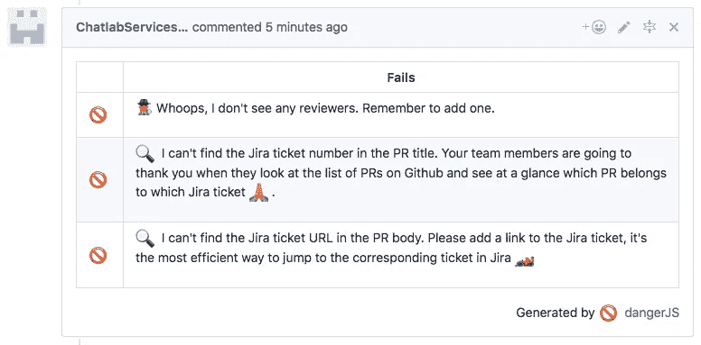
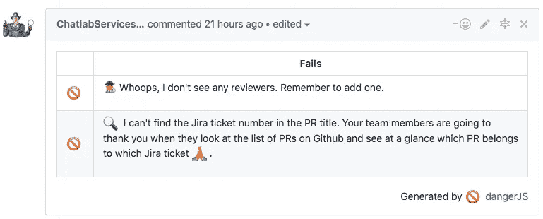
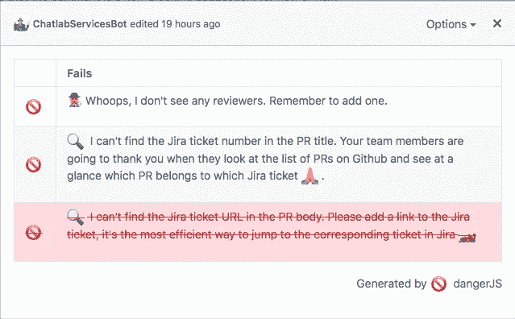

# 不要在拉式请求评审中扮演坏警察——让软件来完成这项工作

> 原文：<https://medium.com/hackernoon/dont-be-the-bad-cop-in-pull-request-reviews-let-software-do-that-job-1eb9e574c2d1>

## 并努力庆祝成就！


Credit: [Internet](https://nerdist.com/tv-cap-inspector-gadget-on-netflix-ducktales-is-back-lady-gaga-in-american-horror-story-more/)

访问 http://www.mikenikles.com 的[](http://www.mikenikles.com/)****获取我的最新博文。****

**你上一次审查一个 pull 请求并提醒作者添加一个链接到你的 bug 跟踪系统是什么时候？添加一个缺失的标签怎么样？也许您找到了一个未设置审阅者/受托人的公开 PR。**

**我肯定有过这样的经历，很长一段时间，当我写下这样的评论时，我并没有想太多。有时，我甚至没有留下评论，只是简单地修复它。直到几年前我开始正式领导工程团队时，我才开始关注我自己的，也关注我的团队在工作中的生产力和整体幸福感。**

# **虚构的吉米不断告诉我该做什么**

**谁是虚构的吉米？可能是任何人，通常是高级工程师或已经在公司工作了一段时间的人(我曾经是，可能现在仍然是虚构的吉米，对不起团队！).就是这个人给公关添加评论，比如“请在公关标题中提到 bug ticket #”或者如果你在一个不太友好的环境中，比如“缺少到吉拉的链接！”或者“标签！”。**

**虚构的吉米是好意，他真的是。不幸的是，新团队成员或工作经验较少的人可能不理解这一点。看，一些在软件行业工作多年的人理解一致性、定义良好的过程的重要性，以及在一定程度上需要挑剔。这是我们随着时间慢慢建立起来的理解。**

**对于收到这样反馈的作者来说，这可能没什么大不了的——起初……但随着时间的推移，我真的相信人们开始对这样的评论感到消极。这导致了完全不必要的紧张，没有人谈论。**

**那么，我们能做些什么呢？**

# **救援的危险**

> **危险在您的 CI 过程中运行，并给团队机会自动化常见的代码审查杂务。**
> 
> **这为您的构建提供了另一个逻辑步骤，通过这种危险可以帮助您在日常代码审查中轻松完成机械任务。**
> 
> **你可以用危险来规范你的团队。让人类去思考更难的问题。**
> 
> **这是由于根据您用 JavaScript 或 TypeScript 创建的规则将消息留在 PRs 中的危险。**
> 
> **随着时间的推移，随着规则的遵守，消息被修改以反映代码评审的当前状态。**

**这是取自 Danger[网站](http://danger.systems/js/)的官方描述。我最近花了一点时间来安装和配置危险。他们的[入门](http://danger.systems/js/guides/getting_started.html)指南包含您需要的信息。或者，将`danger`作为依赖项添加到您的项目中，并运行`yarn danger init`或 NPM 的等效命令。它是一个交互式命令行工具，引导您完成安装过程。不到半个小时。**

> **在我继续之前，让我澄清一下，Danger(就像虚构的 Jimmy)在拉请求中添加了注释，以提醒人们他们忘记做的事情，他们可以对拉请求进行改进，等等。我相信来自人类和软件的信息在心理上的差异会产生很大的不同。此外，随着你继续阅读，你会看到，当人们做得好的时候，我们可以用某种方式使用危险来做出鼓励和激励的评论——甚至自动化一些常见的任务！**

## **我们最初的`dangerfile.js`**

## **对持续集成的更改**

**在大多数情况下，这就像在您的管道中添加`yarn danger ci`一样简单。危险网站有许多 CI 系统的[示例](http://danger.systems/js/guides/getting_started.html#setting-up-danger-to-run-on-your-ci)。**

## **导致拉取请求**

**作为设置过程的一部分，您将创建一个危险机器人用户。当`yarn danger ci`运行时，用户将结果作为对拉请求的注释发布。**

****

**Danger results posted as a PR comment**

**假设我修复了最后一个问题，并将票证 URL 添加到 PR 主体中。下次`yarn danger ci`运行时，它会更新现有的注释。**

****

**注意到编辑过的*下拉菜单了吗？这是 Github [引入](https://blog.github.com/changelog/2018-05-24-comment-edit-history/)的新功能，它与 Danger 更新自己评论的方式非常契合。***

****

**Danger’s comment edit history**

## **庆祝成就**

**正如你在我们的`Dangerfile.js`顶部看到的，我要求团队成员回顾[http://danger.systems/js/usage/culture.html](http://danger.systems/js/usage/culture.html)。这是对变得越来越重要的事情的一个很好的总结:团队快乐。**

**软件工程师面临一个又一个挑战，一个又一个死胡同。失败的测试、错误、性能和安全问题以及产品需求变更只是需要处理的几种情况。现在这里有另一个工具，它发布一个拉请求注释，并告诉我该做什么。为什么不用危险来庆祝成就呢？**

**让团队知道他们做得好。这是一个能走很长路的小姿态！一些想法:**

*   **删除的代码比添加的代码多。**
*   **一个开发者开了一个 PR 来改进文档。**
*   **有人修改了那段没人想碰的代码。**
*   **分享一个新的、随机的激励性引语怎么样，就像 Slack 加载它时所做的那样？**

# **但是等等，危险可以做的更多！**

**到目前为止，我们看了 Danger 分析公关的能力，让作者知道该做什么或庆祝他们的成就。**

**在阅读 [API 参考文档](http://danger.systems/js/reference.html)时，我注意到以下评论:**

```
// An authenticated API so you can extend danger’s behavior by using the [GitHub v3 API](https://developer.github.com/v3/).
```

**它可以在`danger.github.api`获得，并提供了大量的功能，在[这里](https://octokit.github.io/rest.js/)有详细的说明。**

**在我们的例子中，[我们有一个包含 NPM 包和服务的 monorepo](https://hackernoon.com/one-vs-many-why-we-moved-from-multiple-git-repos-to-a-monorepo-and-how-we-set-it-up-f4abb0cfe469) 。为了直观地显示拉请求修改了什么，我们为每个包和服务添加了标签。PR 的作者应该为他们修改的每个包和服务添加一个标签。**

**我从一开始就知道，我不能要求我的团队手动完成这项工作。如果我写的代码和我的团队写的一样多，我就不会想去做，所以我为什么要让他们去做呢？**

**有了危险，这现在可以自动化了！它总是同步的，没有人需要手动做任何事情。代码对于我们的回购结构来说过于具体，无法完整共享，但大致如下:**

```
// Get a list of all files in this PR
const allTouchedFiles = danger.git.created_files.concat(
  danger.git.modified_files,
  danger.git.deleted_files
)// Determine the unique packages / services that changed
const uniquePackagesAndServices = [/* Your way of figuring that out */]// Add labels
danger.github.api.issues.addLabels({
  labels: uniquePackagesAndServices
})
```

# **结论**

**有了危险，我们再一次自动化了小块重复的工作，这些工作曾经花费我们很多时间，或者在不同程度上造成了挫败感。我们甚至有一个工具来庆祝微小的成功，作为个人拉动请求的一部分。**

**对我来说最有希望的是`danger.github.api`,因为这为潜在的非常好的自动化过程打开了大门。**

**你使用危险吗？我很想看看你的`Dangerfile`，并了解你用它做什么。请在评论中告诉我。**

**👏 ❤️**