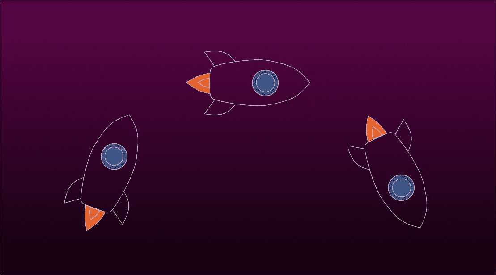

# 不要成为创业上瘾者！

> 原文：<https://medium.com/hackernoon/dont-become-a-startup-addict-4e2d5bb2c38e>

## 一个“创业狂人”的自白



我从哪里开始？

我想从一开始。

我从没想到事情会变得如此糟糕。

我想所有的上瘾都是如此…

# 向上

一切都是从毒品开始的，你知道的，很平常的东西。中型博客，休闲社区，聚会，产品搜索投票。没什么异常。

至少，我是这么想的。

我认为这是可控的，我想，嘿，做一点这种事情是可以的。每个人都这样。

但几周后，我不再满足。我发现自己想尝试更多，你知道，只是出于好奇。

所以我开始在上班的路上听 Y-Combinator 的播客。

在回来的路上。

只要我能挤出时间，真的。

当然，我意识到我开始花很多时间来启动公司。回想起来，我想正是在这一点上，它真正开始影响我的社交生活。还有我的家庭生活。一切真的。

但是我没办法。启动是如此该死的上瘾！我只是没有时间做生活中的其他事情。

在我知道之前，启动是我早上想到的第一件事，也是我睡觉前想到的最后一件事。中间大部分时间。

我怎么也看不够。所有关于赚钱的[学习](https://hackernoon.com/tagged/learning)资料和故事。感觉太棒了！

我完全否认了。

我应该就此打住，我应该走开，忘记我第一次尝试启动的那一天。

但我做了相反的事。

我做了不可思议的事。

我从一个用户变成了一个经销商。

**我创办了一家初创公司。**

# 超级用户

有几个月，我感觉好极了。

但是后来副作用开始了。

我开始睡得少了。少了很多。它对你来说，启动。它会改变你的睡眠模式。一旦你深陷创业，你就再也睡不好觉了。你只能半途而废，无法将启动的动力完全排出体外。

你只差一个松松垮垮的岗位就能再次创业。

当我和其他不像我一样沉迷于创业的人交谈时，我养成了一种傲慢的态度。我想我只是觉得他们不明白，他们不知道这到底有多强大。

我开始向人们“解释”激励、增长黑客技术、UX 和 UI 设计师之间的区别，以及产品市场契合度的实际含义。我确信他们都想知道。

我产生了一种贪得无厌的欲望，想要查看谷歌分析。好像，一直都是。

创业让我对未来产生了偏见，以至于我忘记了自己的过去和现在。

我开始通过创业护目镜来看待生活中的一切。你知道，就像啤酒护目镜，但当你兴奋起来而不是啤酒的时候。

每次我看我的鞋子，我看到的都是“鞋带”。

每次看到飞机起飞，我满脑子都是飞机还剩多少“跑道”。

# 该事件

当我有一张 Asana 票告诉我打电话给我的父母时，我应该已经看到它的到来，但是我一直把它移到 sprint backlog。

或者当我告诉我的女朋友，我们的关系是“垂直的”,我只是目前没有“带宽”。

甚至当我周五晚上去了解 Docker 和 AWS，而不是真正的人时。我的友谊小组变成了一个库伯内特集群。

然后有一天一切都变了。那是在 22 小时的创业狂欢之后，大部分时间都花在了编码上。我一点都不记得了。

他们说，当他们找到我时，我正在一个文本编辑器中输入废话，一个字一个字地提交给主分支。

他们说我还打开了另外两个应用。在 Slack 上，我给自己发了 150 次同样的图片。在谷歌分析上，我看着一个我甚至还没有启动的副业项目的分分钟页面点击率。

当我到达医院时，我是如此的茫然，以至于我以为医生是在用 Javascript 和我说话。我对她的唯一记忆是她对我说了这样的话

```
setTimeout(() => {return “to work”}, 2019);
```

谁知道这意味着什么。

几周后，我回到了父母家。我经历了两周的创业退缩期，开始重新找回自我。我在附近散步，在一棵古老的七叶树下的秋叶中，在一张著名的长椅上停下来休息。

在我的周围躺着光滑闪亮的棕色幼果，从它们尖尖的绿色壳中逃脱，就像它们几千年来每年秋天都做的一样。

在那一瞬间，我觉得自己重新校准回到现在，回到现实的一些表象。

现在我带着一个信息来到这里。

不要带启动。

*作者是* [*Pilcro*](https://www.pilcro.com) *的联合创始人，并且热爱创业！*