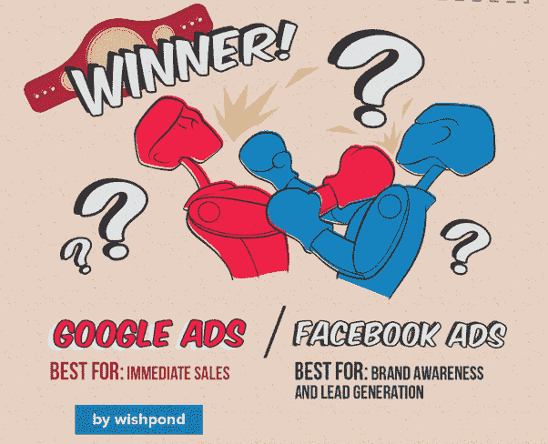
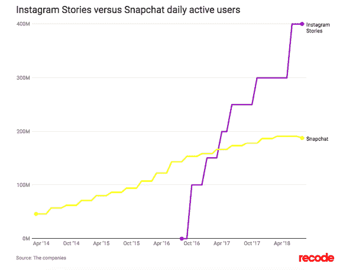
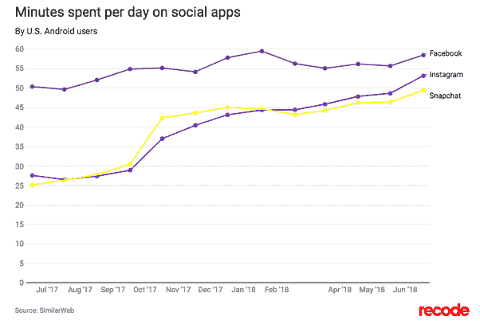
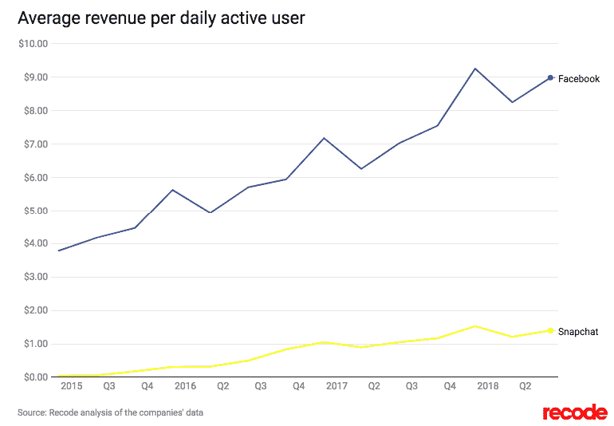

# 不要相信假新闻:只有脸书是脸书黑仔

> 原文：<https://medium.com/hackernoon/dont-believe-fake-news-only-facebook-is-the-facebook-killer-28ceb2b54ec8>

## 就目前的情况来看，我认为没有人能够动摇国王的宝座。至少不足以让扎克皱眉。


(Credit : [Sports Illustrated](https://www.si.com/mlb/2017/09/15/yankees-todd-frazier-home-run-thumbs-down-celebration-video). The Yankees’ thumbs down celebration)

> 过去三年，我偶尔会看到一篇文章，吹捧 Snapchat 是脸书杀手。

我的回答一直都是一样的——“*耶没错！*

请不要搞错，我没有任何印象认为曾经存在一个不能被推翻的政权。企业界也不例外。不管我有多喜欢谷歌的产品、服务和它们的整体商业模式，我甚至不认为它们是不可替代的。微软设法逃脱被他们的牙齿皮肤吹走遗忘。所以，为什么我会对脸书有不同的感觉。当然，脸书是可以替代的，也许有一天会有一家公司能够推翻他们的霸主地位。但是从现在棋盘上的布局来看，我认为这种情况不会很快发生。


```
[**Originally published on Quora**](https://www.quora.com/Are-you-a-former-Facebook-user-or-someone-who-no-longer-uses-Facebook-frequently-Is-there-an-alternative-to-Facebook-that-you-like-better-Why-do-you-like-it-better/answer/Abhishek-Anand-1)Reproduced for HackerNoon. Some minor edits for improved readability.**The original question on Quora:**
Are you a former Facebook user, or someone who no longer uses Facebook frequently? Is there an alternative to Facebook that you like better? Why do you like it better?
```

我不再像以前那样使用脸书了。我每周可能会花几分钟在 facebook 上，大多数时候是因为脸书发给我的一些相关通知。

但我没有离开脸书去其他社交媒体平台。作为一名用户，我对脸书不再抱有幻想。


关于你提出的脸书之外还有什么选择的问题。在我看来，脸书的替代者是脸书本身——至少从我们今天的立场来看是这样的。

## FACEBOOK 给企业带来的价值

网络效应太强了，脸书作为用户获取和参与平台给企业带来的价值是无与伦比的。我仍然使用脸书(*或者更准确地说，我的团队使用*)来处理不同的业务，而且我认为这种情况不会很快改变。

在 Wishpond 做的一个数据练习中，它列出了脸书和谷歌在不同参数上的表现[【1】](https://www.quora.com/Are-you-a-former-Facebook-user-or-someone-who-no-longer-uses-Facebook-frequently-Is-there-an-alternative-to-Facebook-that-you-like-better-Why-do-you-like-it-better/answer/Abhishek-Anand-1#LAyam)，虽然他们都是各自领域的巨头，但最让我感兴趣的可以概括在这张图片中:



## FACEBOOK 对最终用户意味着什么

即使对最终用户来说，脸书也能够形成一个联系非常紧密的社区网络，并且这些年来一直保持着强大——尽管许多人试图颠覆它的地位。将新用户带到平台上是一项相对容易的任务，但要有一个强大的参与平台并相互参与的基础，并确保这个基础不仅在参与度上强大，而且在数量上强大——这是一项相当艰巨的任务。

如果你关注科技出版物，你会看到类似“Snapchat 夺走了脸书的青少年”这样的报道。基本上**所有这些故事**表明青少年更喜欢使用 Snapchat 而不是脸书。

对此我有三点要说:

1.  在过去的三年里，我一直在阅读这篇文章。所以，要么是脸书继续失去青少年，然后又恢复他们，要么是媒体出版物患有短期记忆丧失症，忘记他们每年都这么说。
2.  如果这个故事像每年出现的那样“可靠”，我们就不会看到 Snap 的起伏——这是过去几个月里发生的事情。
3.  即使与脸书通常提供的内容相比，青少年更喜欢“T5”短时间的视觉内容——我可以理解这是真的，脸书的青少年人口统计正在被 Snapchat 和 Instagram 夺走。现在，(a) Instagram 归脸书所有，它也在被货币化。因此，这并不是致命的打击，而且(b) Instagram 在过去几年中的使用量不断增加会告诉你，无论脸书被 Snapchat 抢走了多少用户，它都能够夺回一些在 Instagram 上失去的地盘。我强烈怀疑这种趋势会持续下去。

此外，我想我应该提到，虽然 Snapchat 发展强劲，但 Instagram 并没有受到重创。per 说，Instagram 不需要拯救。它过去是，现在也一直是任何希望建立追随者的人的首选平台。如果说有什么不同的话，人们过去会花很多精力来建立和维护他们的 Instagram 角色。Snapchat 更加即时，通过 Instagram stories(和脸书 stories)，脸书将这一功能添加到其产品中；用户们欢欣鼓舞。看看“Instagram stories”相对于 Snapchat 的增长是如何随着时间的推移而发展的。



此外，这是这些平台的参与度。



正如你所注意到的，脸书和 Instagram 的排名再次高于曾经被吹捧的脸书杀手 Snapchat 脸书和 Instagram 都归脸书所有。

然后就是 ARPU[【2】](https://www.recode.net/2018/8/7/17661756/snap-earnings-snapchat-q2-instagram-user-growth)。让我们也来看看这个。毕竟，企业从事的是赚钱的业务。



首先，这是一个相当大的差距。如果你考虑到 Snapchat 脸书在 DAU 方面领先多少，这种差异的幅度会放大很多倍。当然，Snapchat 仍处于相当初级的阶段，他们有很多时间来强化他们的 rev 模型，不要忘记，即使他们在 DAU 落后于脸书，他们的 DAU 仍是每个创业公司的梦想。但是，即使 Snapchat 考虑了所有这些因素，它甚至还没有开始接近给脸书一个“*足够真实的*”冠军之战。

我想我会停止我的案子。


# **脚注:**

[【1】](https://www.quora.com/Are-you-a-former-Facebook-user-or-someone-who-no-longer-uses-Facebook-frequently-Is-there-an-alternative-to-Facebook-that-you-like-better-Why-do-you-like-it-better/answer/Abhishek-Anand-1#cite-LAyam)[【信息图】谷歌 AdWords vs 脸书广告](https://blog.wishpond.com/post/106238043028/infographic-google-adwords-vs-facebook-ads)

[【2】Snapchat 为什么在缩水](https://www.recode.net/2018/8/7/17661756/snap-earnings-snapchat-q2-instagram-user-growth)


*原载于*[*www.quora.com*](https://www.quora.com/Are-you-a-former-Facebook-user-or-someone-who-no-longer-uses-Facebook-frequently-Is-there-an-alternative-to-Facebook-that-you-like-better-Why-do-you-like-it-better/answer/Abhishek-Anand-1)*。*


# 今天到此为止。明天见！


```
[**Twitter**](http://twitter.com/@abyshake) **|** [**Facebook**](http://facebook.com/abyshake) **|** [**Quora**](http://bit.ly/abyshake) **|** [**LinkedIn**](http://in.linkedin.com/in/abyshake) **|** [**E-mail**](mailto:mail@abyshake.com)
```

[](https://upscri.be/a5ccb9/)

Click here to join the mailing list