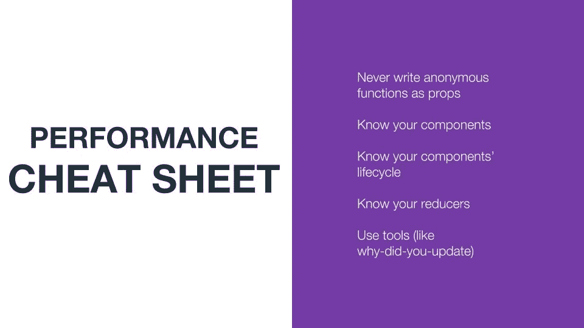

# (不)归咎于 React Native

> 原文：<https://medium.com/hackernoon/dont-blame-it-on-react-native-2eb0be3000b6>

**摘要**
把我们生活中的一切错误归咎于[反应](https://hackernoon.com/tagged/react)当地人总是很有趣。然而，我们一次又一次地发现，在大多数情况下，编写性能更好的 react 代码可以修复我们的应用程序的性能和落后的 UI 问题。

**Part 1 —责备 React Native**
我的故事要从三年前说起，当时 React Native 在 0.12 版本的时候，甚至还不支持 android！我们刚刚在我的公司([wix.com](https://www.wix.com))做出了一个重大决定，孤注一掷，在 react native 上孤注一掷，只用 react native 编写我们的主要应用程序，尽可能少用原生代码。你看，Wix 是一家网络公司。我们有数百名前端开发人员在开发数十种产品。对我们来说，为 ios 和 android 重新编写这些产品太痛苦了。我们看到了 react native 的潜力，并努力去做。
往前跳两年，我们现在有了一款适用于 android 和 ios 的令人惊叹的应用。我们正在为 react native 编写和维护几十个[开源库](https://github.com/wix)和数千个 stars，我们有大约 60 名开发人员不断为 Wix 应用贡献代码。

尽管 react native 自 0.12 版本以来已经有了很大的改进，但事情并不像他们经常描述的那样美好。如果你曾经写过一个真实的、复杂的、流量很大的 react 原生应用，那么你应该知道我在说什么。
归结起来就是这两张图片:

When I think about React Native I want to…

But eventually I just…

我不想撒谎，react native 给了你一个简单的方法(如果你是一个前端开发人员)来编写原生应用，**编写 react native 不是在公园散步。**

这很难，因为反应自然…

*   在本机 API 上添加一个抽象层
*   表演糟透了
*   是单线程
*   使得在常规的本地应用中很容易完成的事情变得很困难(比如高效的长列表)
*   构建更加复杂

这里有一个引语，每个 RN 开发人员都至少对自己说过或想过一次

> **" *对于一个真正高性能的应用来说，我们唯一的选择就是编写一个纯粹的原生应用* "
> -一个 *ny react 原生开发者***

虽然这确实是一个选项，而且可能是一个有效的选项，但这取决于您的用例。我声称它不是唯一的一个！

**第二部分——啊哈时刻**

大约一年前，我们对应用程序进行了大量性能改进。一次又一次，一个又一个错误，一个又一个问题，我们发现有了性能更好的 javascript 和 react 代码，我们可以解决大多数问题。这是我的“啊哈时刻”。它改变了我的生活。

What if I told you we can solve 90% of the problems in javascript

让我们通过一些代码片段和案例研究来演示这一点。

***问题# 1——发送按钮启用/禁用***

*Send button enable / disable*

我们的应用程序的一部分包括一个聊天模块，所以网站所有者可以在他们的网站上与访问者交谈。功能超级简单。有一个输入框和一个“发送”按钮。当输入为空时应禁用该按钮，当输入不为空时应启用该按钮。所发生的是，在用户开始输入之后，大约过了一秒钟(有时甚至更久)按钮才被激活。

我们发现我们呈现了整个聊天室列表，即使我们在一个单独的聊天室屏幕上。发生这种情况是因为在任何其他聊天室发生变化后，我们为每个聊天室创建了一个新的**聊天室对象**。对我们来说，这听起来可能是一个可怕的错误，但是当以功能性的方式写作时，它看起来是正确的，无害的。我们选择解决这个问题的方法是使用记忆化来保存未改变的聊天室。

***问题#2-消息延迟到达***

我们解决的第二个问题是聊天信息实时显示的速度很慢。这里有两个视频(之前和之后)展示了这个问题。

Before

After

正如你所看到的，这两个版本有很大的不同。问题是*componentWillReceiveProps*被调用*方式*太多次。每次调用它时，它都会触发一个新的渲染周期，因为调用了 *setState。*

***问题三——打字动画***

这个我很喜欢。我们非常有才华和创造性的设计师用一个超级光滑和花式打字动画挑战我们。就是那种泡泡头互相滑动，把前面的信息推上去，上下滑动，神奇地变成信息泡泡。你是知道的...任何前端开发人员的噩梦。:)起初，我们采用天真的方法，用动画计算 javascript 上的动画。好吧，那没用。由于动画的工作方式，当使用“useNativeDriver”标志时，您不能设置我们需要制作动画的属性，如“height”。这意味着所有的动画计算都是在 javascript 端完成的，这使得动画看起来非常滞后。在这里阅读更多关于为什么使用原生驱动[时不能改变高度的信息。](https://github.com/facebook/react-native/issues/13150)

然后我们说，等一下！React native 给了你用 native 做任何你想做的事情的承诺。我们照做了。我们试过本地的，但也很烂。虽然动画本身在本机上工作得非常顺利，但当我们试图将它嵌入到 react 本机控制的视图中时，我们遇到了麻烦。为什么？我们的动画的一部分包括改变动画部分的高度的容器，这反过来又改变了用 rn 编写的它的兄弟的布局。因此，我们又回到了起点。我们本来可以在原生面制作动画，但是我们需要告诉 RN 我们已经这样做了(改变了高度)。反过来，rn 需要在他只能在 javascript 线程上做的基础上做他的动画，因为和以前一样的问题。

就在放弃之前，我们发现可以使用 react native 的 [LayoutAnimations](https://facebook.github.io/react-native/docs/animations#layoutanimation-api) 来实现。

***问题# 4——模块加载时间***

最后一个想和大家分享的是一个简单的“需求 vs 导入”的故事。我们的应用程序由许多独立的模块组成。你可以把它想象成每个模块都有一个不同的包。我们发现，通过仅在需要时才要求导入语句来延迟导入语句，为我们节省了大量时间。我说的是跨应用的秒。

同样，我们所做的只是从文件顶部删除了“import”语句(您可能认为这是无害的),取而代之的是只在我们需要时才要求我们需要的东西。

**第 3 部分——这就是 javascript 和 react 的工作方式**

那么我到底在说什么呢？基本上，我想说的是，在这些情况下，react native 不应受到指责。这就是 javascript 和 react 的工作方式。由于 react native 桥和移动设备的低计算能力，在 react native 中更容易看到结果。

为了证明我的观点，我开始创建一个简单的 react web 应用程序，该应用程序的性能会很差，并且可以通过更改很少几行代码来修复(实际上只需要一行代码)。我把这个项目叫做*“好卡/坏卡”*。这是一个非常简单的 react 应用程序。它显示了一个卡片列表，总共 100 张，没有什么疯狂的。每张卡都有一个输入字段。在 bad 卡中，当您在输入字段中输入时，您可以看到 UI 中的延迟。键盘的反应不像你预期的那样。好卡工作完美。我已经把这个项目放到了 github 上，我鼓励你去看看。代码非常简单，只有一行代码就能产生巨大的效果。对于那些没有时间的人，你可以在这里查看两个版本:

*   [坏卡](https://ofirdagan.github.io/good-card-bad-card/dist/bad-card/)
*   [好牌](https://ofirdagan.github.io/good-card-bad-card/dist/good-card/)

**第 4 部分——由我们决定**

现在我们知道了这一切。我们能做些什么呢？这取决于我们。我们必须更加仔细和负责任地对待开发者。

我们可以通过遵循以下准则来做到这一点:

*   **了解您的关键应用程序流并持续监控它们**
    -只要您能确保您的关键应用程序流得到覆盖，并在性能下降时得到通知，您如何监控您的应用程序并不重要
*   **避免编写匿名函数作为道具**
    ——这些可能会产生巨大的影响
*   **了解你的组件**
    不要以为只写 *PureComponents* 就能解决一切
*   **了解你的组件生命周期方法**
    每个组件都是不同的，可能需要使用不同的生命周期方法

最后但同样重要的是**了解你的减速器**。对于熟悉 redux 的人来说。我想给你看一个数据库和 reducers 之间的很酷的类比

先说数据库。假设我们有一个表，其中一个字段有许多写操作，另一个字段有许多读操作。任何写操作都会锁定表并延迟读操作。解决方案是将字段分成两个表。

在 redux 中，假设我们有很多改变一个字段(它也可以是某个对象的内部字段)的操作，但是对这个字段的读取并不多。任何状态变化都会触发渲染周期。这里的解决方案是相同的，分开到两个减速器。

**第四部分——结语**

现在你可能会想，这很好，但是我应该从哪里以及如何开始分析我的应用程序呢？这也太 F***含糊和硬了吧！

幸运的是，我有一个好消息。帮助就在眼前，它的名字是*“你为什么更新”*。“你为什么更新”是一个库，当潜在的不必要的重新渲染发生时，monkey patches 会在控制台中做出反应并通知你。我强烈建议你去 github 上看看，我保证你不会失望的。此外，欢迎你打印这个惊人的性能小抄，我做了这篇文章的关键要点。干杯。

