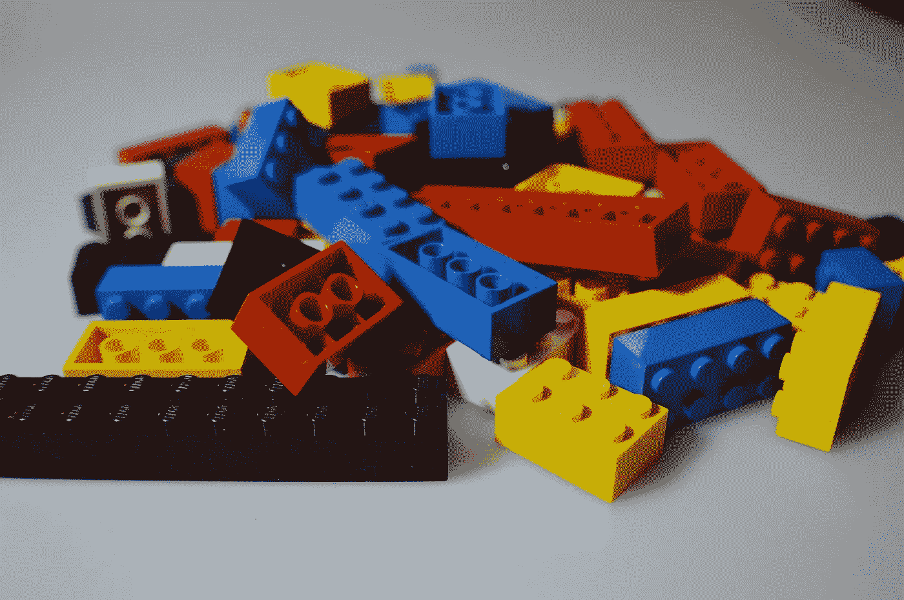

# 不要把你的微服务编码成一个整体，保持它的可维护性而不是过度工程化

> 原文：<https://medium.com/hackernoon/dont-code-your-microservice-like-a-monolith-keep-it-maintainable-not-over-engineered-19f9d5d70f79>

Lego block can be analogous to microservices. Image from [Pixabay](https://pixabay.com/en/lego-children-toys-colorful-play-674880/).

你会用枪打死一只苍蝇吗？答案是否定的。当你想写一个 10K 代码行最多的微服务应用时，情况也是如此。不要过度工程化。好的，你一直在编写和[维护](https://hackernoon.com/tagged/maintaining)大型代码库。有些可能有 100K 多行代码，但你需要克服你的习惯，思考…