# 不要害怕 Rebase

> 原文：<https://medium.com/hackernoon/dont-fear-the-rebase-bca683888dae>

Git 的`rebase`命令是 Git 用户恐惧和困惑的一个常见来源，尤其是那些来自更集中的版本控制系统的用户。这很正常。Rebase 是一个奇怪的，看起来神奇的野兽，它只是进来，开始改变历史。

Rebase 有点像指针。这是每个人都在谈论的令人困惑的构造，但是你不知道为什么有人会使用它，然后突然一切都会*点击*并且整个想法变得非常明显和难以置信的简单。

我在这里强迫*点击*到你身上，这样你就可以去工作并传播`git rebase`的奇迹。

# 什么是 Rebase？

> Git Rebase 是一个工具，可以用来获取在一个地方进行的一些提交，并假装它们一直是在另一个地方进行的。

**好的，但是那个*是什么意思*？**

让我们看一个例子。我们在这个库中有两个分支:`master`和`feature/foo`。`feature/foo`从`master`分支出来，一些提交在`feature/foo`进行。已经向前看了，因为当你不注意的时候，世界不会停止。

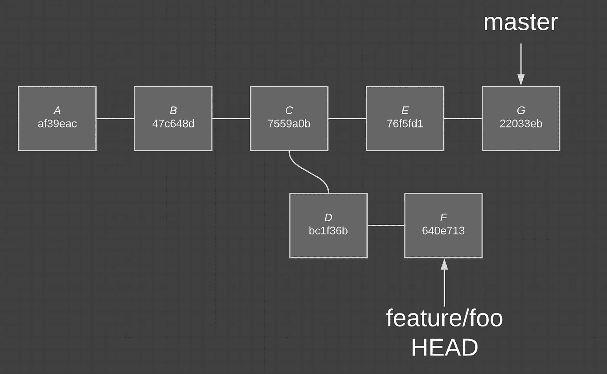

Current state of affairs

我们希望将来自`master`的变更集成到`feature/foo`中，但是我们不想每次执行这个集成时都有一个讨厌的合并提交。

**Rebase 是一个工具，它使您能够集成发生在源分支上的变更，而无需执行合并，因此也无需提交合并。**

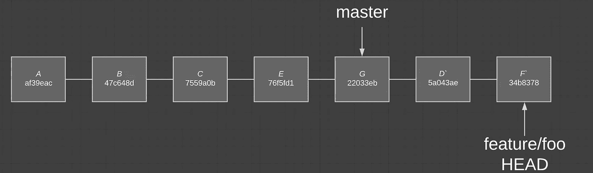

Post-rebase. Visions of fast-forward…

提交 *D* 和 *F* 已经在`master`之上*重放*，当前指向提交 *G* 。您会注意到这些提交实际上被命名为 *D`* 和 *F`* ，并且提交 SHA-1 是不同的。这是为什么呢？

## 提交在 Git 中是不可变的

提交有几个相关的属性:父提交、时间戳和提交时存储库的快照(提交不仅仅是变更集)。Git 在计算标识提交的 SHA-1 时使用这些值。

由于提交是不可变的，并且阿沙-1 应该唯一地标识单个提交，Git 必须创建新的提交，这些提交包含与原始提交相同的存储库快照，但是每个提交都有不同的父提交和时间戳。

这导致新提交看起来与原始提交相同，但是具有不同的 SHA-1。

# 查找提交

当我们从`feature/foo`运行`git rebase master`时，Git 如何知道要移动哪些提交？

让我们首先看一下每个分支上的提交的维恩图。

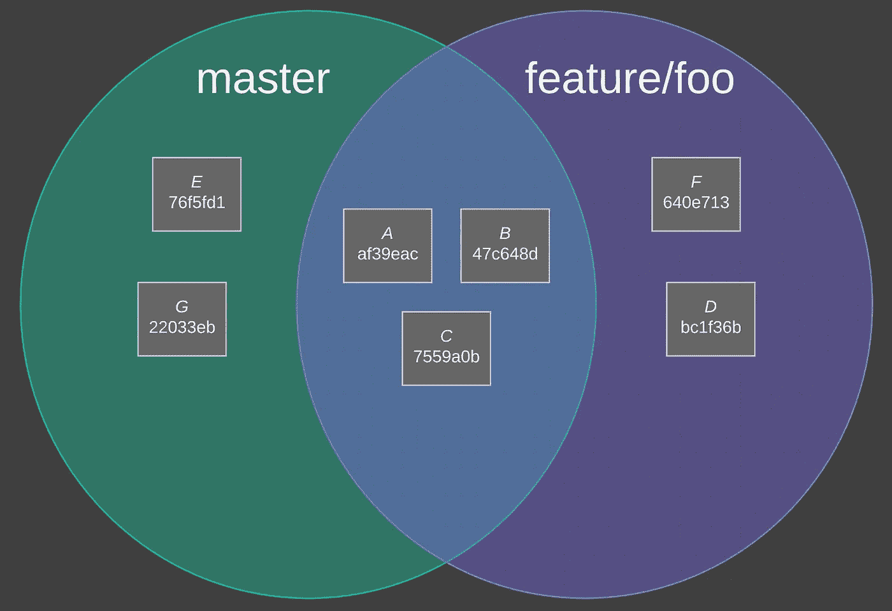

这里我们看到每个分支都有提交 *A* 、 *B* 和 *C* 。`master`有`feature/foo`没有的提交 *E* 和 *G* 。`feature/foo`有`master`没有的提交 *F* 和 *D* 。

Git 将执行集合减法`{commits on feature/foo} — {commits on master}`，以找到正确的提交。这导致提交 *D* 和*f*

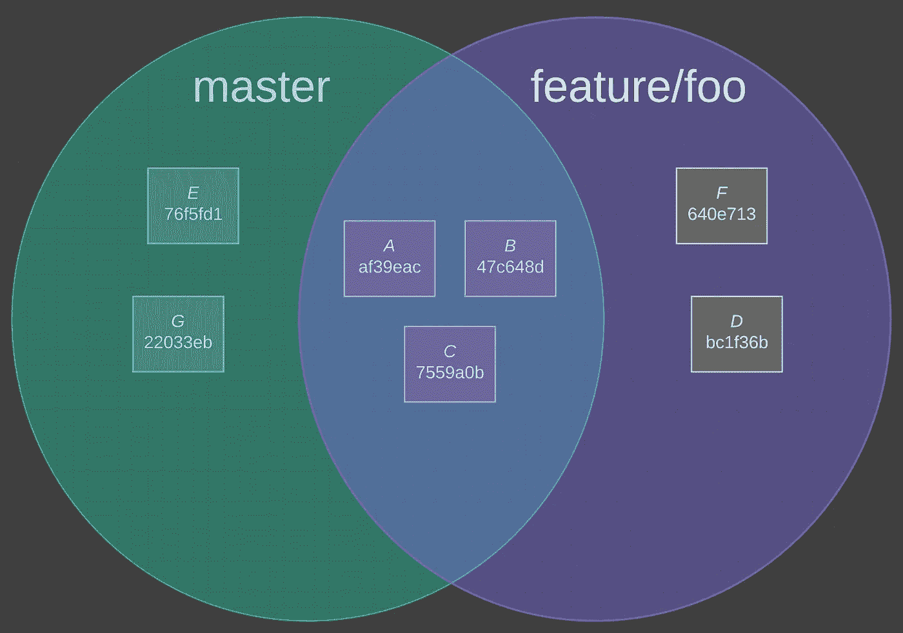

## 我们能证明吗？

是啊！一种简单的方法是使用`git log`来查看我们从这个集合减法中得到的确切提交。

`git log master..feature/foo` *应该*向我们展示提交的`bc1f36b`和`640e713`。

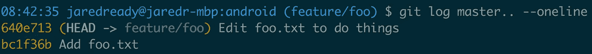

Current branch is implied if you omit a branch after ..

目前看起来不错。让我们有一个更广阔的视野，以确保我没有拉链。

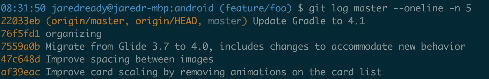

These SHA-1s look familiar

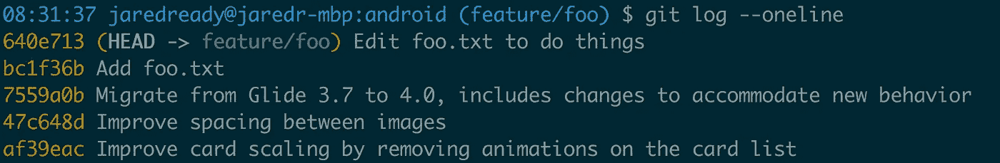

76f5fd1 and 22033eb are missing because we diverged from master at 7559a0b

如果我们现在对`master`执行一个`rebase`，我们应该看到在`feature/foo`提交之前的提交`76f5fd1`和`22033eb`。

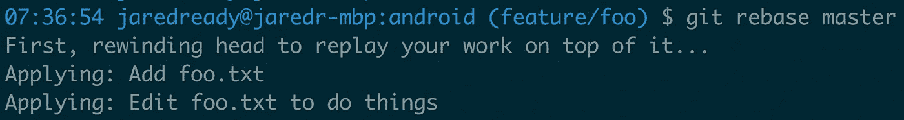

Git is replaying the commits that we expected

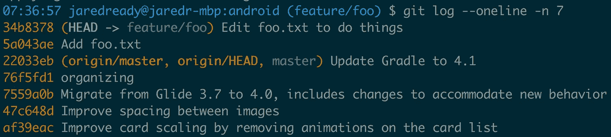

这看起来眼熟吗？

We saw this earlier!

我们现在有一个很好的线性历史。此时，您应该能够看到快速合并是如何发生的。

> rebase 策略有一个额外的好处，那就是知道如果您的 CI 管道通过了 feature 分支，它将在合并后通过 main 分支。对于非线性合并策略，您没有这种保证。

# 使用原力

如果`feature/foo`已经被推送，并且在此基础上尝试另一个推送，Git 将非常礼貌地拒绝推送。这是为什么呢？

> Git 会尽一切努力防止历史被意外覆盖，这是一件好事。

让我们看看 Git 认为`feature/foo`在远程存储库中是什么样子。

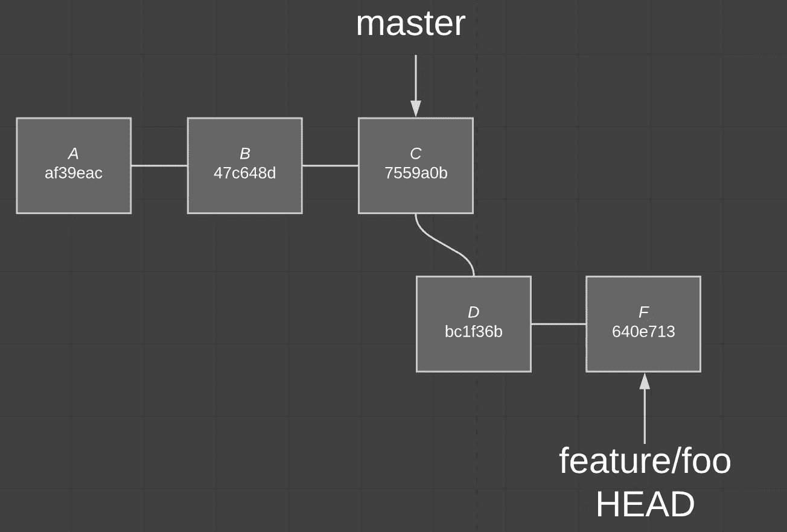

现在让我们看看我们告诉 Git 做什么。

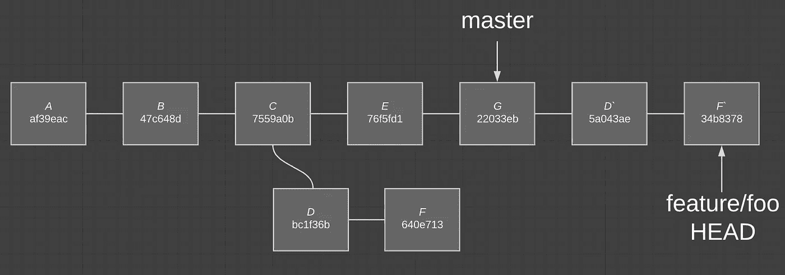

从 Git 的角度来看，提交 *D* 和 *F* 即将丢失。Git 会给你一个类似于`Updates were rejected because the tip of your current branch is behind`的好消息。

你可能会说，“但我可以清楚地看到，在你拍的这张漂亮的照片中，`feature/foo`比以前更领先了。”这是一个很好的观察，但是 Git 只是看到远程存储库上的`feature/foo`包含`bc1f36b`和`640e713`，而您的本地版本的`feature/foo`不包含这些提交。所以为了不丢失这些提交，Git 会礼貌地拒绝一个普通的`git push`，要求您执行一个`git push --force`。

如果你从这篇文章中拿走一样东西，记住在它的核心，rebase 只是找到在某个分支上进行的提交，并创建具有相同内容的新提交，但是具有新的父提交或基础提交。

Git rebase *可以通过利用它的`--interactive`模式让*做更多的事情，但是这超出了本文的范围。如果你想知道你能用`--interactive`模式做什么，我会很快写下来。

如果你喜欢你当时读到的东西👏以示感谢！

跟随 [Hackernoon](https://medium.com/u/4a8a924edf41?source=post_page-----bca683888dae--------------------------------) 和 [Jared Ready](https://medium.com/u/bc152e4dcd63?source=post_page-----bca683888dae--------------------------------) 获取更多高质量的软件工程内容。