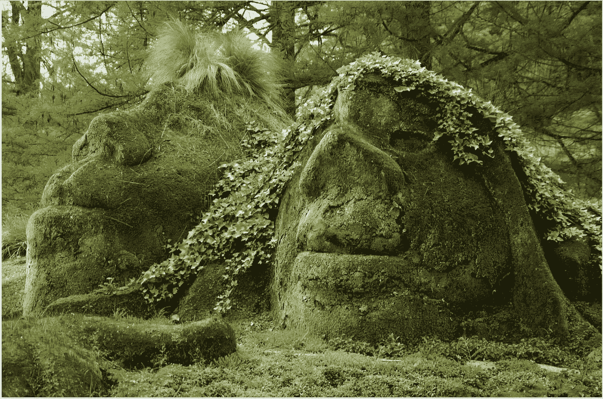

# 不要喂巨魔！

> 原文：<https://medium.com/hackernoon/dont-feed-the-trolls-611e5d1a851c>

我们很多人都听说过童话故事中的巨魔，但当它们出现在你的社交媒体网站上时，它们就变成了真正的噩梦。他们也被称为现代网络恶霸。只有一种方法可以摆脱他们。饿死他们。不要喂巨魔。

httpspixabay.comencontrol-gnome-troll-785555Efraimstochter FREE for commercial use No attribution required

**什么是社交媒体巨魔，你如何知道你是否吸引了一个？**

在像 [*这样的童话里，三只憨态可掬的公山羊*](https://www.pitt.edu/~dash/type0122e.html) *，*一个住在桥下的巨魔用勒索、威胁和恐吓的手段试图吃掉这三只山羊。但占上风的是积极的智慧，而不是消极的威胁。这是一个在 1841 年至 1844 年间首次出版的挪威童话，在挪威神话和斯堪的纳维亚民间传说中，巨魔被描述为一类“居住在孤立的岩石、山脉或洞穴中，以小家庭为单位生活在一起，很少对人类有所帮助”的生物

**挪威人也称巨魔为 jǫtuns，翻译过来的意思是“巨大的财富吸盘”**

众所周知，神话巨魔会试图吸干受害者的成功。这种行为在现代社交媒体和网络钓鱼者中延续至今。在神话中，巨魔也表现出“绑架”的习惯；字面上)和超越一个农场或庄园。你在互联网上的成功相当于今天的农场或庄园，而这种成功是巨魔的晚餐。

现在我们知道了现代巨魔的名字是从哪里来的，也知道了他们是如何做到的。

在斯堪的纳维亚的民间传说中，巨魔被定义为一种特殊的存在。一个是住在森林里的斯哥特罗尔，另一个是山地巨魔 bjergtrolde。所有巨魔都是独居的生物，生活在黑暗潮湿的地方，不喜欢阳光或日光，因为根据民间传说，巨魔一接触阳光就会变成石头。

这里列出了 5 个最流行的现代巨魔，以及它们出现在你的网站上的迹象。

现代网络巨魔住在哪里寻找食物？

今天，Twitter、脸书、LinkedIn 和 Google+是许多巨魔的阴湿山洞，他们想要侵占你建立的社交媒体产业或你展示劳动成果的在线农场，并从中吸取成功的果实。写字楼和工作场所也有巨魔。那些巨魔更容易被认出来，因为他们是双面的。

巨魔不再试图接管农场和庄园。他们绑架和劫持网页和论坛。

我们现在有了社交媒体和网络巨魔，而不是森林或山区的巨魔。如果你在社交媒体上呆的时间足够长，你可能会遇到一两个“巨魔”。

> 大多数现代巨魔跟踪社交媒体页面和网络电台节目，因为他们喜欢这些节目为他们提供现成观众的聚光灯。

其他的巨魔更喜欢生活在网络论坛中。而且，你拥有的社交媒体网站越多，你吸引多种类型的钓鱼者的机会就越大。

**你怎么知道你是否遇到了巨魔？你如何从好奇的追随者中认出他们？**

巨魔很狡猾。根据《城市词典》，匿名网络流氓是指那些“故意发起一场争论，在论坛上攻击他人，却完全不听取他人观点的人。”他们的主要目的通常是隐藏在自以为是背后的自娱自乐。第二个目的可能是从论坛中吸取成功，然后接管它。为了做到这一点，他们将群体中的积极和成长转变为消极和破坏。当页面追随者开始减少，页面数量下降或参与度下降，页面看起来“空空如也”时，你可能会看到或感觉到这种情况你可能会疑惑，“为什么会发生这种情况，我能做些什么来改变？”

**现在你知道如何识别巨魔了，你能做些什么来摆脱巨魔呢？这里有 5 条建议:**

**📌在你对付巨魔的时候，保持你的网站积极向上。记住，巨魔被光吸引，但不能生活在光中。阳光会把他们变成石头。**📌在你把某人带到观众面前之前，监控你的网络直播和广播节目。**📌别被骗了。**查找并学习如何使用您的阻止按钮。巨魔很狡猾，会试图扭转你的局面，让你觉得他们“只是在帮助你”如果你觉得自己没有得到帮助，那是因为你没有得到帮助。**📌不要交战。**争论是他们的食物。像大多数恶霸一样，他们是文字操纵的大师，并从争论中茁壮成长。**📌做那道把他们变成石头的光。忽视他们，你会让他们挨饿。让他们参与进来，你就能养活他们。******

**如果以上建议不起作用—** 使用禁止/屏蔽或向当局报告，或者完全关闭博客帖子、视频页面或主题帖子的评论部分。在所有的神话故事中，巨魔都是被大脑打败的。他们被普通人打败了，有一次，被一只小而聪明的山羊打败了。

***要聪明。不要喂巨魔*** ！

图片来源:https pixabay . comencontrol-gnome-troll-785555 efraimstochter 免费用于商业用途无需署名

文章研究:

[https://en.wikipedia.org/wiki/Troll](https://en.wikipedia.org/wiki/Troll)

三只憨态可掬的公山羊【https://www.pitt.edu/~dash/type0122e.html 

我们中间的巨魔:童话能告诉我们什么..，[https://electric literature . com/the-trolls-in-our-middle-what-fairy-talls-can-tell-](https://electricliterature.com/the-trolls-in-our-midst-what-fairytales-can-tell-)

你会在网上遇到的 10 种网络骗子[https://www.lifewire.com/types-of-internet-trolls-3485894](https://www.lifewire.com/types-of-internet-trolls-3485894)

*原载于 2018 年 8 月 29 日*[*www.bizcatalyst360.com*](https://www.bizcatalyst360.com/dont-feed-the-trolls/)*。*