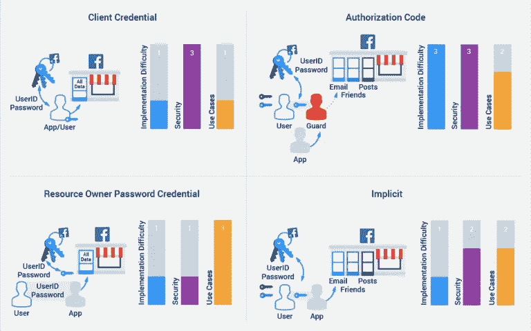
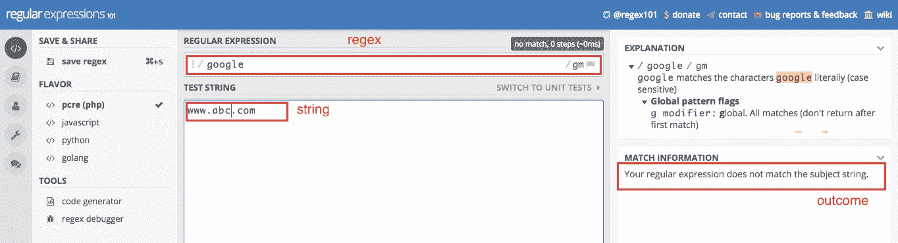

# 除非你是谷歌或者类似的公司，否则不要通过白板和编码测试来招聘

> 原文：<https://medium.com/hackernoon/dont-hire-by-whiteboarding-and-coding-tests-unless-you-are-google-or-the-likes-612e68544cf2>


*照片由* [*马克拉贝*](https://unsplash.com/photos/zCJrolkwRyE?utm_source=unsplash&utm_medium=referral&utm_content=creditCopyText) *上* [*下*](https://unsplash.com/search/photos/whiteboard-wrong?utm_source=unsplash&utm_medium=referral&utm_content=creditCopyText)

除非你是谷歌(Google)之类的公司，否则你既没有充裕的现金，也没有足够的优势让你的公司能够长期均衡运营。换句话说，你雇不起只专注于一件需要高技能的事情的工程师。相反，您的工程师将适应不断变化的优先事项，不断探索新的增长方式，并通过使用像库和 web 服务这样的预制构件拼凑零碎的项目来占领市场份额。

那么应该怎么招呢？

我们应该根据心态而不是技能来招聘。这基于两个基本信念:

*   根据技能招聘是短期的，而根据心态招聘是长期的
*   学习一套技能比改变思维模式更容易

在本文中，我们将探索:

*   主张以心态招聘的 2 个信念的基础
*   如果你以心态招聘，你应该寻找什么样的心态？
*   你如何寻找这种心态的迹象？
*   通过牺牲技能来换取心态，你如何衡量候选人是否拥有获得所需技能的智慧？

# “心态雇佣”的论点

## 短期与长期

当你雇佣一个有能力的人时，她会很快进入状态。然而，当她的工作范围、技能要求、项目目标等发生变化时，她可能没有适应的心态。，改变。很可能她会觉得被背叛了，不舒服，从而变得不开心，没有生产力。

当你雇佣一个有她这种心态的人时，她已经做好了心理准备，随着公司随着市场需求、竞争对手格局、运营条件等的变化而变化。

## 学习技能组合与改变心态

在工程学中，你学习一些东西，应用它，你得到的输出是代码，要么有效，要么无效；代码可能不完美，但一点代码审查，或导师应该修复这一点。换句话说，学习、应用和结果之间的反馈循环是短暂而客观的，这使得在学习上投入时间和精力从而加速学习变得容易上瘾。

另一方面，心态是很容易谈论的，但很难改变。大多数人阅读关于如何变得成功的通俗文学，例如,[富爸爸，穷爸爸](https://en.wikipedia.org/wiki/Rich_Dad_Poor_Dad)，[成功人士的七个习惯](https://en.wikipedia.org/wiki/The_7_Habits_of_Highly_Effective_People)等。但是有多少人会成功呢？改变心态是困难的，并且不同于学习一套技能的过程，原因有二:

*   改变思维模式需要与人类的思维方式作斗争(稍后会详细介绍)，所以这是一个长期的过程
*   我们的周围环境并没有提供一个短暂的，也不客观的反馈回路，也就是说，我们没有足够的信号来告诉我们正在做的事情是否会导致成功，当我们得到这些信号时，往往为时已晚。

# 你应该寻找什么样的心态？

正如阿尔弗雷德·林(Alfred Lin)和布莱恩·切斯基(Brian Chesky)在 Y-combinator 的[创业](https://hackernoon.com/tagged/startup)学校中指出的那样，[公司文化](https://neilpatel.com/blog/brian-chesky-alfred-lin-culture/)是“员工为追求*公司使命*而进行的日常*核心价值观*和*行动*”。

你在招聘中寻找的心态应该与公司文化相联系；你希望新员工在努力实现公司使命的同时，按照公司文化行事。

你可能会倾向于认为，你必须自己找出独特的公司文化所需的心态，这是假设你已经找到了你公司的文化，这是最难的部分。不知所措？

不要这样。这项[研究](https://hackernoon.com/open-door-policy-the-laziest-and-most-incomplete-answer-to-company-culture-fb7cdd6e01a2)表明，尽管公司文化存在差异，但有一些*核心价值观*在所有公司文化中都是共通的。

这里有两个重要的核心价值观，我们在新员工中最需要它们，因为它们最难培养；它们与人类的自然倾向相冲突，这种倾向在工程师中尤为强烈。

*   非常好斗但不完美
*   与跨公司目标保持一致

## 非常好斗但不完美

大多数工程师为自己的能力感到自豪，并不断追求完美。他们经常坚持手头的任务直到最后，以加强对自己能力的信心，即使完成了，他们也坚持打磨次要的细节。这些特点使工程师在不断地切换任务时感到非常不舒服，因为任务不断地被重新划分优先级，以满足不断变化的公司需求。如果不能克服让任务处于不完整或不完美状态的感觉，工程师就会不开心，效率低下。

## 与跨公司目标保持一致

工程和创新很重要—句号。然而，在公司确定了[产品与市场的契合度](https://en.wikipedia.org/wiki/Product/market_fit)之后，它们就变得很重要了，也就是说，至少有 40%的客户愿意为某个产品特性付费。大多数工程师缺乏创业经验，因此不熟悉产品-市场匹配的概念，并且在媒体吹嘘工程成功的推动下，他们最终觉得做非技术或营销/销售相关的任务是浪费公司的宝贵时间和他们的工程技能。相反，工程师有责任采取更具企业家精神的思维方式，管理层有责任让工程师参与非工程决策。

**注:**平心而论，管理层也有责任削弱工程师对营销/销售相关任务的信心；他们通常不善于传达这些任务的重要性，有很多人因为不尊重他们的权威而命令工程师这样做。

# 寻找所需心态的迹象

你可以在简历中寻找这两种心态的迹象:

*   在简历中寻找成就的变化？是否包括有营销/销售倾斜的工程？例如，它包括在社交媒体上宣传一种产品，还是包括将该产品与各种销售工具相结合？
*   问她认为工程师最重要的品质是什么？有没有提到软技能，比如学会在敏捷团队中工作？当谈到工程和商业是如何协同工作的时候，有什么高兴的表情吗？

# 如何衡量学习能力？

如果我们为了心态而牺牲技能和雇佣，我们需要工程师具备观察、推断、阅读代码和确定根本原因的能力，以便快速掌握新的工作技能。以下是你如何发现这些智慧的迹象。

## 观察力

这是一个[图](https://blog.oauth.io/understand-oauth2-grant-types-by-spotting-the-difference/)，比较了 OAuth2 的所有 4 个不同流程。人们不需要对 OAuth2 有任何了解就可以观察并得出一些高层次的结论。



***注*** : *如果你很好奇，* [*OAuth2*](https://oauth.net/2/) *是一个框架，用于请求用户允许访问她的数据或代表她执行某些操作，例如,“使用 Twitter 登录”按钮使 web 服务能够读取用户的 Twitter 简档。*

观察力敏锐的人会注意到:

*   每个 OAuth2 流类型可以根据*实现难度*、*安全性*和*用例*进行分类
*   **授权码**流具有最高的安全性，因为它有一个*守卫*，并且*密钥*永远不会交给 *App* (与所有其他情况不同)
*   **资源所有者密码凭证**流具有最低的安全性，因为它是*用户*将其用户名/密码提供给*应用*的唯一流

其他观察结果的详细信息可在[文章](https://blog.oauth.io/understand-oauth2-grant-types-by-spotting-the-difference/)中找到。

## 推理能力

推断的能力至关重要，因为很少有问题需要从头开始编码；工程师们通常会找到一个与他们试图解决的问题最匹配的模式，并调整这个模式。

regex 是测试推理能力的好方法，尤其是当这个人对它不熟悉的时候。

***注*** : *Regex 提供了一个非常简洁而精确的语法来指定你在字符串中寻找什么样的模式。*

首先说明我们希望候选人做些什么:

*   *目标*:我们想要匹配还是不匹配
*   *正则表达式*:工程师应该制定或调整它，以实现给定“字符串”作为输入的指定“目标”
*   *字符串*:用于测试正则表达式的输入
*   *结果* : ***匹配*** ，如果字符串和正则表达式匹配，否则 ***不匹配*** *。*这应该与‘目标’相对应

下面是一个例子，使用正确的“正则表达式”，即“结果”是*匹配*，并满足“目标”:

```
Goal: Match only valid google URLs 
String: [www.google.com](http://www.google.com)
Regex: /google/
Outcome: match ***<===== 'Outcome' satisfies 'Goal'***
```

在一个在线交互式正则表达式工具上测试一下，例如[https://regex101.com](https://regex101.com,)。使用交互式工具缩短了正则表达式创建和结果之间的反馈循环，因此它既能帮助候选人测试她的正则表达式，也能让你看到她的思路。


下面是一个例子，一个“字符串”导致了*不匹配*的“结果”,但仍然满足所提供的“目标”

```
Goal: Match only valid google URLs
String: [www.abc.com](http://www.google.com)
Regex: /google/
Outcome: no-match ***<===== 'Outcome' satisfies 'Goal'***
```

在[https://regex101.com 上，](https://regex101.com,)一场消极的比赛看起来像是:



这应该有助于她理解 regex 的底层机制和在线工具。

现在提供“目标”和“字符串”的变化，并要求人调整“正则表达式”匹配与否

**示例字符串变体#1**

当“字符串”为`google.evil.com`时，到目前为止满足“目标”的“正则表达式”`/google/`将在下面的示例中失败。

```
Goal: Match all valid google URLs
String: google.evil.com
Regex: /google/ ***<===== Incorrect 'Regex' to achieve 'Goal'***
Outcome: match ***<===== Should be no-match***
```

您需要如何更改正则表达式，以便“结果”是*不匹配*？我们不期望候选人能够编写正则表达式，而是希望他们解释如何调整“正则表达式”，例如，“我们可以检查*google.com*而不仅仅是*谷歌*”——改进的“正则表达式”将是:`/google\.com/`

**示例字符串变体#2**

新调整的“正则表达式”`/google\.com/`将在“字符串”为`fake-google.com`时再次违反“目标”。

```
Goal: Match all valid google URLs
String: fake-google.com
Regex: /google\.com/ ***<===== Incorrect 'Regex' to achieve 'Goal'***
Outcome: match ***<===== Should be no-match***
```

你需要如何改变“正则表达式”以便“结果”是*不匹配*？我们希望候选人围绕匹配以“google.com”开头的任何内容或以“. google.com”开头的任何内容的想法进行头脑风暴——改进后的“正则表达式”将是:`/(^google|\.google)\.com`

你明白了！

## **代码理解**

为了测试代码理解能力，候选人不应该被她必须阅读的代码的编程语言所困扰，她应该被允许谷歌搜索语法，或者更好的是大声询问编程语法。根据所需的编程知识的深度，最好是她测试的代码:

*   是自包含的，例如，执行特定任务的批处理脚本，以最小化外围代码的干扰
*   包含基本的编程结构，如变量、常数、表达式、函数、数据流控制
*   包含面向对象的概念，如类/实例变量/方法、继承、多态/接口
*   包含一些常用的模式，例如，抽象静态工厂、装饰器、构建器等。
*   包含错误处理，包括分层的 try/catch 错误块
*   包含函数式编程，可以是关注程序做什么而不是如何做的简单函数，例如，*映射*、*减少*，和/或包括将函数传递到其他函数/从其他函数返回函数的复杂模式
*   包含异步代码，包括测试理解回调的代码流，以及避免“末日金字塔”回调的新范例，并隐藏异步编程的细节
*   包含并行编程，其中包括内存共享、进程间通信、隐藏理解并行性需求的范例，以及某些语言中常见的并行编程陷阱，这些陷阱在其他语言中不会发生

## 根本原因确定

即使在编写良好的代码中也会出现错误，因此确定根本原因是一项必需的技能。测试这些技能的最好方法是查看你的 bug 数据库，你可以展示你在排除服务/产品/应用程序故障时遇到的许多场景中的一个。每个场景应包含:

*   对事情预期如何运作的解释
*   问题的症状

这是一个常见的调试问题:

***解释事物如何运作:***

每个网络程序都可以运行在一个叫做*的端口*上，端口范围从 0 到 65335。您可以使用浏览器通过指向 https://abc.com:{ *port* }来访问 web 程序

**症状:**

您在端口 2222 上安装了一个程序(程序 B)，并尝试在[https://abc.com:2222、](https://abc.com:2222,)访问，但您看不到任何东西。

然而，在同一台服务器上，有另一个程序(程序 A)运行在端口 1111 上，并且可以使用浏览器[https://abc.com:1111](https://abc.com:1111)访问

问题和预期答案:

***无法访问程序 B 的可能问题是什么？***

*   程序 B 不起作用
*   端口 2222 不工作

***如何确定根本原因？***

通过排除端口 2222 不是罪魁祸首来确定程序 B 不工作

*   在端口 2222 *或*上安装程序 A
*   在端口 2222 上安装尽可能简单的程序

确定端口 2222 不工作

*   在端口 1111 上安装程序 B

# 最后的想法

我们都曾雇佣过我们认为不适合在公司工作的人。当这种情况发生时，在对这些人皱眉头之前，我们应该看看公司的招聘流程，了解它是否被设计成吸引公司成功所需的合适类型的人；这需要了解公司的经营状况及其在行业中的地位。

如果对其他类型的样本[面试](https://hackernoon.com/tagged/interview)问题有兴趣，请留下评论，我会整理出一个简单的站点来分享。