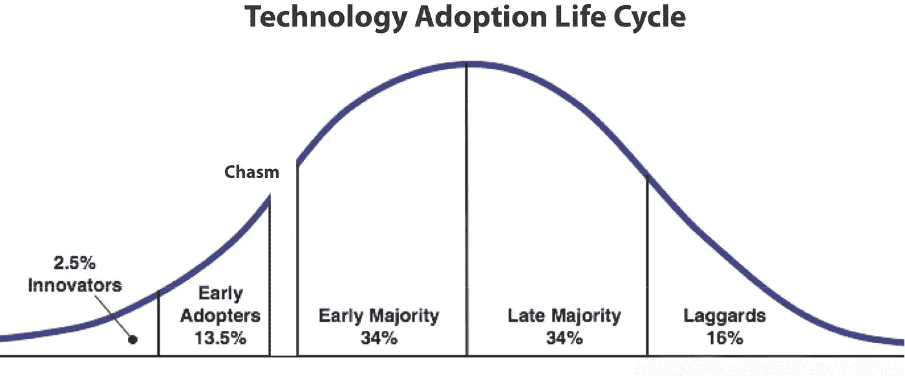
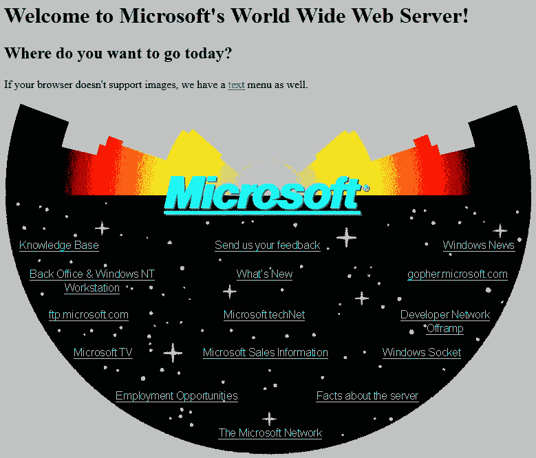
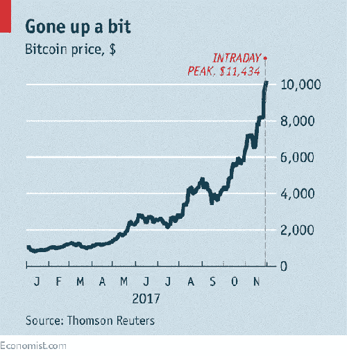

# 不要欺骗自己，这仍然是早期采用阶段

> 原文：<https://medium.com/hackernoon/dont-kid-yourself-this-is-still-the-early-adoption-phase-3463573b4bab>

当你坐在方向盘后面去上班的时候，你还会带着翻盖手机或者把磁带放在甲板上吗？如果是这样的话，你就有可能落在技术采用曲线的最右边，被亲切地称为“落后者”

我们在说什么？

有一个众所周知的钟形曲线，说明了新技术如何到达现场并最终渗透到更大市场的各个阶段。

极少数早期采用者被称为“创新者”，仅占总人口的 2.5%，而“落后者”则是最后的 16%。

那么……你认为我们作为一个社会，与这个被称为加密货币的奇怪的新生事物有什么关系，你准备好迎接下一个量子飞跃了吗？

# 加密货币现在在哪里

诚然，这篇文章背后的按键是由创新阶段的一小部分人推动的，所以 crypto 对我们来说似乎是旧帽子，但当我们退后一步环顾四周，这是一个非常非常年轻的婴儿。

可以把它想象成相当于 1994 年的互联网，其特点是 56k 拨号调制解调器和一个如下图所示的微软主页。你希望你当时在公司投资了几千美元吗？

*微软早期网页*

为了进一步说明这一点，脸书和推特离诞生还有十年时间。

鉴于技术加速的状态，预计在不到五年的时间里，类似的巨型加密货币公司将会出现。我们已经有超过 1000 种官方版本的数字硬币，都是由那些在这个勇敢的新的去中心化世界中看不到任何限制的人推动的。

现在的问题是，这个领域太拥挤了，这就像一个数字游戏，试图找出哪些公司可能具备长期生存和繁荣的条件。

# 这不是第一次金融革命

直到大约两万年前，还没有钱。

最终，与世隔绝的人类部落开发了一个原始的分类账系统，来记录成功狩猎后 Grunt 欠 Growl 多少牦牛肉。这种方法一直有效，直到各个部落开始互相碰撞，每个部落都使用完全不同的分类账方法。

大约五千年前，我们偶然发现了用黄金作为价值转移手段的想法，这有点有趣，因为金属本身并没有提供多少功能。它之所以有价值，仅仅是因为供应不足。它也很重，带着它到处走有点别扭。

到 17 世纪到来时，一些思想家提出了这样的观点，即我们应该改用纸质证书来证明一定数量的黄金藏在某个地方。对于这个激进的建议，人们失去了理智，过了 400 多年，全球货币储备(美元)才最终脱离金本位。

随着技术的发展，采用的速度呈指数级增长。想想看，电话和家庭用电用了几十年才普及到 60%的人口。

现在事情发生得快多了。

今天出生的孩子在成长过程中会非常适应加密货币作为合法金融系统的想法。

# 加密货币现在在哪里

由于通货膨胀的持续贬值效应，投资像美元这样的法定货币是徒劳的。几年后，它的价值(就它将购买的商品和服务而言)比现在低的可能性高于平均水平。

*大幅上涨*

但是这种加密货币的东西[开始感觉像一种实际的投资策略](https://www.youtube.com/watch?v=lJlFWTyW_BY&t=2977s)，特别是考虑到比特币自其概念形成以来价格的飙升。

它开始时每枚硬币仅值几分钱，暴涨至近 20，000 美元，现在大幅回落至 5，000 美元左右。相信我们，百万富翁就是在那段时期产生的。

虽然比特币对你的预算来说可能过于昂贵，但有很多替代硬币(被称为替代硬币)在交易所正式交易。

当然，你应该只投资你能承受损失的钱。孩子们的大学基金、这个月的抵押贷款、食品和汽油钱都有太多的不确定性。

# 为未来买单

也许你从来没有想过，但当你投资加密货币时会发生什么——除了抓住可能是无限小的机会变得非常富有。

你所做的投资为这个行业提供了营运资金，不仅可以开发你最喜欢的硬币的更复杂的版本，还可以创造全新的产品。目前，比特币的市值约为 1120 亿美元。那不是一个微不足道的数字！

尽管比特币似乎非常专注于加密货币，但像以太坊(第二大加密货币)这样的公司已经走上了不同的方向，他们提供了一个区块链平台，开发者可以在这个平台上创建他们可以想象的任何类型的应用程序。这是构建未来的地方，也是整个事情变得令人兴奋的地方。

# 底线

随着新的资金通过个人投资者和像 IBM 这样有远见的公司涌入加密货币行业，你可以期待参与这一繁荣的机会[将以我们从未考虑过的形式](https://coincrunch.io/5-predictions-for-our-security-token-future/)出现。

现在就开始认真思考这个问题，因为你不想成为这场革命中姗姗来迟的慢性子。

# 本文原载于[钱币局](https://www.coinbureau.com/adoption/still-early-adoption-phase/)

# 想要了解区块链和加密货币的最佳新闻、评论和信息，请访问 [coincrunch.io](https://coincrunch.io) 或查看我们的网站:[Youtube](https://www.youtube.com/channel/UCXyrBCWaRJzHfOtnWaR47Qw)|[Twitter](https://twitter.com/coincrunchio)|[脸书](https://www.facebook.com/realcoincrunch/) | [Reddit](https://www.reddit.com/user/coincrunchio)