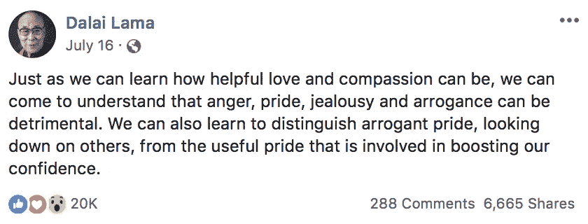

# 不要让社交媒体毁了你的生活和事业

> 原文：<https://medium.com/hackernoon/dont-let-social-media-ruin-your-life-and-career-6258781971e2>

[Photo by [Erik Lucatero](https://unsplash.com/photos/UrhMJ6kfKlo?utm_source=unsplash&utm_medium=referral&utm_content=creditCopyText) on [Unsplash](https://unsplash.com/search/photos/social-media?utm_source=unsplash&utm_medium=referral&utm_content=creditCopyText)]

## 下次当你准备在你最喜欢的社交媒体平台上发布什么东西时，请记住，在互联网上是没有退路的。你的数字足迹将越来越有分量，甚至可能超过你的简历。

最近社交媒体上的不良行为海报儿童是又一个例子，表明只需快速点击几下屏幕，就可以迅速找到他或她自己。

这次[银河护卫队导演詹姆斯·古恩因在推特上开恋童癖和强奸的玩笑而被迪士尼](https://www.nytimes.com/2018/07/20/business/media/james-gunn-fired-offensive-tweets.html?smtyp=cur&smid=tw-nytimesbusiness)解雇。“我过去经常开一些冒犯性的玩笑，”冈恩在推特上说。“我再也不会了。我不为此责怪过去的自己，但我更喜欢自己，觉得自己是今天更完整的人类和创造者。”

冈恩并不孤单。在大多数行业中，我们看到在职业和社交媒体的交叉点上导航是多么的棘手。仅仅一条关于脸书的政治上不正确的声明，一条好斗的推文，或者一张攻击性的 Instagram 照片就能制造出虚拟的麻烦漩涡。

[世界经济论坛(WEF)](https://twitter.com/wef/status/1021824928897740801) 称建立和管理健康的诚信身份(在线和离线)；理解数字足迹的本质(及其现实后果)并负责任地管理它们；在网上对自己和他人的需求和感受感同身受是教孩子如何拥有积极的数字足迹的三个最好方法。

作为成年人，我们都可以从 WEF 针对年轻人的建议中学到一些东西。也就是说，在一个许多高调的个人选择走“低调”道路的时代，我们如何在网上行事。

# **遵循四项积极原则**

每次你发布推文，上传照片到脸书，或者在线分享内容，记住，互联网永远不会忘记——任何不合适的照片，考虑不周的评论，或者有问题的内容都会成为你数字足迹的一部分。

在社交媒体中没有“收回”，即使一条错误的推文被迅速删除，也可以在几秒钟内被截屏并与世界分享。无论你是一名学生，还是一家拥有 5000 名员工的企业的负责人，在社交媒体时代承担领导责任都需要一种专注、认真的方法，这种方法植根于以下四个原则:

## **感同身受的帖子**

同理心是一种理解的行为，是天生意识到、敏感到和/或替代性地经历他人过去或现在的感受、思想和经历，在混乱或不确定的时期，同理心尤其有价值。这是因为同理心有助于我们变得平易近人，引发开放的对话，鼓励高水平的分享。在社交媒体的世界里，一定量的同理心大有帮助，因为那里的受众既广泛又多样。设身处地为他人着想可以开辟新的交流渠道，创造新的理解水平，帮助每个人实现共同的目标。

他不需要介绍，众所周知，达赖喇嘛是一位贡献具有高度包容性的领导人。这在脸书没有什么不同:

## **兼容并蓄**

包容的目的或政策是包容那些否则可能被排斥或边缘化的人，包容性的方法在社交媒体上有很大的作用，在社交媒体上，接受不同的观点是必不可少的。推特、脸书和其他平台也有助于让人们意识到我们的多样性和我们的包容性。

教皇方济各有 1770 万粉丝，很多人都在等待他的下一条推文，其中大多数都充满了包容性:

## **总是追求高尚的道德标准**

争论和捍卫你的立场是有时间和地点的，社交媒体不是。在虚拟环境中进行争论——所有人都可以看到谁在对谁说什么——是行不通的。通过始终保持专业的语气，将诽谤和侮辱排除在谈话之外，瞄准更高的位置。

如今，美国的政治是一个两极分化严重、分歧巨大的话题，但是哈佛商学院教授、前 Metronic 首席执行官[比尔·乔治用他的文章](https://www.linkedin.com/pulse/real-losers-trumps-trade-wars-american-consumers-bill-george/)以外交的方式来解决敏感话题:

> “关于唐纳德·特朗普总统的贸易战将对美国农民、制造商及其员工造成的伤害，已经有很多报道。这都是真的。但是“美国第一”倡议的真正输家将是美国消费者。如果特朗普总统兑现他的威胁，美国消费者将会看到从 t 恤到汽车到新房的所有商品的价格迅速上涨。”

**显示勇气。和所有情况一样，不可能每件事都是好的。但是，无论在顺境还是逆境中，人们都会自然而然地向他人寻求指导和支持。不要害怕挑战现状，分享你的使命，设定界限，和/或坚持你的价值观。**

拥有超过 35 万推特粉丝和活跃于众多社交媒体平台的女演员阿什利·贾德大胆地支持#MeToo 运动和人权等事业:

# **数字沙滩上永恒的脚印**

下次你在网上打开你最喜欢的社交媒体平台时，记住你在那里做的一切都会影响你和你周围的每个人。

就像你在现实世界中会避免酒吧斗殴或公路暴力事件一样，在虚拟世界中牢记你的形象和声誉是很重要的。让我们利用社交媒体来实现它的初衷:与他人“互动”,让人们了解信息，分享你的知识，并创造开放的交流。

正如科技记者约翰·巴特利告诉《纽约时报》 [*，*](https://www.nytimes.com/2006/06/12/technology/12link.html) *“我们生活在网络上，但还没有完全意识到这样做的意义。其中一个含义是，我们在数字沙漠中的足迹是永恒的。”*

**版权所有 2018，作者 Faisal Hoque。保留所有权利。**

我是一名[企业家和作者](http://faisalhoque.com/speaking/)。SHADOKA 等公司创始人。Shadoka 让抱负成为领导、创新和变革的动力。Shadoka 的加速器和解决方案汇集了管理框架、数字平台和思想领导力，以实现创新、转型、创业、增长和社会影响。

著有《 [*万物互联——如何在创意、创新和可持续发展的时代进行变革和领导》*](http://www.amazon.com/Everything-Connects-Creativity-Innovation-Sustainability/dp/0071830758/ref=sr_1_1?ie=UTF8&qid=1376488798&sr=8-1&keywords=everything+connects%2Bfaisal+hoque) 》(麦格劳·希尔)和《 [*生存并茁壮成长:弹性企业家、创新者和领导者的 27 种实践*](http://survivetothrive.pub/) 》(励志出版社)。在推特上关注我。*免费使用* [*万物互联*](http://app.everythingconnectsthebook.com/login.php) *领导力 app 和* [*生存茁壮*](http://app.survivetothrive.pub/login.php) *弹性 app。*