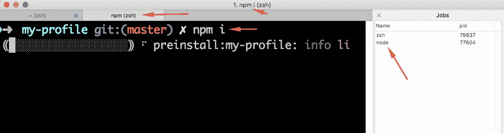
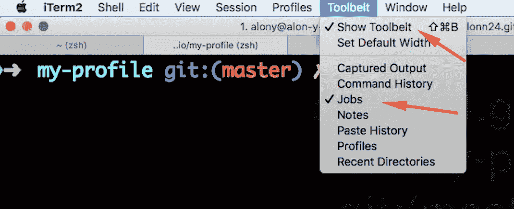
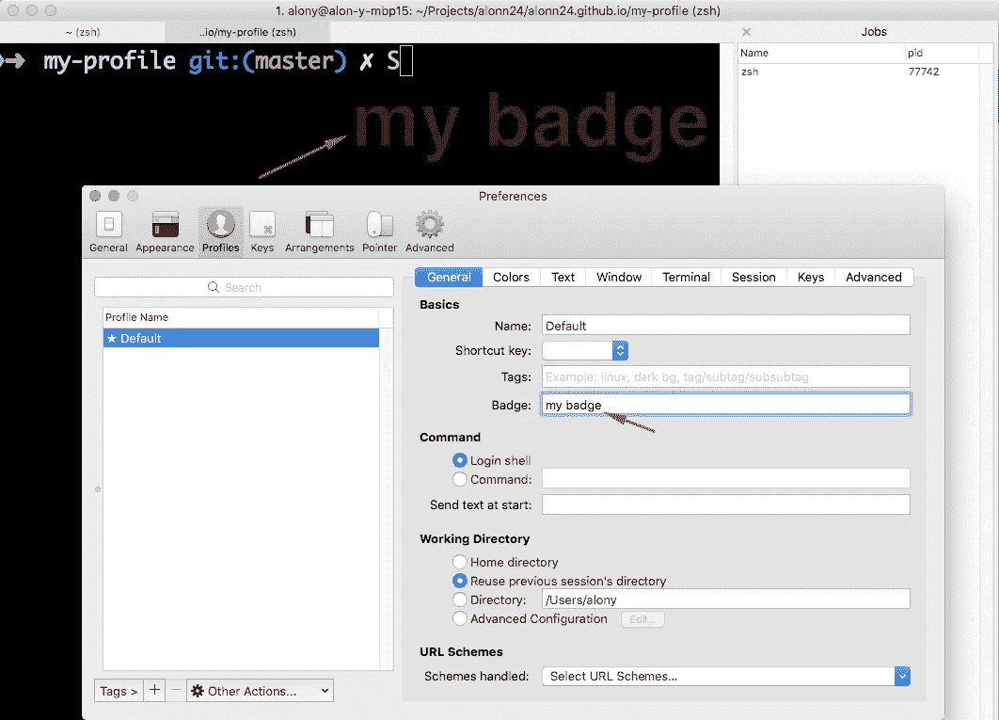
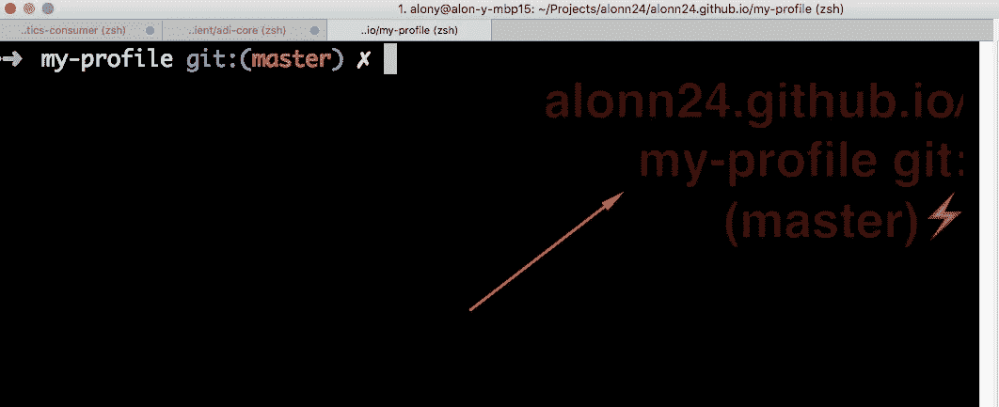

# 不要被 iTerm2 冲昏了头脑

> 原文：<https://medium.com/hackernoon/dont-lose-your-head-with-iterm2-4a6fafbca6b>

[iTerm2](https://www.iterm2.com/) 是一款终端应用，我用它来运行 MacOS 上的所有东西。iTerm2 是 Terminal 的替代品，它提供了许多改变外观和感觉的主题特性。我在 iTerm2 中运行一切，从 git 命令到运行实时服务器，搜索文本和编辑文件。但是有一件事一直困扰着我——运行长流程。长进程总是隐藏当前提示和工作目录。我安装了 [Oh My Zsh](http://ohmyz.sh/) ，它添加了这个漂亮的提示，显示当前的工作目录和我正在使用的 git 分支，但是当运行长进程时，提示超出了缓冲区，我对此一无所知。

一旦您运行一个进程，终端中的所有内容都将失去上下文——状态栏显示正在运行的任务，如果任务足够冗长，提示符将脱离缓冲区，并且不可见。状态栏、标签名称和我能想到的一切都不会显示当前的工作目录或任何关于我在哪里的信息。我甚至不能运行`pwd`，因为一个进程正在运行。



我经常做的一件事是在命令末尾用`&`运行任务，例如`npm i &`，它在后台运行进程，并留下交互可用的提示。您可以通过在它们之间添加`&`来并行运行几个流程。当一个进程在后台运行时，你不能用`cmd+C`中断它，相反你需要用`kill [pid]`或`killall [name]`命令显式终止它。我有时会运行`killall node`,但这会杀死所有在任何地方运行的节点进程。

要终止一个特定的进程，你需要知道 pid，要做到这一点，你需要记住你在运行什么。你可以运行`ps -ef | grep [what you are running]`来获得 pid，例如`ps -ef | grep node`会给你所有的节点进程。iTerm2 为每个面板提供了一个显示带有 PID**的所有过程的面板。只需点击`cmd+shft+B`或**工具带→显示工具带**，然后检查**工具带→作业**以查看包含流程名称和每个流程的 pid 的作业面板。**



要终止一个进程，您可以选择它并按下**选择信号→终止**，或者在控制台中执行`kill [pid]`从面板中知道确切的 pid。

我在并行运行多个进程时遇到的一个小问题是输出——因为输出流从不同的进程获得更新，所以它不整洁且难以理解。我更喜欢运行一个阻塞进程，这样我就可以随时知道我在哪里。使用 iTerm2 徽章可以解决这个问题。

徽章是显示在终端会话右上角的大文本标签。您可以使用**项目 2 →首选项→个人资料→常规→徽章**更新该文本。



徽章可以有静态值，就像上面的例子一样，也可以通过脚本变量有动态值。让我们尝试实现我们首先想要的，我们将尝试设置徽章如下:`[git repo] git:([git branch])`就像我在我的提示。

我们希望创建某种包含文本的变量，并将其设置为 badge 字段。为了创建和更新变量，我们需要安装 iTerm2 [shell integration](https://www.iterm2.com/documentation-shell-integration.html) 。这是一个常见的集成，可以与**项目 2 - >安装外壳集成**一起安装。

外壳集成允许创建变量和使用它们，我们想创建一个变量，将持有徽章文本，正如我们所描述的。在配置启动脚本中，对我来说是`~/.zshrc,`添加以下内容:

```
**function** iterm2_print_user_vars() {
  iterm2_set_user_var gitStatus "$(gitStatus)"
}

**function** getGitStatus {
  **if** [[ $(git status 2> /dev/**null**) = "" ]] then
    echo "$(topDir)"
  **else** echo "$(getGitProjectDir)$(topDir) git:($(getGitBranch))$(isGitBranchDirty)"
  fi
}

**function** getGitProjectDir {
  basename $(git rev-parse --show-toplevel 2> /dev/**null** ) 2> /dev/**null** }

**function** topDir {
  **if** [[ $(basename $(pwd)) = $(getGitProjectDir) ]] then
   echo ""
  **else** echo "/$(basename $(pwd))"
  fi
}

**function** getGitBranch {
  basename $(git branch 2> /dev/**null** | grep \* | cut -c3-) 2> /dev/**null** }

**function** isGitBranchDirty {
  [[ $(git diff --shortstat 2> /dev/**null** | tail -n1) != "" ]] && echo "⚡ "
}
```

第一个函数— `item2_print_user_vars`是这里的主要函数，将在终端中运行任何命令后运行。它使用下面的函数用我们想要的更新`gitStatus`变量:

**getGitStatus** —如果当前目录不是 git 存储库，则返回当前目录。

**getGitProjectDir** —返回 git repo 名称。

**topDir** —如果当前目录不是主 repo 文件夹，则返回当前目录。当真实项目在主回购目录的子目录中时，这对于 monorepos 是有用的。

**getGitBranch** —返回当前 git 分支。

**isGitBranchDirty** —如果我们有 panding 变更，返回“⚡”。

现在，要使用我们创建的变量，我们只需将它添加到徽章文本中，就像我们之前使用静态值一样。我们将在**ITER m2→首选项→个人资料→常规→徽章**插入`\(user.gitProjectDir)`和 walla 中将其添加为徽章文本！下次有什么变化，你会在终端的徽章上看到，永远不会惊慌失措。

