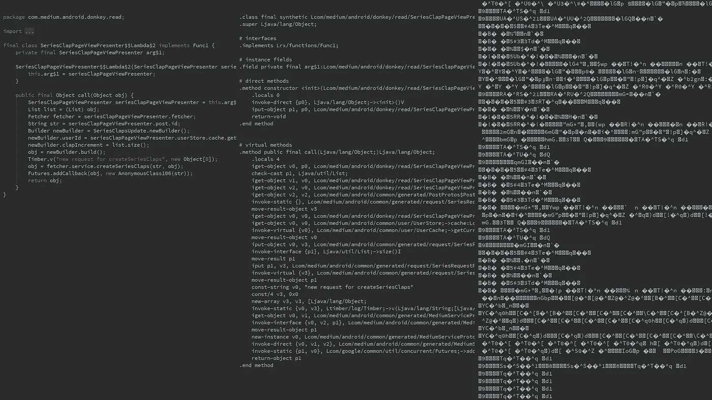

# 对 Medium 应用程序进行逆向工程(并使其中的所有故事免费)

> 原文：<https://medium.com/hackernoon/dont-publish-yet-reverse-engineering-the-medium-app-and-making-all-stories-in-it-free-48c8f2695687>

上周我意识到距离我在这里的最后一篇文章已经过去一年了。我喜欢写自己的故事，就像我喜欢阅读别人的一样，但前提是我认为它们足够有趣，老实说，这是一个很高的标准。我最近一直在对 Android 应用程序进行逆向工程，所以我试图想出一个可能涉及该领域的项目，同时让 Medium 上的读者感兴趣。

反转中型 Android 应用程序可能很酷，但出于什么目的呢？经过一番思考后，我认为一个不错的目标可能是制作一个改进版的应用程序，它可以过滤掉会员需要的故事。

因为 Medium 向新访问者免费提供前三个故事，所以过滤需要会员资格的故事就像让它们免费一样简单，所以让我们在我们的新应用中这样做:)

我们要做的是:

*   获取应用程序源代码。
*   修改它，使媒体的后端 API 免费为我们提供故事。
*   重新编译一切，安装被篡改的应用。

# 获取应用源代码

所有的 Android 应用程序都是从 APKs (Android 包)安装的。Android 操作系统使用这种包文件格式来分发和安装移动应用程序，它包含所有的应用程序资源、资产、证书等，包括应用程序源代码——包含 Dalvik 字节码的 Dex 文件。Dalvik 字节码由 Dalvik 虚拟机执行，它类似于 Java 虚拟机，但针对手机的硬件和需求进行了优化。Dalvik 虚拟机是一个负责在 Android 操作系统上执行程序的机器，你可以把它看作是一个针对手机环境优化的伟大而高效的机器。

我们可以很容易地从我们的 APK 中提取 Dex 文件(即使使用 WinRAR，APK 也是从 ZIP 扩展而来的包文件格式)，但是字节码指令不是人类可读的。使用 smali/Baksmali(汇编器/反汇编器),我们可以将我们的 Dex 文件转换成 Smali 文件，Smali 文件是用类似汇编的语法编写的(仍然是低级的，但肯定可读)。

有了 Smali 文件后，我们可以将它们转换回 Java 文件，但只取得了部分成功。一些原因可能包括开发人员使用混淆器(这种工具意味着使逆向工程过程更加困难)。尽管如此，我们还是会尽可能地分解，因为这确实有助于理解一个应用程序的功能。

[Apktool](https://ibotpeaches.github.io/Apktool/) 和 [Jadx](https://github.com/skylot/jadx) 是帮助我们做到以上的两个很棒的工具。Apktool 生成 Smali 文件，Jadx 试图为这些美味的 Java 文件付出额外的努力。

(From left to right) Java, Smali, and Dex, representing a code section that handles clap requests

# 让所有的故事免费

Medium 向新访问者免费提供三个故事，并使用存储在访问者设备上的会话 cookie 来识别访问者。用新的 cookie 替换会话 cookie 意味着成为一个新的访问者，正如 Medium 的服务器所看到的那样(你可以通过打开一个新的匿名窗口来浏览 Medium 来测试它)。

因此，如果我们所有的获取故事的 HTTP 请求都是在没有会话 cookie 的情况下发送的，我们应该总是得到新访问者的待遇，并成功地接收每个故事。

在夜间浏览了应用程序源代码之后，我发现通过编辑 OkHttp 提供的默认 cookie 存储类可以很容易地完成上述工作。OkHttp 是 Android 和 Java 应用的 Http 库，Medium Android 应用就是用它开发的。据我在他们的文档上看到的，这是一个非常酷的库，支持很多功能。除此之外，它还提供了一个名为 JavaNetCookieJar 的简洁类，在构造 OkHttp 客户端实例时可以引用这个类来使它们持久地存储 cookies。Medium 也在内部使用它。

获取故事的 API 调用是以`/_/api/posts/{postId}`的形式，我们不要为这些请求提供 cookies。下图显示了我们将对 JavaNetCookieJar 进行的修改。你可以在这里看到这个类的最初实现。

^https:\\/\\/api\\.medium\\.com\\/_\\/api\\/posts\\/[^\\/]+$ is a regular expression escaped as a Java string, that matches URLs with the pattern for fetching stories shown above

# 编译修改后的应用程序

如前所述，我们无法完全获得 Java 中的一个应用程序源代码。因此，为了能够重新编译我们的应用程序，我们需要在汇编级别进行所有的更改(我们确实有应用程序的完整汇编源代码)。

对汇编文件进行修改听起来很恶心，但其实也没那么糟糕。尤其是如果我们说的是 Java 字节码汇编(Java 虚拟机和 Dalvik 虚拟机都有比较高级的指令集，这里不是 LC-3 或者 x86)。

这些是对应于我们想要添加的先前 Java 语句的 Smali 指令:

不要担心理解它们，但如果你有一些低级语言的背景知识并试图理解那些指令，我应该告诉你 v2 是 Java 源代码中名为“url”的变量，cond_4 是代码段的标签，它使函数返回一个空的 cookies 列表。

在我们将这些行添加到应用程序源代码之后，我们需要重新编译所有内容。我们将再次使用 Apktool，这一次是为了构建一个 Smali 文件的 APK。现在我们有了一个修改过的 APK，让我们快速的签署它(使用每个 Android 应用程序都需要经历的正常签署过程),我们就完成了！

# 额外收获:增加一个新的设置选项

与我们已经做的类似，我添加了一个新的设置选项来启用和禁用我们的更改。只是添加了一些条件语句，复制了现有的设置代码，并将它们紧密地结合在一起。我们的新应用程序出来相当不错，看看下面吧！

我最喜欢的写作方式是专注于事物的高层次方面，而不需要过多解释技术性的东西(比如我传递给 Apktool 的参数)。然而，如果你想学习本帖中介绍的实际技能，我列出了一些我最喜欢的资源:

[参考逆向工程 Android 应用](https://sushi2k.gitbooks.io/the-owasp-mobile-security-testing-guide/content/0x05c-Reverse-Engineering-and-Tampering.html)

[斯马利寄存器解释](https://github.com/JesusFreke/smali/wiki/Registers)

[小种类、方法、领域说明](https://github.com/JesusFreke/smali/wiki/TypesMethodsAndFields)

[达尔维克操作码](http://pallergabor.uw.hu/androidblog/dalvik_opcodes.html)

我可能还应该提到，中型应用程序是相当容易逆转，事情变得更加复杂时，开发人员真的不希望你逆转他们的应用程序。然而，这些技术上的困难通常会带来回报——未打补丁的漏洞会因为这些困难而隐藏起来。在我的经验中，移动应用程序中的 bug 相当常见，在大公司的产品中也是如此(例如，我最近在 Zynga 的热门游戏“Draw Something”中发现了一个授予无限量游戏币的 bug。我被添加到他们的 [Whitehats 页面](https://www.zynga.com/security/whitehats)。

希望你喜欢我们的小项目，我当然喜欢:)

中等请不要起诉🙏🙏🙏这一切都是为了教育目的。

## **更新—故事的第二部分是** [**这里是**](https://medium.freecodecamp.org/cache-deception-how-i-discovered-a-vulnerability-in-medium-and-helped-them-fix-it-31cec2a3938b)