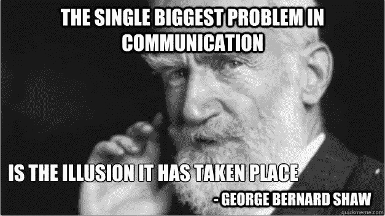

# 讨论代码时不要说“它”

> 原文：<https://medium.com/hackernoon/dont-say-it-when-discussing-code-d673b6b5216d>

这是我和同事讨论技术问题时注意到的；简单的英语口语似乎不合适。

语言已经进化了几千年，以一种与人们最相关的方式来促进人们之间的信息交流。这样做的一个副作用是，语言已经变得更适合于交流关于相对简单的场景的信息，包括:

*   人类与其他人类或动物的互动
*   人类与无生命物体的互动

然而，在过去的几十年里，智能机器和自动化的出现意味着第三种交互变得越来越普遍，那就是:

*   无生命物体与其他无生命物体的相互作用

事实证明，英语的标准口语形式(可能还有其他人类语言)并不擅长讨论这种复杂的非生命物体与物体之间的互动。

例如，以下面的句子为例，它涉及人和物体之间的相互作用:

约翰撞上了一个路标，它被损坏了

在这种情况下，我们知道‘它’指的是一个物体，所以这句话很清楚；是路标被损坏了。

然而，这句话就不那么清楚了:

汽车撞上了一个路标，它被损坏了

在这种情况下，我们不知道是汽车还是路标被损坏。

当讨论代码时，我们描述的大多数情况都与一个或多个无生命物体之间的交互有关，所以在句子中使用像“it”这样的冠词通常是个坏主意。

例如:

父进程向其子进程发送了一条消息，然后遇到一个错误

在这种情况下，我们不知道错误实际上是在哪里触发的；在父进程上还是在子进程上？

一个句子中包含的宾语越多，像“it”这样的冠词就越容易混淆。当讨论代码时，我们不应该害怕多次重复一个句子的主题。此外，当同事描述多个对象之间的复杂交互时，我们应该毫不犹豫地打断他们，并问一些问题，如“你说的‘它’是什么意思”。