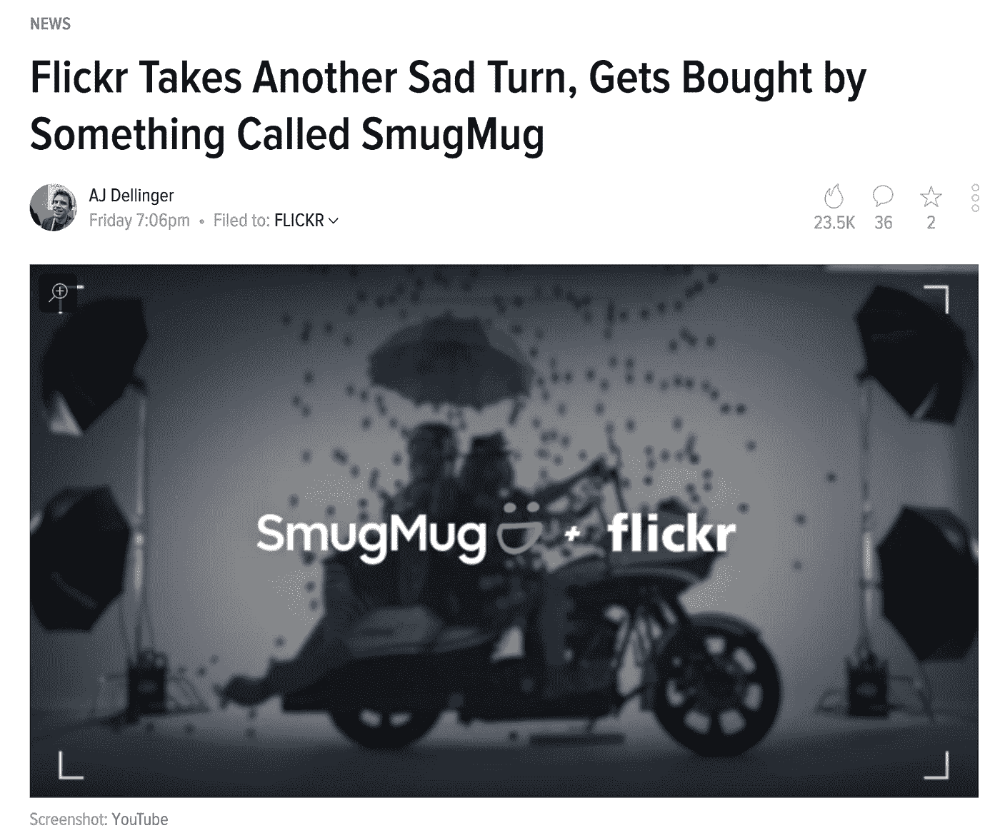
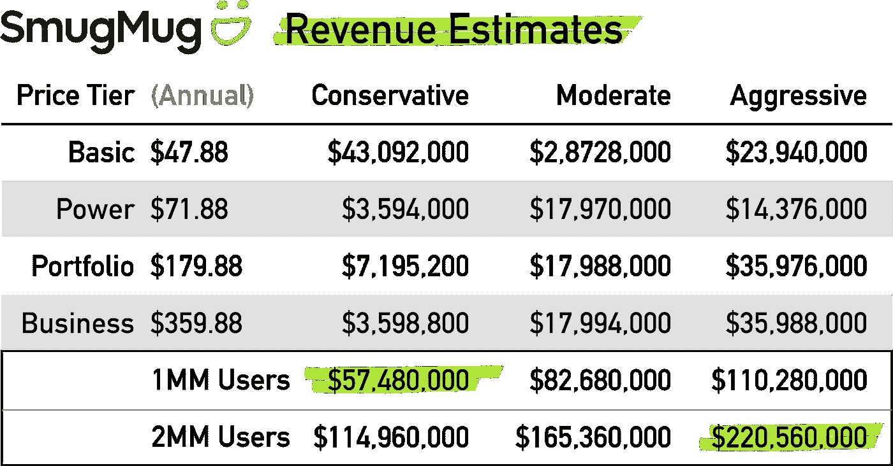

# 不要沾沾自喜地拒绝 1 亿美元以上的初创公司

> 原文：<https://medium.com/hackernoon/dont-smugly-dismiss-100m-startups-fb19314afdaa>

*由* [到*约瑟夫*到](https://twitter.com/josephflaherty)

当 Web 2.0 先驱 Flickr 被 SmugMug 收购时，大部分报道都是正面的，有些是伤感的，但也有一些热门报道贬低了 Flickr 被一家在技术界鲜为人知的公司收购。[这个故事](https://gizmodo.com/flickr-takes-another-sad-turn-gets-bought-by-something-1825432997)是一个有用的例证:

For the record SmugMug isn’t some obscure brand: [1,493,282](https://www.facebook.com/gizmodo/) techies follow Gizmodo on Facebook. [1,134,331](https://www.facebook.com/SmugMug/)photo enthusiasts follow SmugMug.

对于寻求点击量的记者来说，幸灾乐祸是一个有用的策略，在我作为作家的时候，我写过一两个尖刻的标题，但对于企业家来说，这是一个危险的习惯，因为它将拥有一个知名品牌与成功的企业混为一谈。

这篇文章的作者在技术上是正确的，SmugMug 在科技界并不广为人知，也没有通常的成功迹象:

*   SmugMug 没有 Instagram 或 Google 这样的消费品牌。
*   SmugMug 没有破解 app store 前 200 的应用。
*   SmugMug 没有知名风投或名人用户的支持。
*   SmugMug 也缺乏一个免费的定价层来吸引大量的 dau。

据 SmugMug 的创始人兼首席执行官唐·麦卡斯基尔称，SmugMug 拥有数百万付费用户。SmugMug 的创始人没有分享任何收入数据，但算术可以帮助人们了解这家初创公司的规模。SmugMug 提供了四层定价[和年化支付折扣，我在计算时使用了这四层定价:](https://www.smugmug.com/plans)

*   **基本:**$ 47.88/年
*   **电力:**$ 71.88/年
*   投资组合:$ 179.88/年
*   商业:359.88 美元/年

我将这些金额应用于三种转换场景:

*   **保守:** 90%，5%，4%，1%
*   **中度:** 60%，25%，10%，5%
*   **攻击性:** 50%，20%，20%，10%

Perhaps the most impressive fact is that SmugMug was started in 2002 with just a [$500K](https://mixergy.com/interviews/smugmug-chris-macaskill-interview/) loan.

假设只有 100 万付费用户，SmugMug 的年收入在 5700 万美元到 1.1 亿美元之间。如果他们的客户数量接近 200 万或更多，并应用适度的倍数，他们将是一个独角兽。他们也有其他的收入来源，比如销售实体印刷品和代理数字版权，创造更多难以建模的收入。SmugMug 不像 Instagram 那样是互联网的支柱，但它是一个值得研究的实质性业务，而不是顶嘴或嘲笑！

# 创业世界比大多数人想象的要大得多

撇开 SmugMug 不谈，这篇文章的观点是，因为公司不知名或没有令人印象深刻的虚荣指标而拒绝它们是危险的。我见过鲜为人知的创业公司卖出的价格足以让他们的创始人在经济上维持生活。这些产品是典型的[“无聊”，在这个词最好的意义上是](https://hackernoon.com/blessed-are-the-boring-9fb800eca775)。创始人都是有天赋的领导者，但他们更注重推广他们的企业，而不是他们自己。这些公司几乎从未被媒体报道过，但在未来的几年里，它们会在企业家群体中产生连锁反应。

关注积极的异常值是很自然的，比如十亿美元的成功，但对任何不成功的事情采取势利的观点会导致许多人忽视价值数亿美元甚至数十亿美元的重要初创公司。

有人不熟悉某个品牌的事实并不意味着它不好，不管他们认为自己有多“了解”。外面有一个[隐形独角兽](https://hackernoon.com/50-big-companies-that-started-with-little-or-no-money-4ef1b68aac25)的世界，所以不要让虚荣的世界观阻止你进行怪异和奇妙的冒险！