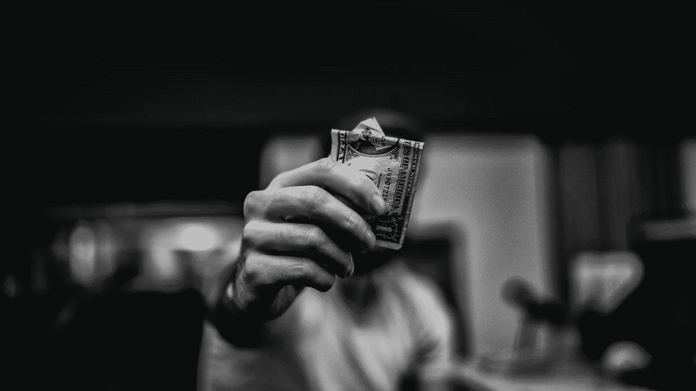
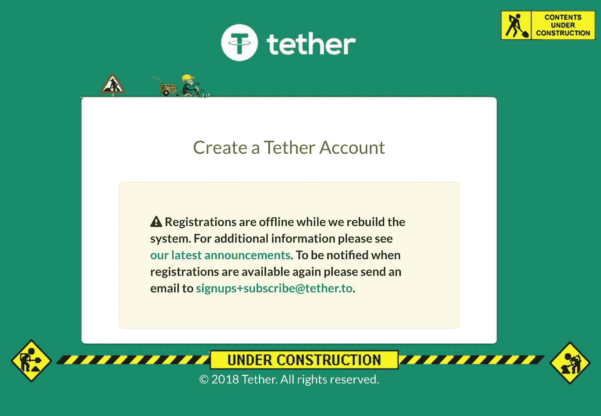
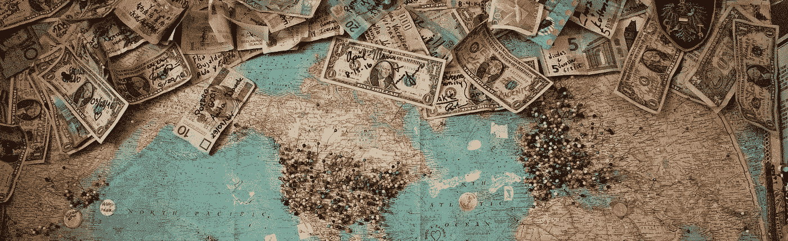

# 不信任系绳？试试戴！

> 原文：<https://medium.com/hackernoon/dont-trust-tether-try-dai-e0c52676be72>

## 秘密意见

## 这是人民的稳定的收入，为了人民。

# 什么是系绳？

Tether (USDT)是一种与美元挂钩的[加密货币](https://hackernoon.com/tagged/cryptocurrency)，由 Tether，Ltd .创建和管理。这意味着，对于存在于[区块链](https://hackernoon.com/tagged/blockchain)上的每个 Tether-the-token，还有 1 美元存在于 [Tether-the-organization](https://tether.to/) 的银行账户中。这个想法是，当美元存入由 Tether 管理的账户时，他们发行新的 USDT 代币。相反，如果撤回美元，他们会烧掉 USDT。在撰写本文时，有超过 20 亿 USDT [在流通](https://wallet.tether.to/transparency)。

Photo by [lucas Favre](https://unsplash.com/photos/MNXaW_ABlZY?utm_source=unsplash&utm_medium=referral&utm_content=creditCopyText) on [Unsplash](https://unsplash.com/search/photos/dollar?utm_source=unsplash&utm_medium=referral&utm_content=creditCopyText)

# 为什么系绳有用？

假设你在你最喜欢的交易所交易这个和那个，你的蜘蛛感官警告你加密市场即将崩溃。你必须逃到美国！但是如果你选择的交易所实际上不接受法定存款呢？当没有办法卖掉你的代币来换取现金时，该怎么办？你真的必须转换到 BTC 或瑞士联邦交易所，转移到另一个交易所(如 GDAX 或 Gemini)，然后以美元出售吗？啊！

**USDT 来救援了！由于 USDT 与美元挂钩，你可以(理论上)将手中的人民币兑换成 USDT 货币，从远处看着价格下跌，手中握着满满的 USDT，脸上挂着微笑。**

Tether 为加密货币交易所提供了一种很好的方式来提供“美元”,而没有与美国银行系统实际连接并遵守传输和存储美元要求的所有混乱的繁文缛节和监管术语。

# 听起来很棒！我为什么不相信它？

嗯，系绳是存在于互联网上的，有时候互联网上的人也会撒谎。我并不是说 Tether 不值得信任——我的意思是……他们会直接在网站上告诉你他们在银行里有多少钱。但是你必须相信他们的话，因为还没有一个合法的第三方审计。

另外，假设你用辛苦赚来的比特币换了 USDT，现在你想用那个 USDT 换一箱本雅明。很简单，你只需去系绳网站，注册一个帐户，存款 USDT，并提取美元到您的银行账户…

Any day now…

或者不是。显然，菲亚特撤回并没有提供给像你我这样的普通人相当长一段时间。也许他们真的在“重建系统”他们已经重建它很长时间了。

哦，别忘了看看推特上的 Bitfinex。

# 你能概括一下吗？

一家名为“Tether”的公司创造了 Tether，并声称每个 Tether 都有一张美元钞票藏在 Khazad-DM(或者可能是一家银行，idk)的肠子深处，但我们不得不相信他们的话。交易所喜欢 Tether 的 Tether，因为它允许他们给客户美元，而不是真正给他们美元，同时也避免了很多监管。客户喜欢它，因为他们可以在离岸交易所“用美元交易”,而没有尝试法定存款的所有麻烦(也许还能避开税务员的监视)。然而，[窥探的目光](https://www.coindesk.com/report-cftc-sends-subpoenas-bitfinex-tether/)这几天也不远了。

Moving on then…

# 好吧，我不要系绳。戴是什么？

戴是一种与美国娃娃挂钩的加密货币…

# 等等，又一个？

是的，但是这个不同。而不是依赖一个不知名的公司和它隐藏在窗帘后面的巨额财富的承诺(不要偷看！)，戴的旁系是在的以太坊上公开管理的。戴得到的不是可能存在也可能不存在的美元借据，而是锁定在以太坊公开可见的智能合约中的以太。

戴是由一家名为 Maker 的公司创建的，由 MakerDAO 管理。MakerDAO 是一个由持有 MKR 代币的个人组成的联盟，他们为戴稳定币系统的风险参数投票。该系统允许用户将以太(以及将来某一天的其他代币)存入智能合同，以接收和转售 Dai。存款是一种抵押债务头寸(CDP ),其中债务以 Dai 计价，必须烧掉 Dai 才能取回抵押品。Dai 的价格通过一个称为目标价格反馈机制的子系统稳定在目标价格附近

# WTF？停下来。别说了。

没错。基本上，聪明的人和聪明的合同在一个特殊的市场上移动一堆乙醚，产生可供你我使用的 Dai。整个系统的存在是为了保持 1 戴大约等于 1 美元。为了正确地了解它是如何工作的，最好是访问[网站](https://makerdao.com/)或者查看一些[详细的](https://github.com/makerdao/docs/blob/master/Dai.md) [文章](/cryptolinks/maker-for-dummies-a-plain-english-explanation-of-the-dai-stablecoin-e4481d79b90)。

# 随便啦。我在哪里可以找到戴？

有几个好地方可以去:

[**oasis dex**](https://oasisdex.com/)——傣人卖傣的地方。

[**Bancor**](https://www.bancor.network/communities/5a604b1f7b6b0e0001fc6ce2/currency) —多个以太币代币的流动性提供者。

[**雷达雷**](https://app.radarrelay.com/WETH/DAI) —一个去中心化的交易所。

[**Bibox**](https://www.bibox.com/) —集中交易所(慎用。这里有龙)。

# 我能用它做什么？

像 Tether 一样，Dai 也可以用于对冲加密货币的价格波动，例如以太价格的下跌。

然而，它也可以在以太坊生态系统中的分布式应用程序(dApps)中用作稳定的货币，这可能受益于低波动性货币。例如，P2P 贷款市场将受益于戴而非 ETH 的贷款，因为贷款人可能不想放弃几天后价值可能增加 20%的 ETH。此外，利用假人(CPU 周期)和 StorJ(磁盘空间)等真实资源的 dApps 可能更适合用 Dai 来命名，因为它更容易将价格与等效的集中式服务进行比较。

随着以太坊 dApp 生态系统的进步会发现越来越多的用途，随着它越来越受欢迎，抵押品越来越多，Dai 的稳定性也会增加。它还不完美，但绝对是系绳的健康替代品。

# 酷豆。谢谢！

不客气

如果你喜欢这篇文章，请在 [Twitter](https://twitter.com/Edward_Giraffe) 上找到我，说 *hi* ，或者在下面留下评论。

