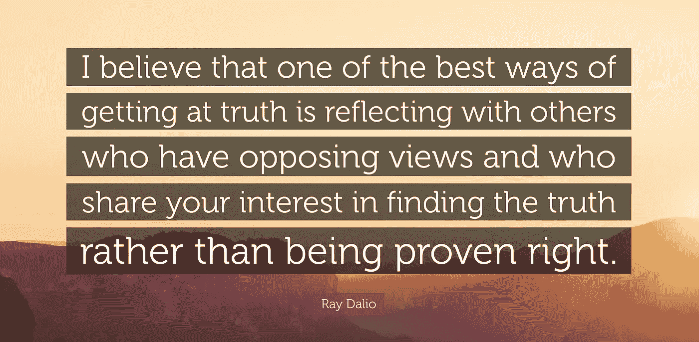

# 不要担心显得聪明，要担心发现真相

> 原文：<https://medium.com/hackernoon/dont-worry-about-appearing-smart-worry-about-finding-the-truth-9305f3b98255>

你有没有过这样的经历:你准备了几个小时的演讲，却被一个你没有考虑到的问题弄得措手不及？或者你发现自己在和一个同伴辩论时，只是在想“为什么我不能说服这个人用我的方式看问题？”

## 如果你喜欢这篇文章，我正在为新人和有抱负的人写一本书…