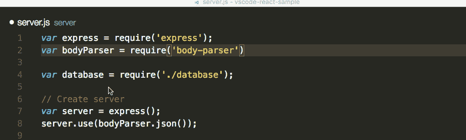
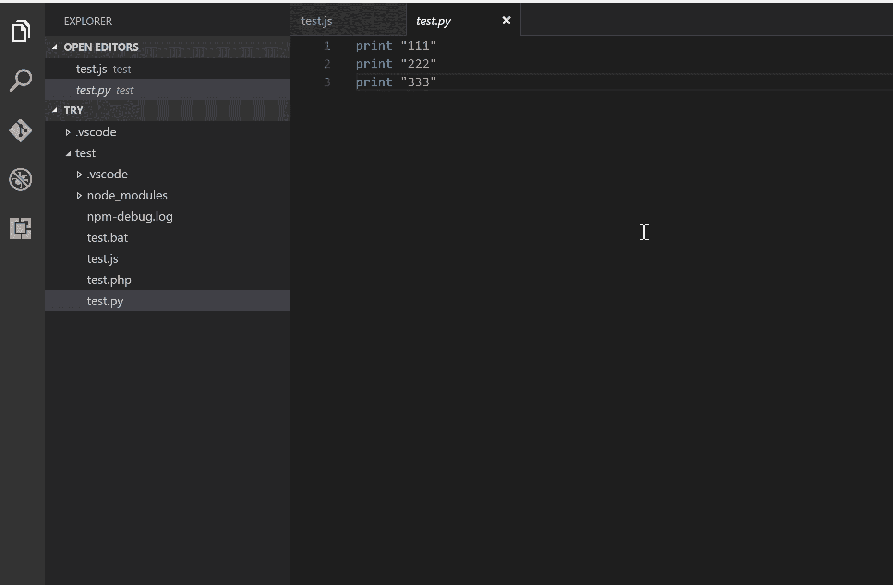

# Javascript 开发人员的 Dope 与代码扩展

> 原文：<https://medium.com/hackernoon/dope-vs-code-extensions-for-a-javascript-developer-7981625f4c4a>

根据 2017 年 [Octoverse](https://octoverse.github.com/) 的数据，微软的 Visual Studio 代码高居贡献者最多的*项目榜首。*这意味着有很多开发者绝对热爱 VS 代码。
这里我有一个扩展列表，它可能不会让你成为一个更好的开发者，但肯定会让你感觉自己是一个更好的开发者！


Image from [https://wallup.net/code-microsoft-visual-studio/](https://wallup.net/code-microsoft-visual-studio/)

一个漂亮的小命令会让我得到我已经安装的 VS 代码扩展的列表

```
$ code --list-extensionsalefragnani.project-manager
aaron-bond.better-comments
eamodio.gitlens
eg2.vscode-npm-script
formulahendry.code-runner
jamespgilbert.comment-label
schristian-kohler.npm-intellisense
shardulm94.trailing-spaces
steoates.autoimport
streetsidesoftware.code-spell-checker
whtouche.vscode-js-console-utils
xabikos.JavaScriptSnippets
```

> 一位智者曾经说过:gif 和 JPEGs 比语言更有说服力

## [**NPM 智能感知**](https://marketplace.visualstudio.com/items?itemName=christian-kohler.npm-intellisense)



## [Git 镜头](https://marketplace.visualstudio.com/items?itemName=eamodio.gitlens)


## [NPM 剧本](https://github.com/Microsoft/vscode-npm-scripts)


## [代码运行器](https://marketplace.visualstudio.com/items?itemName=formulahendry.code-runner)



## [尾随空格](https://marketplace.visualstudio.com/items?itemName=shardulm94.trailing-spaces)

```
"editor.trimAutoWhitespace": true,
"files.trimTrailingWhitespace": true,
```


Image by [niichie](https://github.com/Niichie)

## [自动导入](https://marketplace.visualstudio.com/items?itemName=steoates.autoimport)


## [代码拼写检查器](https://marketplace.visualstudio.com/items?itemName=streetsidesoftware.code-spell-checker)


## [控制台实用程序](https://marketplace.visualstudio.com/items?itemName=whtouche.vscode-js-console-utils)


## [Javascript 代码片段](https://github.com/xabikos/vscode-javascript)

```
imp→ import fs from 'fs';
imn→ import 'animate.css'
imd→ import {rename} from 'fs';
ime→ import * as localAlias from 'fs';
ima→ import { rename as localRename } from 'fs';
enf→ export const log = (parameter) => {console.log(parameter);};
edf→ export default (parameter) => { console.log(parameter);};
ecl→ export default class Calculator { };
ece→ export default class Calculator extends BaseClass { };
```

## [项目经理](https://github.com/alefragnani/vscode-project-manager)


## [评论标签](https://marketplace.visualstudio.com/items?itemName=jamespgilbert.comment-labels)


## [更好的评论](https://marketplace.visualstudio.com/items?itemName=aaron-bond.better-comments)


还有几个，特别是给 ng 粉丝的:

*   [有角度的 v5 片段](https://marketplace.visualstudio.com/items?itemName=johnpapa.Angular2)
*   [内嵌式角度 2](https://marketplace.visualstudio.com/items?itemName=natewallace.angular2-inline)
*   [Angular2 材料](https://marketplace.visualstudio.com/items?itemName=hardikpthv.AngularMaterial)

其他值得一提的不是没能进入 12 强就是太明显的: [gitlink](https://marketplace.visualstudio.com/items?itemName=qezhu.gitlink) 、 [esLint](https://github.com/Microsoft/vscode-eslint) 、 [chrome-debug](https://github.com/Microsoft/vscode-chrome-debug) 、 [yarn](https://marketplace.visualstudio.com/items?itemName=gamunu.vscode-yarn) 、[支架对上色器](https://marketplace.visualstudio.com/items?itemName=CoenraadS.bracket-pair-colorizer)。