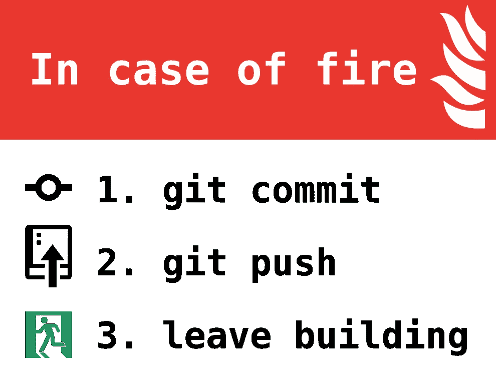

# 点文件自动化:第 2 部分

> 原文：<https://medium.com/hackernoon/dot-file-automation-part-2-a902797c9313>

如果某件事值得做，就值得做得过分。本系列的第一部分处理了如何启动和运行基本的点文件自动化，以及让脚本识别它们运行在什么系统上。[https://hackernoon.com/dot-files-automation-c29bf63d765c](https://hackernoon.com/dot-files-automation-c29bf63d765c)
本文将更进一步，深入探讨模块化的、基于系统的点文件结构，这种结构从嵌套继承中获益。

TLDR 链接到回购如果阅读文件更容易。

 [## 骑行交通/点文件-自动化

### 在 GitHub 上创建一个帐户，为 riding in traffic/dot file-automation 开发做出贡献。

github.com](https://github.com/ridingintraffic/dotfile-automation) 

这是如何工作的？有一个足够简单的流程。
[OS symlink]→[common _ profile]→[OS release profile]→[host profile]
这种复杂性是必要的，因为我的工作和个人笔记本电脑都是 mac，然后我在四种 linux 上工作:Raspbian、ubuntu、centos 和 kali。因此不同的系统有不同的需求。检测功能如下

该脚本的核心是识别我在哪个机器上工作，然后创建适当的符号链接，或者加载适当的配置文件。我知道，如果逻辑只是在点文件中，事情可能会简单一些。然而，有安全意识的人可能喜欢在他们工作的每台计算机上没有所有的点文件信息。此外，如果你是一台工作电脑，如果网络文件正在做一些更“微妙”的工作，这可能是一个保密问题，因此，把工作留在工作中是有益的。用于此目的的符号链接脚本如下。在创建新的符号链接之前，有一些很好的附加保护措施来备份旧的点文件。

接下来，当从一台机器跳到另一台机器时，我的一个主要烦恼是我的纯文本笔记不会保持更新。不幸的是，我每天花很多时间的网络已经屏蔽了 evernote，并暴露了 github。对此，最好的解决方法是在 git repos 中记录一些笔记。然而，记住更新它们可能是一件痛苦的事，有一个功能可以做到这一点。

最后，在工作中总会讨论我们想去哪里吃饭，为了帮助我们选择，也有一个功能。为了悬念，增加了一些睡眠。

希望可以看到每个系统配置的有用性。我还喜欢备份我的配置，以确保当我的系统崩溃时，我可以快速恢复。目的是在我创建系统的时候有一点点的初始工作，但是之后我再也不用担心丢失我的工作了。最后，这一切都依赖于黄金法则，在火灾的情况下，git 犯，git 推，离开建筑物…这有一个函数。

