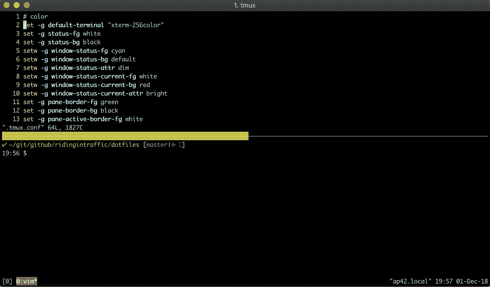

# 。点文件自动化。

> 原文：<https://medium.com/hackernoon/dot-files-automation-c29bf63d765c>

[https://www.tastingtable.com/cook/national/how-to-sharpen-knives-on-stone-sharpening-stone](https://www.tastingtable.com/cook/national/how-to-sharpen-knives-on-stone-sharpening-stone)

磨快并清洁你的工具，让它们更耐用。磨练你的工具，使它们更精确。SRE 的工具始于终端。终端用点文件打磨得很锋利。

在终端中生活足够长的时间，调整和定制就会发生。活得久一点，当这些调整在一场灾难中丢失，或者当你换机器时，你会被束缚住，难过地回到一无所有。

阶段 1:在 GitHub repo 中维护我的 tmux、bash、git 和 vim 的 dot 文件，然后从 repo 手动符号链接到我的主目录。

阶段 2:自动化所有配置设置过程和支持软件。

复杂性 1:半打机器。

复杂性 2:机器被分为 Mac 和 linux。

复杂性 3:一些 linux 虚拟机希望以 root 用户身份运行。
*-关于 root 的狂怒笔记-* 这些是 kali 和 security 的发行版，并不打算长期存在，但我会在足够长的时间里想要一个工具集。

点文件被安排在将要运行的 shell 脚本中，然后适当的 bash git tmux 和 vim 文件被符号链接，并基于我运行的操作系统和用户来使用。

如果我在这些方面做错了什么，我真的很想听听，这些是我在过去 5 年左右的时间里拖来拖去修改的 dot 文件，我们都知道，看着 6 个月前写的任何东西，我们可以想出更好的方法来做事情。

it is certainly nothing flashy but the majority of the tweaks are the keyboard shortcuts

让我们开始吧。