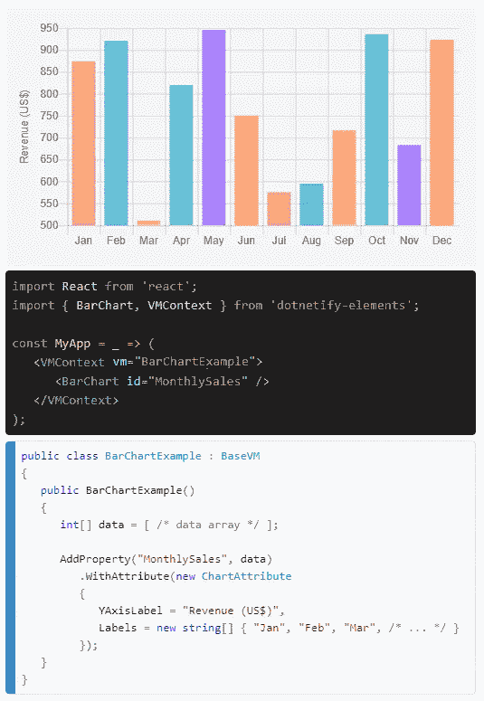
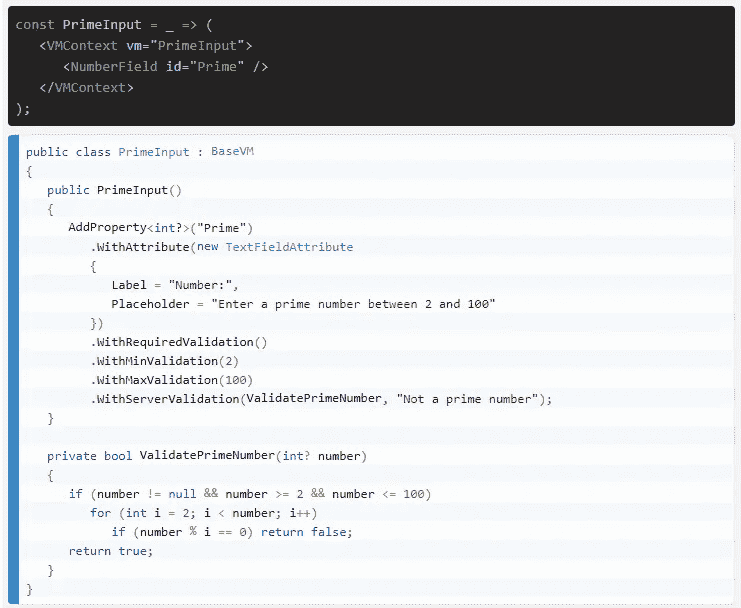
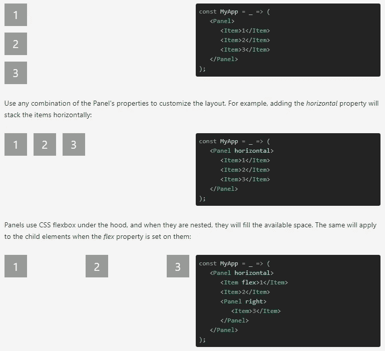
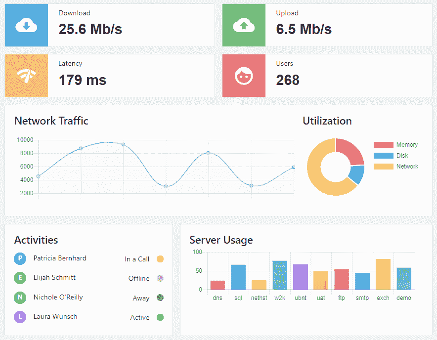

# 元素:实时 Web UI 组件工具包。网

> 原文：<https://medium.com/hackernoon/dotnetify-elements-real-time-web-ui-component-toolkit-for-net-f921b70aab35>

这是发布的文章 [DotNetify-React:用 React + SignalR 构建反应式 MVVM 应用的后续文章。网芯 2.1](https://hackernoon.com/https-hackernoon-com-dotnetify-react-released-efc7de44a47e) 。

*DotNetify-Elements* 是一套免费、开源的 [React](https://hackernoon.com/tagged/react) 组件，可以通过 WebSocket，以一种反应式的 MVVM 方式，轻松连接运行在 ASP.NET 核心或 ASP.NET 框架服务器上的 C#对象。

[**在这里看文档和现场演示。**](http://www.dotnetify.net/elements/)

**[***dotNetify*项目**](https://github.com/dsuryd/dotNetify) 的最终目标是显著降低通常与现代 web 应用程序开发相关的复杂性。NET 开发人员的视角，通过统一的 UI 框架，促进简单和可维护的代码的生产，通过:**

*   **消除样板代码，**
*   **采用函数式、声明式和反应式[编程](https://hackernoon.com/tagged/programming)范式，**
*   **将业务/数据驱动的逻辑牢牢地放在后端，让前端只负责 UI/表示，**
*   **功能强大的 UI 组件系统，易于配置、定制和扩展。**

**为此，这里有一个使用 *dotNetify-Elements:* 的例子**

## **声明性的、简洁的、符合惯例的**

**比如实现下面的条形图，包含服务器数据，只需要几行代码。**

****

**Bar chart with server data needs only a few lines of code.**

**客户端是完全声明性的，不需要自定义代码从服务器获取数据。水合 UI 组件是通过 *id* 属性约定完成的，它只需要匹配作为数据源的服务器端视图模型属性的名称。**

**服务器端视图模型提供了配置和数据，并可以利用 dotNetify 的运行时反应属性和 fluent 方法使代码简单、简洁和可读。**

## **简单反应形式**

**从设置 UI、获得初始设置、跟踪脏状态、执行客户端和服务器端验证、显示错误，到提交输入，创建客户端表单可能是一项相当繁琐的工作。**

***Elements* 给你一个强大的抽象，让你轻松简单地处理最复杂的嵌套表单。所有的配置和验证都是在 C#视图模型上声明的，但是这并不意味着低效的、与浏览器的持续对话，这要归功于内置的客户端逻辑，它只在适当的时候向服务器提交数据。**

****

**Example of getting input with client- and server-side validations.**

## **简单布局系统**

**定位和设计 UI 元素的任务通常非常耗时，尤其是对于通常不从事 web 前端工作的开发人员来说。CSS 非常强大，但需要时间来掌握，这可能会让只想快速为内部应用程序或周末项目组装一些前端的开发人员望而却步。这就是*元素*可以帮忙的地方。**

***元素*提供了一个反应灵敏的主布局网格，除此之外还有一个只需要几分钟就能理解的面板系统。每个面板都可以自动定位其子元素，中间有一个固定的间隙，垂直或水平排列它们，并适应可用的空间，等等。**

****

**A system of panels for quick and nice layout.**

**面板也可以用 CSS 完全定制，你可以把它作为一个字符串传入，这个字符串的范围仅限于那个组件。**

## **简单的实时可视化**

**单单 DotNetify 就已经给了你一个简单、轻量级的抽象，可以使用 SignalR 实时向浏览器发送数据。 *Elements* 通过利用其他开源库，将它们包装成直接挂钩 C#视图模型的一致 API，进一步提高了标准。**

****

**Example of Bootstrap-themed real-time dashboard.**

## **主题化和定制**

***元素*的设计特别注重让每个组件都可以主题化，并且让你能够根据自己的需要逐步定制它们。每个组件都可以分解成子组件，您可以通过组件的属性来替换其中的任何一个组件。**

**您甚至可以通过扩展为服务器提供 API 的基本元素类型来创建自己的组件，并在此基础上构建自己的 UI。**

## **与现有的 ASP.NET 框架项目集成**

**虽然它是用。请记住，即使您的项目仍然基于 ASP.NET web forms 技术，也有一个好方法可以将*元素*集成到应用程序中，并与您现有的 web 页面一起工作。查看文档的入门部分，这里有一个 github repo[演示了从 Visual Studio 2017 项目模板生成的 ASP.NET MVC 和 WebForms 项目中完全实现的实时*元素*页面。](https://github.com/dsuryd/dotNetify-Elements/tree/master/Templates/ASPNetFramework)**

## **项目的状态**

**本文的发布日期标志着 *dotNetify-Elements* (v0.1)的首次公开迭代。如果你喜欢你所看到的，请让我知道，帮我找到错误，并向我提供你的反馈，以便有一天这可以使它成为生产就绪版本 1.0。同时，我希望你会发现这对个人项目和公司的内部应用程序非常有用。**

**感谢您的阅读！对于技术问题，请使用 [github 回购问题论坛](https://github.com/dsuryd/dotNetify-Elements)。**