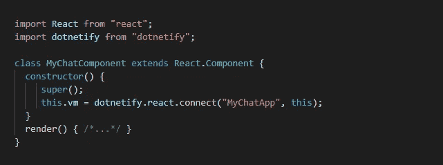

# DotNetify:使用 SignalR 构建协作 Web 应用的多播视图模型

> 原文：<https://medium.com/hackernoon/dotnetify-multicast-view-model-for-building-collaborative-web-apps-with-signalr-6a6272f203ab>


DotNetify3.1 版本发布了，随之而来的是在跨平台 ASP.NET 服务器上编写多播视图模型类的新功能。

什么是多播视图模型？假设你已经熟悉 [dotNetify 和它的服务器端 MVVM web 应用程序开发方法](https://hackernoon.com/https-hackernoon-com-dotnetify-react-released-efc7de44a47e)，它是一个服务器端视图模型，你可以通过多个 [SignalR](https://hackernoon.com/tagged/signalr) 客户端连接共享同一个实例。对视图模型的任何数据更新，无论是由服务器还是任何客户端，都将被同时发送到所有。

# 为什么选择多播视图模型？

这有许多应用，几乎所有需要与多个客户端进行实时通信的应用，例如简单的物联网广播、聊天应用、多人游戏和各种在线协作工具。

但是，当然这一切都可以用一个 SignalR hub 类来完成，就像每个聊天教程喜欢展示的那样？答案是肯定的，但是……让我们来看看这些聊天应用的例子。它简单得令人难以置信，因为如果您继续沿着这条路走下去并开始构建更高级的特性，您可能会以复杂、紧耦合的代码而告终——无论是在客户端还是在服务器端——这不容易编写测试！

MVVM 设计模式通过将业务逻辑从基础设施中分离出来，有助于保持代码的高度可测试性。DotNetify 抽象出 SignalR 的本质，在很大程度上你甚至不知道它的存在，所以你可以专注于构建你的客户想要的功能。

# 它是如何工作的

这是定义多播视图模型的方法:

```
public class MyChatApp : **MulticastVM**
{
}
```

这是一个普通的 C#类，继承自一个 dotNetify 的基类。对于客户端脚本，我们将使用 React，我们将添加一个组件来连接到这个视图模型:



每当这个组件在多个浏览器上呈现时，服务器总是给它相同的视图模型实例。

让我们添加一些基本聊天的文本框:


这里是完整的服务器端视图模型，它将产生与官方 SignalR 聊天示例相同的结果:

```
public class MyChatApp : **MulticastVM**
{
   public List<string> Messages { get; } = new List<string>();
   public Action<string> Message => this.**AddList**("Messages", msg);
}
```

请注意，我们已经从代码中完全删除了直接的 SignalR 方法调用，并使用属性/命令绑定来让数据在服务器和连接到该视图模型的所有客户端浏览器之间无缝流动。

当您需要获得更多关于连接客户端的信息时，您可以将`IPrincipalContextAccessor`和`IConnectionContext`注入到视图模型中。这些接口提供了当前正在连接的客户端的环境上下文，例如 SignalR 连接 ID、基于声明的身份、使用的 IP 地址等等。

# 分区实例

除了单个实例之外，一些用例还希望为不同的连接组提供不同的实例。例如，通过身份验证的用户可以同时从桌面和智能手机连接，并共享一个不能与其他用户共享的视图模型实例。

SignalR 具有定义和广播到组的能力，当 Redis 被配置时，它可扩展到多个服务器。使用`MulticastVM`，定义一个组就像覆盖`GroupName`属性一样简单:

```
public class PerUserVM : **MulticastVM**
{
   private readonly **IPrincipalAccessor** _principalAccessor;       public override string GroupName
   {
      get => _principalAccessor.Principal.Identity.Name;
   }    public PerUserVM(**IPrincipalAccessor** principalAccessor)   
   {     
      _principalAccessor = principalAccessor;   
   }
}
```

基于调用连接的上下文，`GroupName`值将是动态的。其工作方式是，当身份名为 *UserA* 的经过身份验证的客户端连接时，将创建一个新实例，并将其与客户端的组名“UserA”相关联。当 *UserA* 再次从不同的设备连接时，即不同的连接，它将被赋予任何具有匹配组名的现有实例。由于身份名称相同，两台设备将使用相同的视图模型实例。但是当 *UserB* 连接时，将没有匹配的组名，将创建另一个实例并与‘UserB’组名关联。

使用这种机制，您可以扩展它来检查来自数据存储的连接用户的组成员资格，并为任何特定的组创建分区视图模型实例。

# 直接信息

如果我们只需要向某些用户发送消息，该怎么办？使用`IConnectionContext`，您可以将连接的用户与他们的 SignalR 连接 id 相关联，一旦有了这些 id，就可以使用`Send`基本方法向您选择的一个或多个连接发送消息:

```
**Send**(new List<string>{ connId, ... }, stateName, stateValue);
```

# 如何开始

如果您是 dotNetify 的新手，您可能对上面的示例代码有很多疑问。请访问 dotnetify.net 网站，那里有关于 API 的详细解释。那里有大量的其他材料:现场演示、模板，甚至 React 的 UI 工具包。一切都是免费开源的。

感谢阅读！