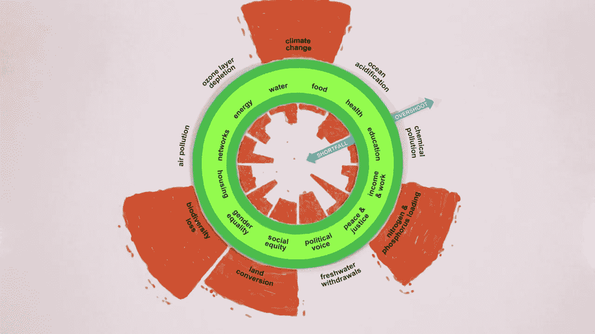

# 甜甜圈经济学——可持续未来的最佳选择

> 原文：<https://medium.com/hackernoon/doughnut-economics-the-best-alternative-for-a-sustainable-future-898110323d71>

牛津大学环境变化研究所的成员凯特·拉沃斯(Kate Raworth)在她的书《甜甜圈[经济学](https://hackernoon.com/tagged/economics):像 21 世纪经济学家一样思考的七种方式》中开辟了一条道路，并提醒我们“经济增长最初并不意味着幸福。”然而，这是政府告诉我们的。

《卫报》记者[乔治·蒙比尔特](https://www.theguardian.com/commentisfree/2017/apr/12/doughnut-growth-economics-book-economic-model)，一位从不害怕挑战权势集团的作家，无论是政府还是像孟山都这样的企业，在他对拉沃斯的经济学方法的评论中指出，随着亿万富翁掌控政府，政治领导人变得没有发言权。他们能给公民带来的最大好处是经济增长的诱惑力，正如他所说，“仙尘应该能让所有的坏事消失”。我们应该对这样一个事实视而不见，即这种承诺的增长造成了环境破坏，对缓解失业或不平等毫无帮助。他引用了一份从英国外交部泄露的备忘录:“贸易和增长现在是所有职位的优先事项……像气候变化和非法野生动物贸易这样的工作将会减少。”似乎没人介意我们破坏什么，只要我们拥有财富。

在这种情况下，拉沃斯是一个非常需要的声音。她说出了“难以忽视的真相”，即上个世纪的经济哲学已经“失去了阐明其目标的愿望”，并宣扬了一种存在严重缺陷的人性。正如她所言，“理性经济人”的主导模式是一种基于自利、孤立和算计的模式，你可能会说这描绘了一幅操纵型自恋者的画面。她还说，我们最终得到的是一个无尽增长的圣杯。

**甜甜圈经济**

相反，拉沃斯说，经济活动应该以“在地球力所能及的范围内满足所有人的需求”为目标。她对强大经济的愿景是，无论经济增长与否，都会“让我们繁荣”。这意味着改变经济是什么以及它如何运行的图景。这就是[甜甜圈](https://www.kateraworth.com/doughnut/)出现的地方。

她通过将经济牢牢地置于地球系统和社会中，重新构建了经济的概念。她的图表显示了物质和能量的流动，也提醒我们每个人，我们不仅仅是“工人、消费者和资本所有者”

[甜甜圈](https://hackernoon.com/tagged/doughnut)有两个环:甜甜圈的内环代表我们过上好生活所需的充足资源:食物、清洁水、住房、卫生设施、能源、教育、医疗保健和民主。任何生活在甜甜圈中间的洞里的人，都生活在一种被剥夺的状态中。甜甜圈的外环由地球的环境极限组成，当我们超出这个极限时，我们就会造成危险程度的气候变化、其他形式的环境污染、物种灭绝以及对生物世界的各种其他攻击。

**我们怎样才能创造一个甜甜圈经济？**

遵循拉沃斯愿景的经济模式将主要寻求减少财富和收入的不平等。再者，我们从自然界获得的财富应该被广泛分享；这包括从农业到矿业的一切。金融业的结构应该是保护和再生资源，而不是浪费资源，国有银行应该投资于从根本上改变我们与环境关系的项目，比如零碳公共交通和社区能源计划。她还建议我们必须用一种新的方式来衡量繁荣。

我们以前听说过其中一些想法，但拉沃斯所做的是将它们整合成一个连贯的计划，其结果可以在实施时进行衡量。政府急需将拉沃斯的想法转化为政策。

如果你对 2019 年有一个决定，我建议是这个:[读她的书](https://www.amazon.co.uk/dp/B01BUOGF58/ref=dp-kindle-redirect?_encoding=UTF8&btkr=1)，发现我们可以拥有人类繁荣和一个繁荣的生活世界。为了我们的子孙后代，我们现在就应该改变经济模式。