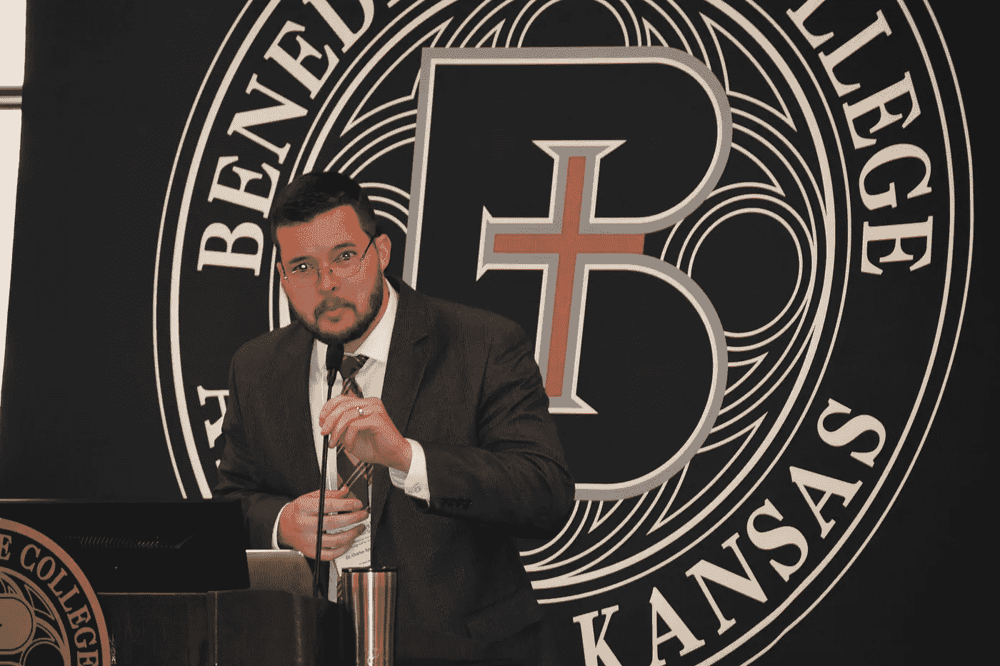

# 查尔斯·斯普劳斯博士谈交通中的人工智能:人工智能如何帮助保护气候

> 原文：<https://medium.com/hackernoon/dr-charles-sprouse-talks-ai-in-transportation-how-ai-could-help-safeguard-the-climate-5f8934eaf654>

Dr. Charles Sprouse. Photo Copyright 2018 by John Tuttle.

[查尔斯·斯普劳斯博士](https://www.benedictine.edu/faculty-staff/sprouse-charles)，堪萨斯州艾奇逊市本笃学院教授，2016 年获得机械工程博士学位。他还设计了许多科技设备。9 月 29 日，他和他的两位客座同事是在本笃会校园举行的“人工智能和人类”讲座的演讲者。这是天主教学者 T2 联谊会年会系列讲座的一部分。

作为第一个发言的演讲者，Sprouse 讨论了人工智能在交通行业的当前和未来意义，以及它对乘客和行人的意义。

 [## 第一集:天主教学者会议——“人造情报”...

### 欢迎来到假设工作室播客的第一集，这是一个探索过去的音频节目…

www.podomatic.com](https://www.podomatic.com/podcasts/whatifstudios/episodes/2018-10-06T14_09_05-07_00) 

Sprouse 已经决定他将在这个特殊的领域演讲人工智能的使用，因为它目前淹没了有人工智能思想的开发人员。他告诉他的同事和其他听众，在今年早些时候的一次人工智能会议上，非营利组织 [Ecomotion](http://ecomotion.us/) “认可了智能交通领域的 580 家新创业公司。”因此，它是一个相关的主题，在履行组织和潜在用户之间积累了越来越多的兴趣。

“这是一个巨大的领域，”斯普劳斯说，他接着讲述了在我们的车辆中使用人工智能的一些具体细节。由于 21 世纪的车辆是“按需”的，用于往返工作等功能，自动驾驶汽车可以达到几个有益的目的。斯普劳斯提出，如果一辆自动驾驶的人工智能汽车能够容纳多人，并提供与优步汽车相同的可用性，那么一个只需要一辆车上下班的人可能会“与大约 20 个人共用这辆车”

可以说，许多人拥有一辆汽车的零部件。因此，每个共有人不必为他们的那部分车辆支付他们自己的整辆车的费用。斯普劳斯博士说，这种暗示可能会导致总体上“更少的汽车”,这对车主来说在经济上是有利的。

因此，人工智能在交通中的这一功能不仅会降低人们的交通费用，而且还可能比我们目前的交通状况对气候造成更小的破坏。目前，有一点(科学界认为是)全球气候危机，主要是由于人类的温室气体排放。普通汽车每年产生大约 6 吨二氧化碳。

在车辆中使用人工智能系统将节省时间。有了自己的人工智能，汽车会选择最快的路线，而不会像你和我一样花太多时间在停车场寻找空位。因此，它将能够比任何人类出租车服务更及时地将更多的人送到目的地。

如果斯普劳斯提出的类似优步的交通工具在未来被使用，它可以降低二氧化碳的排放量。这将不可避免地降低极端气候变化的风险。