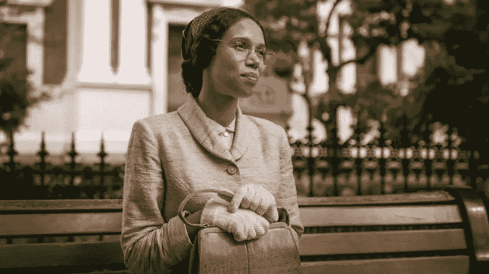
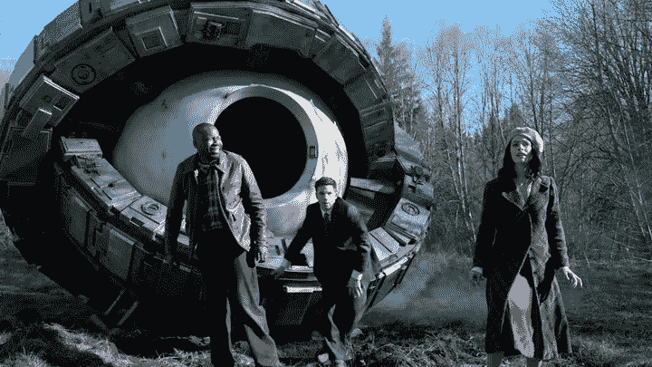
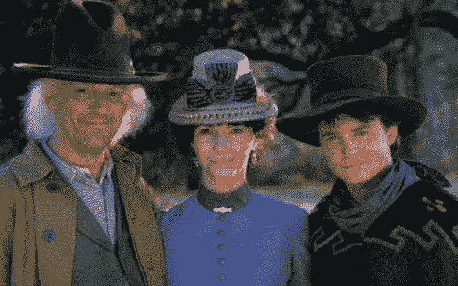

# 《神秘博士》、《罗莎·帕克斯》、《永恒》和《有色人种时间旅行者的命运》

> 原文：<https://medium.com/hackernoon/dr-who-rosa-parktimeless-and-the-fate-of-the-colored-time-traveler-fcf923b93622>

新的*神秘博士*系列，由乔迪·惠特克饰演有史以来第一位女医生(时间领主)，本周有一集重磅炸弹，叫做罗莎。

这位医生和她的英国同伴瑞安、亚兹和格雷厄姆于 1955 年回到阿拉巴马州，以确保罗莎·帕克斯不会被阻止她拒绝在公交车上让座的公民抗命行为，这一行为现在已成为传奇。

这一集几乎被普遍认为是“强有力的”和“情感上有影响力的”，我不得不同意。从技术上讲，这不是一篇评论，而是这一集提出的一个问题，一个像我这样的科技黑客和科幻迷已经花了很多时间思考。

Photo: BBC America

我认为这是一个令人心碎的场景，在过去到达这个城镇后，我们以前的时间旅行者坐在一家餐馆里吃饭。餐厅里的人，包括员工，看起来都很不自在。当我们的团队想知道为什么时，他们解释说:“我们这里不招待黑人或你的墨西哥朋友，”服务员说。

我的意思是，对于我们这些认真思考过如果时光旅行我们会做什么的人来说，这几乎总是我想象我会做的第一件事。时间旅行会让你感到饥饿。虽然 Ryan(黑人)在公共汽车和餐馆受到歧视，但他们不太知道如何看待 Yaz(巴基斯坦裔)——让她猜测她会融入哪里。

这一集让我对时间旅行产生了长久以来的恐惧。如果我作为一个非白人，回到美国历史上，会是什么样子？？

好吧，所以你在想——时间旅行不是真实的，所以我对时间旅行有一种“长期的恐惧”是完全不理智的，不是吗？

作为一个科幻小说的超级粉丝，一个美国历史的狂热爱好者，一个相信科学家有一天可能会把看起来像科幻小说的比喻变成真正的技术的人，这是值得一点点考虑的事情。我自己也想回到美国历史上的很多点！

我从未真正向任何人表达过的恐惧，在最近的 NBC 时间旅行节目《永恒》中得到证实，该节目与本周的《神秘博士》有很多相似之处。这是我记得的第一部至少有一名黑人成员(鲁弗斯，由马尔科姆·巴雷特扮演)实际上必须处理这类问题的科幻剧。

Timeless was one of the first time travel shows to seriously address being “colored” in American History

鲁弗斯在《永恒》的第一集里说:“我是黑人，美国历史上没有一个地方会让我感到敬畏”。

好吧，所以我不是黑人。和亚兹一样，我也有巴基斯坦血统，正如她解释的那样，那时候在南方没有很多这样的人——很可能人们会感到困惑，不知道如何与我打交道。

对一些人来说，这可能看起来很傻，但我想知道，如果我回到历史上美国或欧洲的某个地方(在美国长大是我们历史课的重点)，我怎么才能吃到一顿饭？(好的，另一个问题是我从哪里得到吃饭的钱，但这是所有时间旅行者都会有的问题！)

我在看《终结者》的时候就想到了这个问题(尽管他们只回到了 1984 年)，但这部电影让我认真思考了时间旅行。当我看 1963 年 11 月 22 日的时候，我想到了这个问题，在这部电影中，主要人物回到了 60 年代初，去拯救 JFK，最后到了德克萨斯。当我看着柯克船长和斯波克在《星际迷航》中回到 60 年代初，或者在*的《星际迷航:下一代*中皮卡德和数据在 19 世纪 90 年代去三藩市时，我想到了这个问题。当迈克尔·克里斯顿在《T4 时间线》一书中的英雄们回到中世纪的欧洲时，我想到了这个问题。

说到中世纪，我在小学读《选择你自己的冒险》小说时就想到了它，这部小说涉及到穿越回中世纪。他们提出的选择只会是回到过去的白人的选择。

当马蒂·小飞侠(我在返校游行中扮演的角色)和多克·布朗(他是一名科学家，自从我毕业后去了麻省理工学院，我就渴望成为这样的科学家)回到 20 世纪 50 年代时，我就想到了这个问题，当他们回到狂野的西部时，情况就更糟了！

出于这个原因，大多数时间旅行节目假设时间旅行者可能是白人，不需要处理种族问题。《永恒》是第一个以严肃的方式解决这个问题的节目之一——除了二十世纪的旅行，鲁弗斯和他的团队还回到了十九世纪——回到了林肯时代以及本世纪下半叶的旧金山，以及 18 世纪和独立战争时期。他们通常必须想出一些借口来解释为什么一个白人女子(露西，由阿比盖尔·斯宾赛扮演)会和鲁弗斯在一起——要么他是个奴隶，要么是个仆人，或者诸如此类的解释。

对于像我这样的人来说，追溯美国历史的首要问题不仅仅是避开南方。说到旧金山和加利福尼亚，他们也有自己的种族主义。当我在湾区买了一栋房子时，房子和附近地区的 CCR 明确规定，“除了仆人以外，任何人都不能住在这栋房子里。”这些是在 20 世纪 50 年代写的。直到 20 世纪 60 年代的民权法案和 20 世纪 70 年代通过的住房相关法律——独立宣言签署 200 年后——这样做才是非法的。

Back the to the Future

到目前为止，我想说《永恒》可能是所有时间旅行电影或节目中处理这类问题最好的作品，其中包括《独行侠》(基于一个黑人牛仔)，以及《哈丽雅特·塔布曼和地下铁路》。

上帝保佑，如果我回到过去，被困在那里。我将怎么办?在《神秘博士》中的另一个令人毛骨悚然的场景中，我们的时间旅行者不得不将他们团队中的黑人和棕色人种成员(Ryan 和 Yaz)偷偷带进汽车旅馆房间，因为，嗯，“这是不允许的”！

如果鲁弗斯或亚兹(或者我，就此而言)回到过去爱上一个白人会怎么样？？如果我像布朗医生一样爱上了一个白人学校老师会怎么样？你实际上不需要追溯到那么远的历史来看我们将要面临的一些问题，你只需要追溯到几十年前。我的黑人和亚洲朋友告诉我上世纪 90 年代和 80 年代的故事，告诉我美国农村和郊区的故事，让我毛骨悚然。

好的，那么回到《神秘博士和罗莎》,它展示了不久前在南方被“有色人种”的许多日常侮辱。当他们在讨论 2018 年种族主义仍然存在的事实时，亚兹在这一集中采取了一种乐观主义的观点。她指出，53 年后，将会有一位黑人总统，谁知道 50 年后会是什么样子！

她没有提到，也许明智地考虑到他们试图传递的乐观信息，在 61 年里，这个家伙上了国家电视台，围绕第一位黑人总统就他而言不是真正的美国公民这一事实发起了一场政治运动，然后当选为总统！

当然，这都是猜测，但对于我们这些认真对待科幻小说、历史和科学的人来说，这是所有严肃的时间旅行者追求者都应该思考的事情！

事实上，在美国致力于建造时间旅行装置的主要物理学家之一，来自康涅狄格大学的 Ronald Mallet 是黑人。随着中国和印度科学技术的进步，以及美国日益增长的反移民情绪，谁发明了第一个时间旅行装置，谁就是白人，这并不是必然的。上帝保佑他们，如果他们回到历史上一个像美国那样美好的地方！