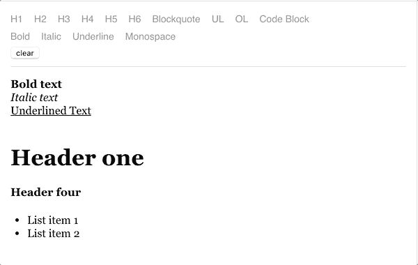

# Draft.js:如何移除文本格式

> 原文：<https://medium.com/hackernoon/draft-js-how-to-remove-formatting-of-the-text-cd191866d9ad>

Photo by [Natalia Y](https://unsplash.com/photos/NScCnMEYHQ0?utm_source=unsplash&utm_medium=referral&utm_content=creditCopyText) on [Unsplash](https://unsplash.com/search/photos/type-setters?utm_source=unsplash&utm_medium=referral&utm_content=creditCopyText)

我们 Propeller 在 Draft.js 中遗漏的一个特性是可以清除所选文本的样式，在编辑器中保留纯文本。我们相信这种行为是普遍使用的，我们的用户可能会期望这个功能在它的位置上。和往常一样，为了添加这个特性，你需要花大量的时间去钻研 [Draft.js 文档](https://draftjs.org/docs)以便找到所需的信息。

> 这篇文章描述了你应该采取什么步骤来将这种行为添加到你的项目中。

## TL；速度三角形定位法(dead reckoning)

和往常一样，有一个 [npm 包](https://www.npmjs.com/package/draft-js-clear-formatting)可供您使用，不用手动实现所有的东西。

Draft.js 中的所有编辑可分为 3 组:

*   内嵌样式
*   自定义实体(例如图像、链接等。)
*   块类型

为了清理文本，我们需要照顾所有这些群体。

## 内嵌样式

这个很简单。首先，我们需要定义一个我们在项目中支持的样式列表(在我们的例子中——粗体、斜体和下划线文本)。接下来，我们需要调用作为 Draft.js 包一部分的`Modifier`模块的方法`removeInlineStyles`。很明显，这个方法允许我们从选定的范围中删除指定的内联样式。所以我们需要为我们的`styles`数组的每一项调用它。

为了简化代码，我们将在这里使用`reduce`方法。如果你不熟悉它，你可以在这里阅读。

注意，我们在这里使用了两个不同的`editorStates`——我们在函数中传递的参数表示编辑器的当前状态，而`EditorState`应该与`Modifier`模块一起从 Draft.js 本身导入。

`push`方法用于创建一个新的`EditorState`对象，应用`contentWithoutStyles`作为编辑器的内容。

注意我们传递给`push`方法的第三个参数(一个字符串`change-inline-style`)。这个参数叫做`changeType`，Draft.js 用它来指定一个正确的撤销/重做行为。这个特殊的样式意味着一个或多个字符已经应用或删除了内联样式。

## 实体

这个更简单。我们不需要构建任何额外的样式数组或使用任何迭代函数。相反，我们需要调用完全相同的`Modifier`模块的`applyEntity`方法。这个方法允许我们将一个实体应用到选定的范围。为了移除所有实体，我们需要将`null`作为第三个参数传递给这个函数。

您可能会再次注意到，我们在`EditorState.push()`调用中使用`apply-entity`作为变更类型。这意味着一个实体已经被应用或删除到一个或多个字符。

## 块类型

复杂的那个。以便移除不同的块类型(标题、列表项、代码块等。)并保留文本，我们需要将每个块的类型更改为`unstyled`。你可以在这里阅读更多关于什么是块以及为什么它有不同类型[的信息。这篇文章并不是 100%真实的，但是它给了我们正确的思维方式来更好地理解 Draft.js 是如何工作的。](/@rajaraodv/how-draft-js-represents-rich-text-data-eeabb5f25cf2)

改变块类型的最好方法是遍历所有的块，并为其中的每个块调用一个改变函数。

首先，我们需要从选择范围中获取所有的块。这里我们可能想使用`[draftjs-utils](https://github.com/jpuri/draftjs-utils)`包中的`getSelectedBlocksMap`方法。

接下来，我们需要检测我们是否想要在块上执行任何操作。在我们的例子中，我们需要检查块类型，我们通过调用块的`getType`方法来完成。因此，如果块有任何类型(`blockType !== ‘unstyled’` ) —块应该被更新。

一旦我们发现要更新的块，我们需要改变它的类型。这里我们需要更新选择范围来选择整个块(您可以在这里使用文本长度来设置选择范围的结束索引)。

现在我们需要调用`Modifier`模块的`setBlockType`方法来更新块的类型并获得新的`contentState`，然后我们需要将其推送到`EditorState`。这个函数期望得到一个`blockType`参数，在我们的例子中应该是`unstyled`，因为我们想要清除所有的编辑。该操作的变更类型为`change-block-type`。我想现在你明白它的意思了:)

让我们把它们结合在一起，使用`reduce`方法来简化代码，这样我们就像在`Inline Styles`部分那样只运行`EditorState.push()`一次。

## 将一切结合在一起

一切就绪！让我们让所有这些功能发挥作用！我会推荐使用`lodash`包的[流](https://lodash.com/docs/4.17.11#flow)函数或者这里的任何替代函数，因为这将极大地增加代码的可读性。让我们试一试:

这是结果:

We select all the text, hit ‘Clear’ button and all editing is removed!

如果你到现在还在读这篇文章，你可能也想看看我之前关于 Draft.js 的文章，并把它应用到你的项目中。