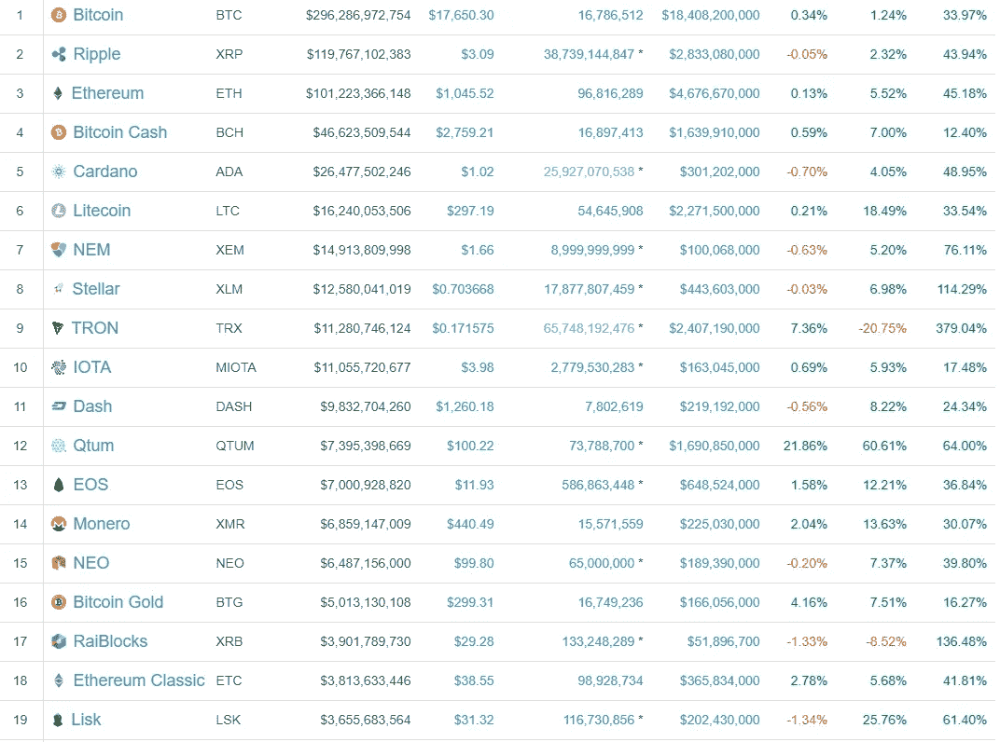

# 梦想一片绿色的海洋

> 原文：<https://medium.com/hackernoon/dreaming-of-a-sea-of-green-e7b013d6b1ee>

*2018 年 1 月 6 日——市值 815，864，140，317 美元*

终于来了！绿色的海洋。

终于…在盯着屏幕看了几个小时后，全绿了。

这是几天，几个不眠之夜，我的思想总是在燃烧。

> 我们成功了！100 倍的收益！我们不能被驯服！

我终于可以关掉[电脑](https://hackernoon.com/tagged/computer)并放下电话。现在是凌晨 4 点，我孤身一人。

最后，我闭上眼睛，躺在床上。不会再梦见 ICOs 或者[担心](https://hackernoon.com/tagged/worrying)死红色。

> 但是..等一下。如果我错过了什么呢？

我跳下床，一身冷汗，畏缩不前。横跨在疯狂和边缘之间。

> 他们有一个伟大的团队，他们有伟大的技术。但是，谁会用这个呢？我有吗？你知道吗？我们真的要检查一下吗？

如果我错过了什么。下一个是哪个硬币？我需要更多弹药。100 倍收益是 3 小时前的事了。