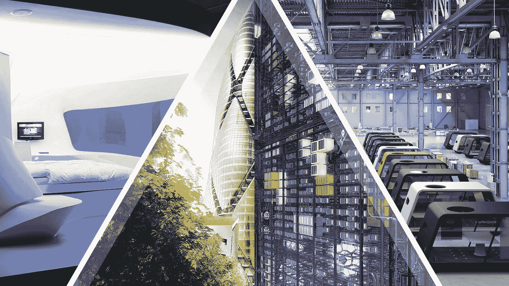
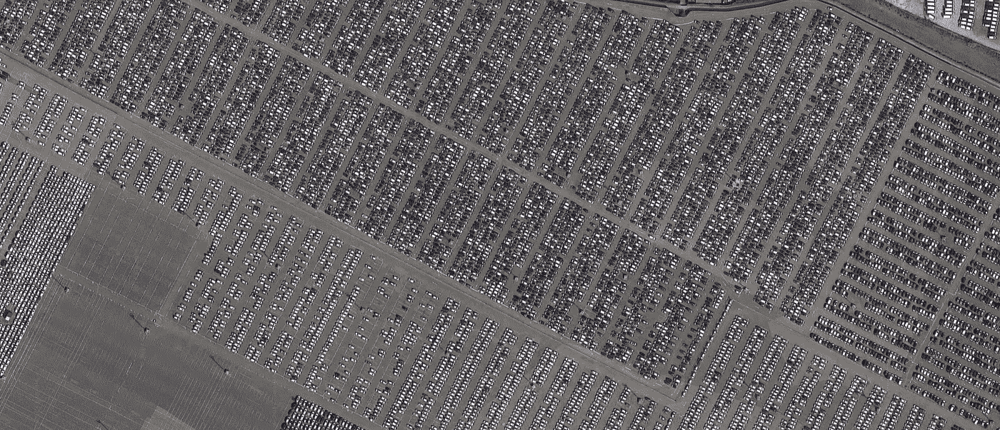
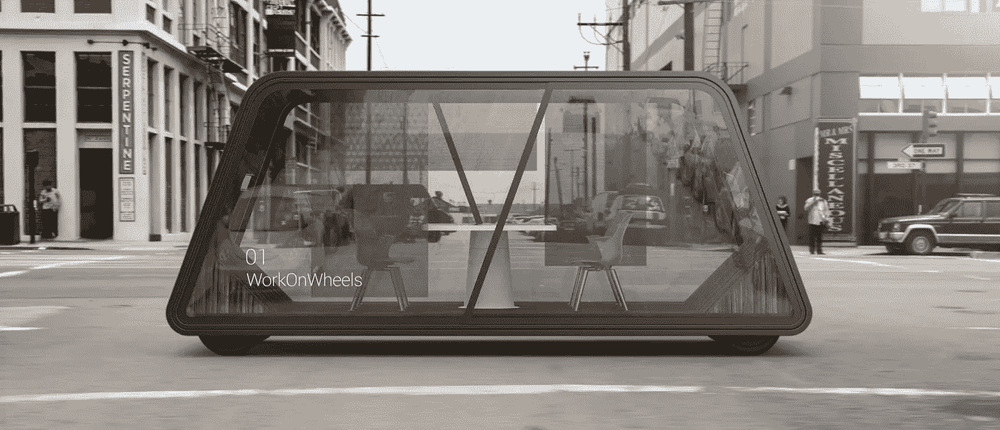
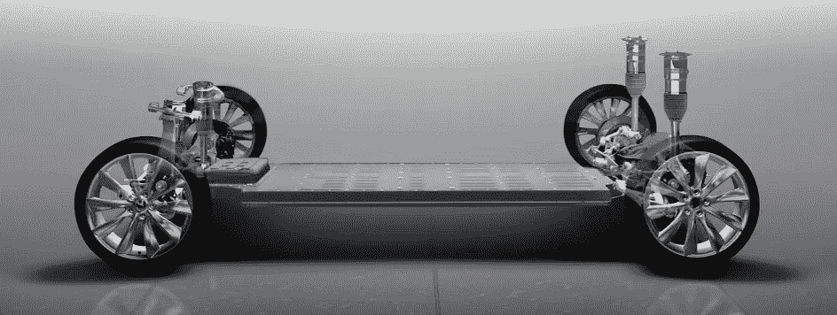
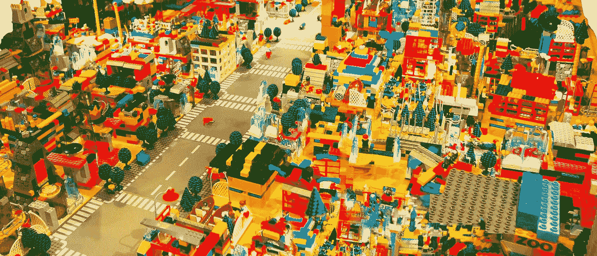
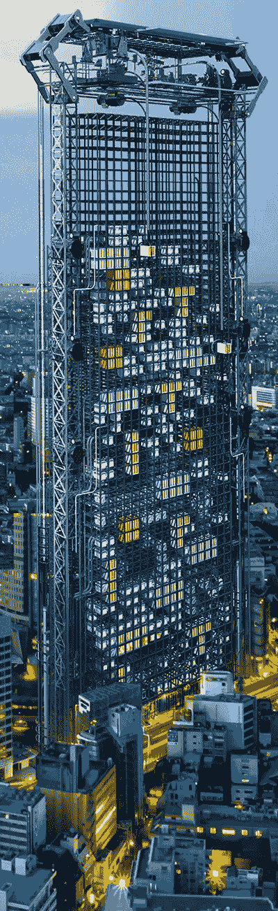
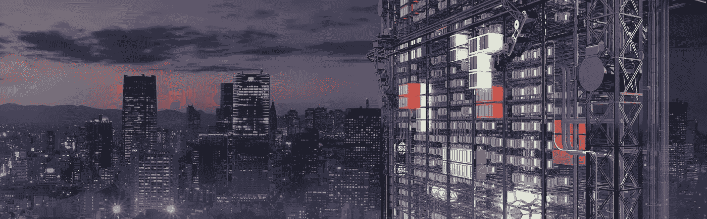

# 无人驾驶酒店房间:优步、Airbnb 和人类房东的终结

> 原文：<https://medium.com/hackernoon/driverless-hotel-rooms-the-end-of-uber-airbnb-and-human-landlords-e39f92cf16e1>

## 无人驾驶汽车如何实现一晚或 1000 英镑的按需住宿，而且价格比你的房租便宜 10 倍

“晚上好，女士们先生们，我们即将开始向悉尼降落。请系好安全带，将托盘竖直放置。当地时间是晚上 8:42，潮湿的 27 度。我们的飞行人员祝你新年快乐，我们希望你在 2025 年再次与我们一起飞行。”

*screech*。你已经着陆了。是时候放松屁股了。

你今天早上才订了这班飞机，现在你在地球的另一边。*惊人的*。第一次去澳大利亚，你既紧张又兴奋。一周探索这座城市，五周进行新的设计项目。当项目匹配出现在你的提要中时，你在两秒钟内就声明了它。你已经在[贵族经济](http://peerism.org/)中赚取了 24000 美元的设计费。

> 平。“需要房间吗？”。

你还没有预订任何住宿。“是的，请”，你回答。

> “就在前面，420 号”。

你咯咯地笑着，然后按照增强的方向，通往一个光滑的无人驾驶酒店房间。它和一辆小型公共汽车差不多大，但是没有座位、方向盘和引擎。一个巨大的透明面板延伸了车辆的长度和高度，迎接你的到来。面板打开，你走进去。

里面是你所期望的一切。左边是一个沙发座，按一下按钮就可以折叠成一张大床。右边是一个小厨房，配有电炉、自来水、水槽、微波炉和吧台冰箱。后面是带马桶、淋浴和洗脸池的可拆卸浴室模块。

> “你好，欢迎回家。饿吗？”

“我可以去一些泰式炒面和啤酒，谢谢”，你回答。

> “6 分钟后就到。想快速游览一下这座城市吗？”

“今晚不早了。你说，我们明天去邦迪海滩看看。

你的房间开始向邦迪方向行驶，一张实时地图显示在其中一个侧面板上。你坐下来，放松一下，在另一面板上放些网飞。整整 6 分钟后，一架无人机降落在屋顶上，通过天花板上的一个隔间降低您的订单。如果你需要订购任何套餐，你只需询问房间，无人机就会到达；它甚至可以洗衣服！

> “抵达邦迪 7 号塔”。

你抬头看着一座像乐高积木一样的模块化摩天大楼，高耸在洒满月光的云层之上。你的房间与一个电动滑冰鞋对接，并在进入面向窗户的位置之前被提升到 30 层。其中一个侧面板顺利打开，展现出一个巨大的相邻客厅模块。

额外的模块是可选的，可以按需要求:一个额外的床，私人健身房，水疗中心，小吃吧，办公室等。塔楼的不同层有咖啡馆、餐厅、零售店、娱乐区、公共厨房、自助洗衣店、健身房甚至电影院。每晚 30 美元的奢华生活。

当你的无人驾驶酒店房间自动充电准备好明天带你去城市和海滩的大范围旅行时，你睡着了。您为期六周的体验将根据您精确的点播偏好进行个性化，包括邀请您参加当地社区、活动和兴趣网络。

> “晚安”。

# 汽车制造业的危机

上图是英国一个名为 Sheerness 的小镇码头上数千辆未售出新车的截图。这是 T2 数百个新车闲置不用的地方之一。虽然汽车制造商通常保持 60 天的供应量，但美国制造商在 2016 年的库存中创下了超过[400 万辆未售出汽车](https://www.msn.com/en-us/money/companies/gm-has-a-huge-supply-of-unsold-cars/ar-AAofFfZ)的历史新高。

生产过剩的问题是资本主义的一个常见危机，在资本主义中，生产的商品多于消费它们的消费者。在自由市场中，这应该会导致价格下降，直到过剩供应下降以满足需求。但是通常情况下，制造商要么人为限制供应，要么干脆销毁未售出的商品。

汽车制造业面临着供应过剩的独特挑战，因为生产线的初始设置成本非常高，停止生产的成本也非常高。当一条汽车生产线出现故障时，每分钟会损失[22，000-50，000 美元](https://www.manufacturing.net/article/2006/03/22000-minute-manufacturing-problem)的收入和工资成本。所以你可以打赌，如果某款车卖不出去，他们会继续生产，直到下一年的车型。

> 按需自动驾驶汽车不可避免的现实给整个汽车行业带来了巨大的隐现的生存风险。

地球上有近 13 亿辆汽车，每年有超过 9400 万辆新车从生产线上下线，汽车工业看起来很像一个失控的[人工智能曲别针最大化器](https://wiki.lesswrong.com/wiki/Paperclip_maximizer)；消耗大量资源来销售数以千计的各种汽车模型，然后我们[把这些模型闲置了 95%的时间](http://www.reinventingparking.org/2013/02/cars-are-parked-95-of-time-lets-check.html)。

然而，如果按需无人驾驶汽车实现了，那么你 10 美元的优步之旅突然变成了不到 1 美元的城市之旅。到那时，对大多数人来说，拥有一辆汽车的吸引力将会减弱，从而产生大量多余的无人驾驶汽车。

鉴于对 2040 年前道路上 20 亿辆汽车的预测，并考虑到无人驾驶汽车只需要在充电时处于闲置状态，我们可以粗略计算出**仅需要 1 亿辆按需无人驾驶汽车来取代所有 20 亿辆人类驾驶汽车**。

换句话说，当每个汽车制造商都开始生产高需求的自动驾驶汽车**时，只需要一年就可以达到供过于求**。

汽车制造商将如何以及向何处转移以保持生存？

*One of many* [*IDEO Automobility*](https://automobility.ideo.com/moving-spaces/intro) *Moving Spaces concepts*

# 模块化无人驾驶房间

无人驾驶汽车需要把握的关键概念是，它们真正重新定义了我们所有的假设和先入为主的观念。内燃机被两个小型电动机取代，仪表板和方向盘是不必要的，当汽车不发生碰撞时，安全功能是多余的。

**无人驾驶汽车只是房间**位于全电动传动系统和可充电电池组的顶部，带有一些额外的视觉、激光或雷达传感器。

Tesla Powertrain

一辆[特斯拉 Model S](https://www.tesla.com/models) 只有 [18 个活动部件](https://www.youtube.com/watch?v=E7Jg1IJ68_g&feature=youtu.be)，相比之下，一辆普通的内燃机车有 1500 个活动部件。因此，据预测，到 2025 年，所有新生产的汽车都将是 100%电动的,而且成本比现在销售的最便宜的内燃机汽车要低得多。

这开启了将车辆重新想象成移动房间的无限可能性，能够满足[大量](https://automobility.ideo.com/moving-together/personal-storage)人类体验和活动:

*   无人驾驶办公室
*   无人驾驶会议室
*   无人驾驶健身房
*   无人驾驶卧室
*   无人驾驶浴室
*   无人驾驶咖啡馆
*   无人驾驶电影院
*   无人驾驶商店

这些房间也不需要单独使用。[它们](http://www.next-future-mobility.com/) [可以](https://www.pixmoving.com/) [成为](https://www.osvehicle.com/)动态的、模块化的，并通过按需请求与其他无人驾驶房间互联。轻按一个按钮或说出一个请求，片刻之后，你就可以让浴室或健身房模块自动到达你的位置，并自动连接到你当前工作的办公室模块。

当汽车制造商迅速满足无人驾驶按需运输的 1 亿辆汽车需求时，他们将不可避免地**将运营转向制造无人驾驶模块化房间**，以满足特定的人类体验。任何未能实现转型的汽车制造商都将不复存在。

*编辑【5 天后】:丰田正以他们的* [*e-Palette 动力系统*](https://techcrunch.com/2018/01/08/toyota-launches-dedicated-mobility-services-concept-vehicle/) *为轴心，成为无人驾驶房间制造商，成为“* [*移动服务公司*](https://techcrunch.com/2018/01/08/toyotas-mobility-business-shifts-into-high-gear-at-ces/) *”。*

# 乐高摩天大楼+分散城市

如果我们假设技术和经济驱动力推动我们的现实走向无人驾驶模块化房间，那么我们将不可避免地要求这些房间在城市的摩天大楼中垂直堆叠。惯性的力量会一直存在，所以我们不会期望人们想要不停地运动。

Ondemand 无人驾驶房间肯定会提供这样的选择:在一个城市睡觉，在另一个城市醒来，或者在前往目的地的途中请求附加模块。但随着越来越多的人采用这种方式在城市中生活和移动，我们更希望减少道路上的车道数量，减少停车位数量，减少环境足迹。

实现这一点的最佳方式是在运输过程中通过城市地下的[隧道](https://www.boringcompany.com/)铺设无人驾驶房间，并在静止时垂直堆叠这些房间。在运输过程中，房间可以连接到其他模块，如火车车厢，而在静止时，房间可以连接到所有方面。

**巨大的垂直摩天大楼可以自动将这些无人驾驶房间**和乘客提升到数百米的高度，在墙板打开露出其他连接的房间模块之前，它们被固定到位。

左边的图片是由设计师 Haseef Rafiei 设计的[豆荚自动售货机概念](https://www.dezeen.com/2017/05/19/pod-vending-machine-haseef-rafiei-3d-printed-housing-modular-homes-mini-living-movies/),虽然是相当工业化的建筑设计，但它却很好地传达了这一愿景。想象一个类似的塔，为无人驾驶的酒店房间和公寓设计了现代和豪华的设计。各种级别可能包括餐馆、夜总会、零售店和娱乐场所。

> 这个想法的迷人之处在于，无人驾驶酒店房间与无人驾驶公寓房间真的没有什么不同。

在今天的现实中，我们认为酒店是只住几夜的昂贵住所。酒店和 Airbnb 住宿由于其在城市内的固定和高需求位置，能够收取昂贵的费用。

通过解耦住宿和物理位置，我们分散住房和授权个人立即切换到替代位置。如果 Bondi Tower 7 收取 50 美元的过夜费，而 Bondi Tower 36 收取 10 美元的过夜费，那么您的房间可以代表您讨价还价，并重新定位到您偏好的最便宜的位置。

事实上，这些无人驾驶的房间和“停车”塔可以利用区块链[技术](https://hackernoon.com/tagged/technology)来[完全消除人类房东](http://www.bbc.com/news/technology-30998361)。廉价的全电动无人驾驶汽车可以以今天每分钟一至两辆汽车的速度从生产线上下线，并立即开始容纳和运送人类。

无人驾驶房间可以拥有自己，管理自己的财务，并通过智能合同自主安排自己的维护。一旦他们还清了建设成本，他们就可以以仅够支付低运营成本的租金提供服务，但利润为零。

如果我们进一步扩大对未来的愿景，为什么不从无人驾驶的模块化房间中建造整个城市呢？从平坦坚实的表面开始，我们可以指导这些房间像积木一样自我组装成摩天大楼、公园、桥梁和你期望在城市中看到的一切。

分散的模块化城市可以适应优化完美的生活条件，最大限度地提高所有居民的幸福和创造力。

## 如果你喜欢这个，你会喜欢我在[无人驾驶货车家园](/@nathanwaters/driverless-van-homes-comfort-freedom-below-0-living-costs-part-2-75b5ff4a431a)上的帖子！

