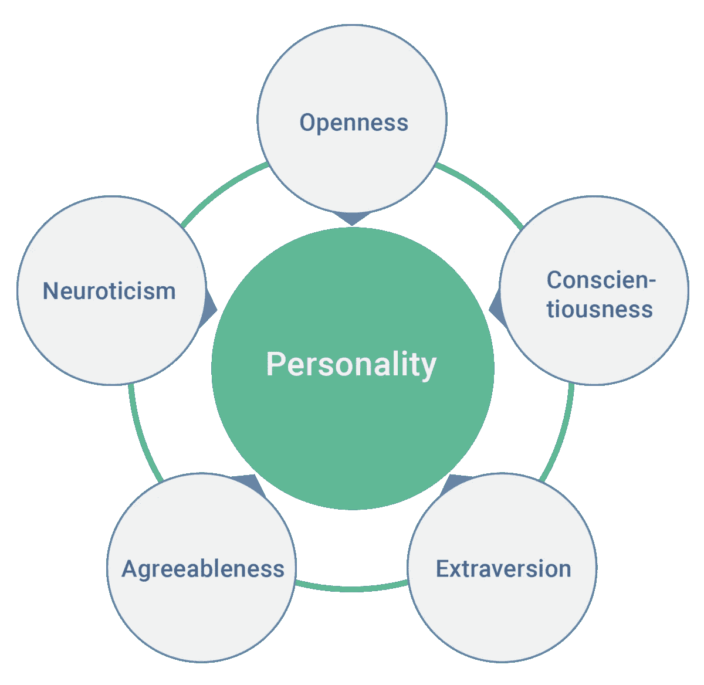
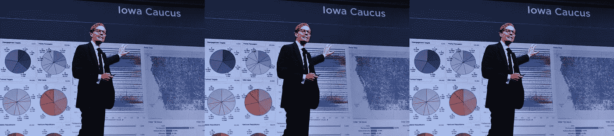
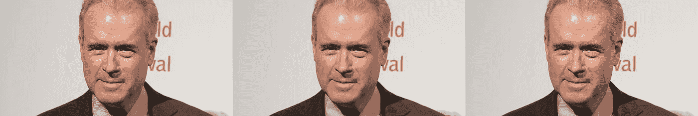

# 用人工智能驱动情感指标

> 原文：<https://medium.com/hackernoon/driving-sentiment-metrics-with-ai-9bb7bf9f591d>

Robert Mercer 如何资助从目标人口统计到利用心理图形的转变，以及为什么这位 70 岁、头发有趣、患有推特抽动秽语综合征的总统候选人在网络游戏中占据主导地位。在通往 2020 年的道路上，还会有更多类似的事情发生。

OCEAN’s 2016

如果你关注金融领域，尤其是投资领域，你肯定对复兴科技的 Medallion 投资组合很熟悉，这是历史上最赚钱的对冲基金。只对员工开放，它的回报是无与伦比的:从 1994 年到 2014 年的 20 年间，T2 的平均回报率为 71.8%；在全球金融危机之后的 2008 年，平均回报率高达 98%,同年标准普尔指数下跌了 38%。由前 NSA 密码分析师和全能数学天才 Jim Simons 于 1982 年创建，是第一家部署数学统计建模和定量分析应用程序作为预测股票市场的主要方法的公司。西蒙斯后来加入了罗伯特·默瑟，一个刚刚从 IBM 出来的计算金融奇才。该公司极其隐秘——他们的网站主页由[一句话和两个地址](https://www.renfund.com/Home.action?index=true)组成——其博士拥有数学、物理和计算机科学博士学位。统计学家和科学家是首选员工，典型的华尔街类型受到鄙视，在当前人工智能与金融科技相结合的爆炸开始扎根之前的几十年里，该公司已经通过大数据分析赚了很多钱。

对于 2009 年卸任文艺复兴科技公司首席执行官的西蒙斯来说(2017 年底之前，他一直担任彼得·布朗的联合首席执行官美世)，这笔钱的很大一部分通过[西蒙斯基金会](https://www.simonsfoundation.org/)和[美国数学](http://mathforamerica.org/)用于许多慈善事业。当他向政治家捐款时，他们主要是民主党人。在分配财富方面，罗伯特·默瑟(Robert Mercer)有着不同的、有些古怪的偏好，其中最值得注意的是，他比任何其他人都更应该为唐纳德·特朗普(Donald Trump)在 2016 年大选中击败希拉里·克林顿(Hillary Clinton)负责。(尽管可以说这种区别应该属于克林顿本人。)美世公司古怪的一面值得研究，但是关于我们第 45 任总统的就职，美世公司依靠三管齐下的策略:

1)向史蒂夫·班农任副总裁的剑桥分析公司投入数百万美元。利用数据分析的力量。

2)向史蒂夫·班农担任执行主席的 Breitbart News 投入数百万美元。利用社交媒体的力量。

3)向特朗普的竞选活动投入数百万美元，史蒂夫·班农曾担任该竞选活动的负责人，后来又担任特朗普总统的首席策略师。

愉快地潜伏在普通人的视线中策划特朗普的夸夸其谈，每个人都看到班农是这个隐蔽议程的牛头犬脸，披着革命的外衣，所有黑暗君主的虚张声势实际上掩盖了班农的基本工作:成为星期五罗伯特·默瑟将雇用的最好的女孩。最终，班农的毒性将决定他在主要目标实现后的消耗商数，但在被扫地出门之前，他坚定地致力于执行梅塞的命令，让特朗普当选，这是对任务的纯粹、盲目的忠诚，需要更多的移动部分。进入脸书。

当马克·扎克伯格本月早些时候在国会作证时，他准备充分地指出，脸书是如何确保科岗/剑桥分析数据泄露事件中的所有泄露数据都已被中和的。当他发现脸书基本上被骗了，他立即采取行动，并等待了两年才采取任何行动。尽管如此，他确实给一屋子人留下了相当认真的印象，这些人显然在尽最大努力理解这位来自异国的来访者。等式另一边的告密者 Christopher Wylie[以略微不同的角度讲述了这一系列事件](https://www.theguardian.com/news/2018/mar/17/cambridge-analytica-facebook-influence-us-election):在史蒂夫·班农和剑桥分析公司(Cambridge Analytica)的指导下，他帮助构建的用于收集和利用数千万美国公民数据资料的工具在 2015 年末为脸书所知。2016 年 8 月，Wylie 收到一封信，要求他立即删除获得的任何材料。他没有。脸书没有跟进。班农随后成为特朗普的竞选经理，这实际上意味着剑桥分析公司成为特朗普的竞选经理。

What do you mean, “trying to”?

虽然人们很容易对一个极其富有(而且愤世嫉俗)的对冲基金经理决定在以后的生活中成为一名政治傀儡师感到愤世嫉俗，但我们不要给这个在访问华盛顿时脱下连帽衫换上西装的极其富有的程序员一个机会。

一份从澳大利亚脸书泄露的文件详细描述了一个它宁愿保持沉默的研究项目:该公司使用算法来[实时查明并利用](https://arstechnica.com/information-technology/2017/05/facebook-helped-advertisers-target-teens-who-feel-worthless/)儿童和年轻成年人的情绪，使市场商人能够相应地利用年轻经历的情绪频谱，而不是每天，而是每分钟。这是 2017 年完成的研究，在脸书推出亚历山大·科岗应用程序很久之后，对超过 600 万人进行了研究，其中一些人还不到十几岁。

但是，在脸书情感度量分析目录中，临床试验可能是最不祥的征兆，它试图将这些情感推向预定的目标，并观察结果。2012 年，脸书和康奈尔大学对近 70 万名 FB 用户进行了为期一周的研究，以评估当一组人从他们的订阅源中删除积极内容，而另一组人从他们的订阅源中删除消极内容时的反应，并与对照组进行对比。目的是观察“情绪传染”是否真的存在，是否真的会像任何病毒一样传播，达到了预期的、不令人惊讶的结果:悲伤的大便让你悲伤，快乐的大便让你快乐。重要的是，那些领导实验的人既没有告诉参与者发生了什么，也没有获得他们的同意来参与一项专门设计来影响他们情绪状态的研究。令人惊讶的是，在[不得不回避和掩盖](https://www.theguardian.com/science/head-quarters/2014/jul/01/facebook-cornell-study-emotional-contagion-ethics-breach)如此肆意背信弃义之前，[在《国家科学院学报》上发表了](http://www.pnas.org/content/pnas/111/24/8788.full.pdf)的结果。

从去年的澳大利亚案例来看，一个完全不令人惊讶的转折:脸书声称他们关于你的公共数据的内部数据不是为了公共消费。这与国会议员本·卢汉(D-NM)在国会作证期间分配给扎克伯格的四分钟时间结束前向他提出的观点非常一致:首先，他询问扎克伯格为什么脸书在 2013 年意识到的一个[重大数据收集漏洞](http://www.wired.co.uk/article/facebook-news-data-scraping-mark-zuckerburg)直到扎克伯格 2018 年抵达华盛顿前一周才得到解决；其次，他想弄清楚脸书在“影子档案”(即不使用脸书的人)上收集了多少平均数据点。(这位议员声称，FB 用户平均有 2.9 万人。)最后，众议员卢汉要求解释为什么一个希望继续成为非脸书用户的非脸书用户，从未与脸书签署同意书，只是希望他们的身份不被脸书的数据分析引擎跟踪和包含，却被指示*登录他们的脸书页面*以关闭这些权限。这是一天中更多[信息交流之一，扎克伯格的沉默凝视意味深长。](https://www.youtube.com/watch?v=VA1S5A4Yuxc)

He’s totally checking you out

保持正确的观点很重要:正如马克·扎克伯格对参议员奥林·哈奇(Orrin Hatch)所解释的那样，脸书是通过广告赚钱的。所以*当然*他们使用目标数据来卖东西，而*当然*他们会让其他人使用目标数据来卖东西，而*当然*一旦他们被发现做了不道德的事情，他们会为此道歉。这已经成为他们商业模式的一部分。当扎克伯格被国会议员约翰·萨班斯(D-MD)问及 2016 年大选中两位总统候选人的脸书批准的广告数量时，他手头没有这些数字，但众议员萨班斯有:大约有 66，000 个广告批准给希拉里，590 万个批准给川普。这让我们回到剑桥分析。

有很多媒体报道了剑桥分析公司，它在特朗普竞选团队的要求下成功使用了心理测量分析和以个性为中心的微针对性广告，以及 2012 年奥巴马轻松拿下的宾夕法尼亚、密歇根和威斯康星这三个州，特朗普以不到一个百分点的优势赢得了每个州的选举人票。当考虑到有效部署的人工智能系统的力量时，这是应该引起共鸣的数字:是的，两名博士候选人开发的性格测试示意图被亚历山大·科岗劫持，他是一名教授，从事学术研究，实际上是商业研究，被出售给剑桥分析公司，由此产生的超过 8000 万脸书用户的数据收获使该公司受到了一些应得的审查；然而，川普以不到 [8 万张选票](https://www.washingtonpost.com/news/the-fix/wp/2016/12/01/donald-trump-will-be-president-thanks-to-80000-people-in-three-states/?noredirect=on&utm_term=.3b3a96384e9c)赢得了上述三个州。*总计*。这个百分比不到曝光的 FB 个人资料数量的 1/1000，当使用数据分析将美国民众分为 32 种性格类型时，剑桥分析公司显然比脸书英特尔公司获得了更多。但是脸书用户成了大规模的攻击目标，而且不仅仅是圣彼得堡臭名昭著的巨魔农场。在 2016 年大选的最后几周，特朗普竞选团队在密歇根州和威斯康星州的位置非常重要，这需要高度人工智能的操作来关联定量、定性和非线性数据驱动的见解。特朗普拿下密歇根州 0.2%。随着时间允许情绪化的人类赶上机器学习框架已经可以理解的东西，这将看起来不那么随机。

如果这种操作背后的数据科学非常复杂，那么这个优化循环的布局将呈现为有史以来最基本的[马克·隆巴迪](https://www.pierogi2000.com/artists/mark-lombardi/)草图:一圈绑在一起的语音气泡描述班农/布莱巴特>班农/剑桥分析>脸书>目标演示>班农/布雷巴特>班农/剑桥分析>脸书>目标演示等。无休止地循环重复，直到实现期望的反馈。前三个有直接的，有罗伯特·默瑟名字的泡泡的结缔组织；第四个是目标演示，通常不知道美世是谁，但确实认同认知得到验证和强化，即使这些认知的形成没有被注意到。

How to Shag an Election

罗伯特·默瑟资助剑桥分析公司以他认为合适的方式影响美国选举。剑桥分析公司隶属于英国战略传播公司 SCL 集团，旨在“填补美国共和党政治市场的真空”根据其最近失业的创始人和[热门麦克风名人](https://www.channel4.com/news/cambridge-analytica-ceo-alexander-nix-suspended)，亚历山大尼克斯的说法，这是通过数字参与的方式进行的行为修正。美世的个人投资回报率肯定反映了他多年来从文艺复兴的奖章基金获得的任何财务回报。

然而，值得注意的是，美世最初部署 Cambridge Analytica 是为了让他在 2016 年大选中的首选特德·克鲁兹发挥魔力。当特朗普赢得初选时，美世利用了这一点，当然不是因为特朗普也是一个内向、社交笨拙、有天赋的数据科学家和成功的亿万富翁(特朗普不是这些东西)；更确切地说，这是因为罗伯特·默瑟想购买美国总统任期内最大数量的股份——控股权，他似乎已经做到了。

作为一个神秘的国王创造者，据说他在社交场合非常害羞，罗伯特·默瑟可能不喜欢他的个人数据被挖掘出来并可供购买，但他似乎非常愿意对他人这样做，因为这与他的世界观大体一致:[人的价值在于他们的收入](https://www.thenation.com/article/one-of-trumps-biggest-donors-thinks-cats-have-more-value-than-welfare-recipients/)，如果他的收入是一名学校教师的几千倍，那么他就比一千名教师更有价值。显而易见，除了作为满足他利益的素材，默瑟一点也不关心特朗普的支持者或他们的价值观。与最近几周爆发的脸书/剑桥分析公司的宣传不同，[opensecrets.org](https://www.opensecrets.org/news/2018/04/exclusive-robert-mercer-backed-a-secretive-group-that-worked-with-facebook-google-to-target-anti-muslim-ads-at-swing-voters/)发现了另一个新保守主义暗钱的漏斗，这些暗钱通过制造恐慌的广告渗透到 2016 年大选的最后几天:一个名为“现在就保护美国”的 501(c)(4)。大多数美国人没有看到带有近似喜剧的仇外心理的广告，但一些摇摆州的人看到了，这就是他们的意图。脸书和谷歌合作，将这些广告投放到他们被指引的地方，罗伯特·默瑟(Robert Mercer)出资 200 万美元赞助了这一切。

Using Citizens United to unite citizens

在默瑟眼里，那些依靠福利的人被认为是有负面价值的，但猫不是，因为它们给人类带来快乐。从那以后，事情只会变得更加令人不安:Mercer 认为 1964 年的民权法案是一个重大错误，认为白人种族主义不再存在，认为气候变化是一个骗局。他也真的真的真的很喜欢枪支，这包括和他们一起玩装扮游戏的 T2。他的其他爱好包括在他的地下室放一个价值 270 万美元的玩具火车，以及为俄勒冈州山区的大量尿液储备提供资金。(没错。应该指出的是，后者得到了化学家亚瑟·罗宾逊的帮助，他是[俄勒冈科学和医学研究所](http://www.oism.org)的创始人，在不反对全球变暖或促进智能设计的情况下，他对 14000 个样本进行了研究。不知道是否有任何尿尿小瓶有表示俄罗斯应召女郎姓氏的标签，或者——正如 [The Intercept 很快注意到](https://theintercept.com/2016/08/23/trumps-new-billionaire-backer-also-funds-huge-stockpile-of-human-urine/)的那样——这可能对 2016 年美世资助的超级政治行动委员会的命名产生了什么影响，以使特朗普当选:“让美国成为第一。”)

罗伯特·默瑟的底线是:他和复兴公司的每个人都赚了很多钱，而且还会继续赚下去。可以肯定的是，他们是一群有创造力的人:Renaissance 成功地(到目前为止)没有支付 IRS 声称其欠下的 2000 年代数千万笔交易的 68 亿美元税款，方法是将它们归类为长期交易，因此税率较低，它通过银行购买并持有至少一年的【一揽子期权】。Renaissance 在 2014 年出现在参议院面前，为自己的立场辩护，被点名的银行不再参与向该公司出售一揽子期权的做法。美国国税局坚决要求支付数十亿美元的欠税。它可能不需要一屋子的宽客或人工神经网络来合理准确地预测特朗普政府将如何看待税务人员对罗伯特·默瑟的困境。

总结一下人工智能和社交网络的力量，当评估像罗伯特·默瑟这样的控制欲强、渴望权力的人可以在任何和所有媒体上部署人工智能系统的所有悲观和厄运时，重要的是回忆一下，也只有一个人，一个住在夏威夷的退休律师，在 2016 年 11 月 9 日认为“我应该做点什么”，并这样做了。她利用脸书的平台煽动了有史以来美国民主和全球抗议的最佳范例之一:2017 年妇女游行。Mercer 和他的同类永远不会有合适的货币来购买。