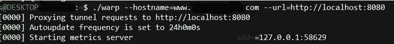

# 使用 Cloudflare Warp 放弃您的托管提供商

> 原文：<https://medium.com/hackernoon/drop-your-hosting-provider-with-cloudflare-warp-ba704bbd8f09>


谁需要 AWS 或托管费用？使用 **Cloudflare Warp** ，您可以在几分钟内让服务器在家中启动并运行。所有这些都不需要 DNS 或 DMZ 配置或庞大的框架。

只需在您的机器上运行您选择的 web 服务器，Warp 就会通过 Cloudflare 处理它。Warp 是一个新特性，目前还在测试阶段。

这使我们不必去找宿主。过去，仅仅在你家的[网络](https://hackernoon.com/tagged/network)上运行就需要在你的防火墙上打开端口。一件容易搞砸的事情。

此外，到现在(2018 年)每个人都应该运行**只有 HTTPS。**

在过去几年中，配置 HTTPS 变得越来越容易，但 Warp 的伟大之处在于，您只需将您的站点作为 HTTP 服务器运行，Cloudflare 会处理其余的工作。

让我们开始吧。

首先，我们将使用 **httpsd** ，它有适用于 Linux、Win 和 Mac 的二进制文件。

[](https://github.com/digplan/httpsd) [## digplan/httpsd

### httpsd -即时 https 服务器

github.com](https://github.com/digplan/httpsd) 

httpsd 是一个即时启动的 web 服务器，它的输出由提供的 shell 脚本生成。

创建 shell 脚本，此处称为 index.sh:

```
cat index.html
```

还有我们的 index.html

```
<!DOCTYPE html>
<h1>Hello World</h1>
```

启动它！

```
./httpsd ./index.sh --insecure --port=8080
```

使用*—不安全*标志将启动 http 而不是 https 服务器，这是可以的，因为 Cloudflare 将以非常简单的方式处理 https。

你可以使用任何网络服务器。例如，有一个用于 Python 的简单 HTTP 服务器:
[HTTP://www . Python forbeginners . com/modules-in-Python/how-to-use-Simple HTTP Server/](http://www.pythonforbeginners.com/modules-in-python/how-to-use-simplehttpserver/)

**Cloudflare Warp** *，*只是一个简单的二进制文件，它通过隧道连接到 [Cloudflare](https://hackernoon.com/tagged/cloudflare) 服务器，并为您的站点提供服务。

[](https://www.cloudflare.com/products/cloudflare-warp/) [## 云耀斑扭曲|云耀斑

### 锁定应用程序的来源以防止攻击需要许多复杂的步骤。从使用擦洗服务…

www.cloudflare.com](https://www.cloudflare.com/products/cloudflare-warp/) 

我已经把二进制文件的名字改成了 warp，这使得事情变得更加简单。有了由 Cloudflare 托管的域名服务器，我们只需启动它。

```
$ ./warp --hostname=www.mydomain.com --url http://localhost:8080
```



就是这样，托管变得简单。