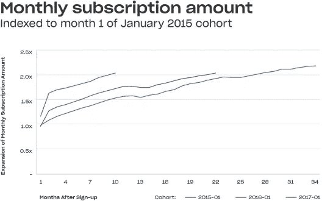

# Dropbox S-1 拆卸

> 原文：<https://medium.com/hackernoon/dropbox-s-1-teardown-f406417ca318>

我喜欢 S-1s。我知道我很奇怪，但 S-1 充满了关于商业模式、公司业绩的真知灼见，并在有时浮夸的散文中嵌入了迷人的故事。

[Dropbox](https://hackernoon.com/tagged/dropbox) 多年来一直是我最喜欢的创业公司之一。多年来，我在 HBS 大学的课堂上讲授了一个关于如何启动科技风险企业的案例。我们还向 HBS 大学所有一年级学生教授 Dropbox 的早期案例。我以前的几个学生很早就加入了这家公司，并在多年后成为了关键高管。所以，昨天 [Dropbox S-1](https://www.sec.gov/Archives/edgar/data/1467623/000119312518055809/d451946ds1.htm) 出来的时候，我很兴奋的通读了一遍，看看能学到什么。明确一下，我不是公司的投资人，也不拥有任何股份(据我所知！)

简而言之，Dropbox 是一台提款机，拥有神奇的商业模式。任何得出相反结论的人都不理解现金流和 GAAP 之间的区别以及负面流失的力量。让我们跳进来。

**商业模式有效吗？是啊！**

Dropbox 有一个神奇的商业模式，S-1 中的数据证明了这一点。该公司报告称，“我们 90%以上的收入来自自助服务渠道”。想一想。免费产品如此有吸引力，以至于它推动了大规模的采用，从免费到付费的转换是如此明显和顺利(更多的使用导致更多的存储导致付费产品)，以至于该公司拥有一个客户获取引擎，该引擎来自一个简单的伟大产品和一个令人信服的价值主张。忘掉销售和营销吧，在 Dropbox，产品本身就是一台高效的客户获取机器。

为所有这些免费顾客服务的成本太高了吗？令人高兴的是，Dropbox 正在遵循存储和云成本下降的成本曲线。毛利率从 2015 年的 33%飙升到 2016 年的 54%，再到 2017 年的 67%。如果一位首席执行官告诉你，她将在两年内把收入 10 亿美元的业务的毛利率从 33%提高到 67%，你会把她送进精神病院。Dropbox 轻松做到了。

Dropbox 商业模式的另一个神奇之处在于，它像病毒一样传播开来。每次我将 Dropbox 文档分享给某人时，他们都需要一个 Dropbox 帐户。每当他们建立一个 Dropbox 账户，就会推动更多的文档共享和存储。如此循环往复。2017 年的 1 亿新账户是另一个惊人的数字，证明尽管有人担心增长饱和点，但病毒机器仍继续良好运行。

**群体和负面流失**

Dropbox 商业模式的另一个引人注目的部分是负面流失的力量(即，从你现有客户那里获得的净收入正在增长而不是萎缩)及其同伴的行为。我们在我们的一家企业存储组合公司 [Nasuni](https://www.nasuni.com/) 和我们的数据库软件公司 [MongoDB](https://www.mongodb.com/) 中看到了类似的行为。每年，该公司都以每年净增长 20–30%的客户群为起点。因此，从理论上讲，如果你解雇了所有的销售人员，关闭了所有的营销活动，这些公司仍然会以每年 20-30%的速度增长。

Dropbox 的同类公司也在以类似的方式行事。在 S-1 的第 63 页有一张图表讲述了这个故事。注册这项服务几个月后，用户群迅速增长。2015 年 1 月的订阅量是两年前的两倍。20 个月后，2016 年 1 月的订购量增长到每月订购量的 2 倍。10 个月后，2017 年 1 月的订购量增长到每月订购量的 2 倍。一句话，哇。当一群人随着时间的推移变得越来越好的时候，很明显，一些非常正确的事情正在发生。

但是损失怎么办？

现在，我知道你们中的许多人都在想——如果商业模式如此神奇，杰夫，那么亏损怎么办？该公司报告称，2017 年净运营亏损远超 1 亿美元。你如何调和这些不一致的数据点？

许多商业记者似乎不理解 GAAP 净收入对于基于订阅的商业模式来说是一个无意义的衡量标准。Dropbox 用户注册年费，并预先支付现金，然后公司确认全年的收入。此外，还有大量影响损益表的非现金费用，如股票薪酬。你真正需要考察的是自由现金流。

第 67 页讲述了自由现金流的故事。该公司的自由现金流从 2015 年的负 6400 万美元，到 2016 年的 1.37 亿美元，再到 2017 年的 3.05 亿美元。想一想。这是一家年收入年增长率超过 30%的公司，能够在两年内实现近 4 亿美元的年度自由现金流。与此同时，他们将毛利润提高了 34 个百分点。又来了，哇。

**杂七杂八的花絮**

其他一些事情让我觉得很有趣。在筹集了如此多的私人资本后，大多数创始人可以期望总共拥有他们公司的 5-10%的股份。根据 S-1，首席执行官兼创始人德鲁休斯顿拥有 25%的股份，他的联合创始人阿拉什菲尔多西拥有 10%的股份，合计 35%。德鲁和阿拉什从零到 10 亿美元建立了一家公司，筹集了大量资金，仍然拥有超过三分之一的股份。如果 Dropbox 最终价值超过 100 亿美元，这些人将在纸面上成为亿万富翁，同时仍然保留对他们公司的完全控制权。太神奇了。

另一件令我着迷的事情是，从开始到现在已经过了 11 年。如果德鲁在上市后的许多年里都没有继续担任公司的首席执行官，我会感到震惊。因此，建立真正的企业需要很长时间，即使你的商业模式很神奇，并且你恰到好处地抓住了每一个主要的平台趋势(例如，在 Dropbox 的情况下，大规模的长期转移到云、存储、大数据和移动)。

最后的趣闻:该公司在 2017 年底向 Dropbox 慈善基金会注入了 1100 万美元的现金和股票。自由现金流的有趣使用和对未来有趣计划的认可。

**结论**

当我在 HBS 大学教授 Dropbox 案例时，我在课程结束时列举了该公司的商业模式要素:强大的病毒式传播、强大的网络效应、循环收入模式、高毛利率、负流失率、低客户获取成本。我想这就是你如何在 10 年内从零到 100 亿美元的市值。