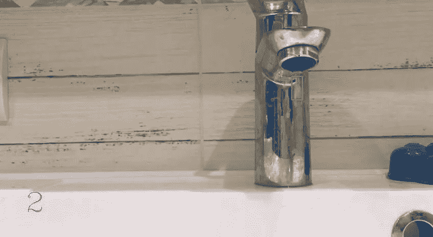
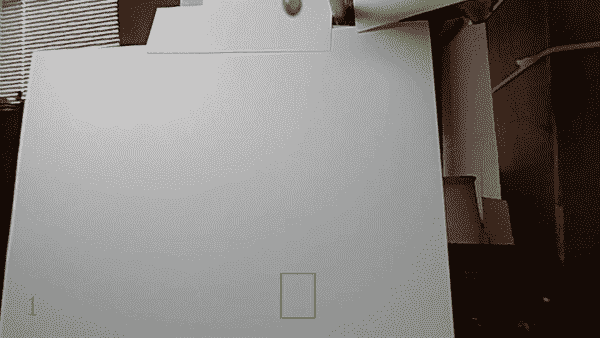

# 水滴计数

> 原文：<https://medium.com/hackernoon/drops-counting-80688a660467>



亲爱的读者们，你们好！在这篇文章中，我将分享我是如何数水滴的。是的，你没看错。滴剂

这一切都是从我们团队开始研究机器学习的时候开始的，或者更准确的说，我们研究了 Python 和 OpenCV。在练习任务中，我有机会实现算法，在给定的视频中或实时计算下落的水滴。现在我告诉你事情的经过。

开始了。首先，要数水滴，你需要它们来自某个地方。为此，我们由客户服务经理和架构师组成的团队为我提供了视频，我可以开始工作了。

下一步，有必要考虑为我们实现必要算法的方法。没有太多的选择，它落在了 OpenCV 上，即段[视频分析](https://opencv-python-tutroals.readthedocs.io/en/latest/py_tutorials/py_video/py_table_of_contents_video/py_table_of_contents_video.html#py-table-of-content-video)，段[光流。](https://opencv-python-tutroals.readthedocs.io/en/latest/py_tutorials/py_video/py_lucas_kanade/py_lucas_kanade.html#lucas-kanade)

为了实现液滴计数算法，我使用了密集的光流，找到了前一个镜头和下一个镜头之间的位移，就这样。如何处理这种抵消，如何处理还不太清楚。

实际上，要捕捉视频中的运动物体，你必须在所有镜头上留下这个单一物体，也就是说，你需要去除背景、异物等。密集光流做得非常好，但我不能决定如何处理最终结果。但是你永远不能满足于已经取得的成绩，尤其是当你的成绩不能解决任何问题的时候。

非常好。让我们继续工作。回想起在我们的机器学习课上，我们做了很多图像处理，我决定开始专门研究图像。大家都很清楚，一个视频就是若干个镜头，镜头本身就是图像。然后我们进入 OpenCV 中的[图像处理部分，开始处理我们的人员。](https://opencv-python-tutroals.readthedocs.io/en/latest/py_tutorials/py_imgproc/py_table_of_contents_imgproc/py_table_of_contents_imgproc.html#)

我们可以阅读

```
cap = cv.VideoCapture("videoFiles/drop8.mov")
```

或者我们可以使用我们设备的摄像头

```
cap = cv.VideoCapture(0)
```

.

然后，我拍摄第一张照片，并将其转换为灰度。接下来，我在视频播放时浏览了所有镜头，每一个下一个镜头都转换为灰度:

```
cap = cv.VideoCapture("videoFiles/drop8.mov") ret, frame1 = cap.read() gray1 = cv.cvtColor(frame1, cv.COLOR_BGR2GRAY) tmp_count = 0 prev_has_col = False while cap.isOpened: gray2 = gray1 ret, frame2 = cap.read() &nbsp; &nbsp; if ret: &nbsp; &nbsp; gray1 = cv.cvtColor(frame2, cv.COLOR_BGR2GRAY)
```

然后，您可以找到两张照片之间的差异，并开始处理获得的图像:

```
difImage = cv.absdiff(gray1, gray2)
```

我将中间模糊应用于镜头之间的差异，以切断背景。也就是说，在众多物体中挑出一个运动物体:

```
difImage = cv.absdiff(gray1, gray2) blur = cv.medianBlur(difImage, 15)
```

此外，对于获得和处理的差异，我可以找到一个“列”(拉伸下降)，并且每当我找到一个“列”，我就将计数器加 1:

```
d = blur.sum(axis=0) has_col = np.max(d) &gt; np.median(d) + 1000 if has_col &amp; ~prev_has_col: tmp_cout += 1 prev_has_col = has_col
```

为了证明液滴已被实际检测和计数，我在液滴和液滴计数器周围添加了轮廓:

```
blur_contours = cv.blur(difImage, (31, 31)) res, treshold = cv.threshold(blur_contours, 10, 255, cv.THRESH_BINARY) _, cnts, _ = cv.findContours(treshold.copy(), cv.RETR_EXTERNAL, cv.CHAIN_APPROX_SIMPLE) frame = searchForMovement(cnts, frame2, 100) cv.putText(frame, str(tmp_count), (50, frame_height - 50), cv.FONT_HERSHEY_COMPLEX, 1.8, (0, 0, 255))
```

最终结果可以在下面的视频中看到:



目前，该算法在接近理想的条件下工作。此外，背景应该或多或少是均匀的，水滴的来源和相机应该是静态的。未来，该算法将得到改进，并可应用于各种家庭和工业环境。此外，我计划使用该算法开发一个简单的移动应用程序，您可以在下面的文章中了解到这一点。

***感谢您的关注！***

*原载于 2018 年 11 月 19 日*[*issart.com*](https://issart.com/blog/drops-counting/)*。*