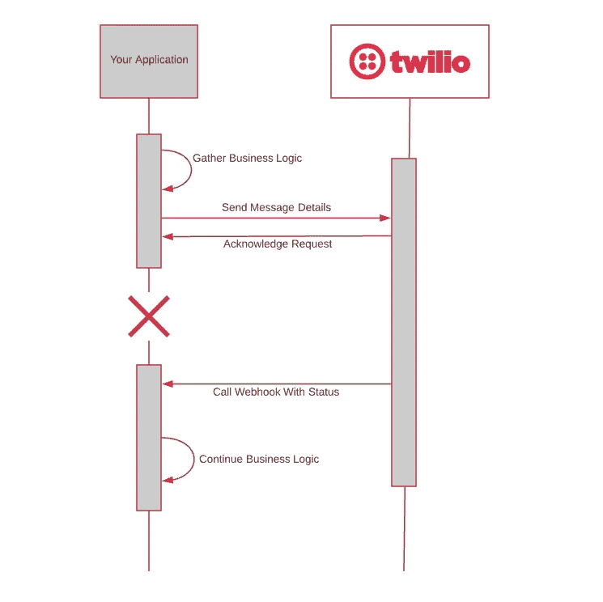
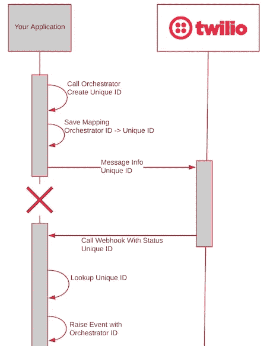

# 耐用功能配方——让 Webhooks 变得简单

> 原文：<https://medium.com/hackernoon/durable-function-recipe-webhooks-made-easy-4878b1972417>

Photo by [Johannes Plenio](https://unsplash.com/photos/NYDTneTcSdo?utm_source=unsplash&utm_medium=referral&utm_content=creditCopyText) on [Unsplash](https://unsplash.com/search/photos/webhook?utm_source=unsplash&utm_medium=referral&utm_content=creditCopyText)

处理 webhooks 是后端开发中非常常见的模式。你调用第三方 API，API 立刻成功返回。然后第三方做一些漂亮的事情，比如发送信息，或者使用神经网络。当它完成时，它调用*您的* API 并给出结果。

这是一个非常简单的模式，在理论上很有意义。但是在实践中会变得复杂。一旦调用了 API，就完全失去了状态。当服务调用您的 webhook 时，您需要弄清楚它在谈论您的哪个实体。然后您需要在调用 API 之前重新创建它的状态。这通常涉及到对数据库的大量回调，以重新创建几秒钟前的数据。

这些年来，我已经构建了无数的 webhook 处理程序。我觉得我已经尽可能地优化了 webhook 模式。*然后我建了一个具有 Azure 持久功能的。*

如果你是持久功能的新手，看看我的[第一印象](https://hackernoon.com/durable-functions-backend-development-made-easy-and-cheap-cbab7acc7050)或者微软的[概述](https://docs.microsoft.com/en-us/azure/azure-functions/durable-functions-overview)。基本上，你用代码定义工作流，同时享受无服务器的好处。

# 耐用功能网钩

对于 webhooks，我们将使用[人类交互](https://docs.microsoft.com/en-us/azure/azure-functions/durable-functions-phone-verification)模式。这种模式包括:

*   执行一些动作
*   等待某个外部事件(通常是人)引发任意长的时间。
*   继续执行。

在这种情况下，外部事件将是一个 webhook。这个食谱将包括使用流行的 Twilio 服务发送短信。发送消息后，Twilio 可以用传递状态进行回复。例如，如果消息发送失败，您可能希望执行一些业务逻辑。

我已经为许多用例用多种语言构建了 Twilio 处理程序。但是持久的功能使它成为最容易的。通常是这样的:

我已经得到了关于我要给其发送信息的人的各种信息。我发送消息，记下 Twilio 给我的唯一消息 ID，就这样。一切都没了。现在我在等待。

一段时间后(通常在几秒钟内)，Twilio 用一个惟一的消息 ID 访问我的 API。这一般是在 app 完全独立的部分。我使用 ID 来查找消息，现在我必须重新创建发送给 Twilio 之前的所有内容。但是我*刚刚*有了！这可能看起来不多，但在规模上，所有这些返回数据存储的次数真的会增加。

在持久函数中，webhook 逻辑在发送消息后一行发生**。让我们看看它是如何工作的。**

Video Tutorial for This Article

# 获取设置

我将在 Mac 上运行 VS 代码，但这将在任何操作系统上运行。我们将从使用 VS 代码中的 [Azure Functions](https://marketplace.visualstudio.com/items?itemName=ms-azuretools.vscode-azurefunctions) 扩展开始，在一个空目录中创建新的 C# function 项目。

然后我们需要一些包裹。运行这些命令来获取持久函数、Azure 表存储和 Twilio 的扩展。

`dotnet add package Microsoft.Azure.WebJobs.Extensions.DurableTask --version 1.6.2
dotnet add package Microsoft.Azure.WebJobs.Extensions.Storage --version 3.0.1
dotnet add package Microsoft.Azure.WebJobs.Extensions.Twilio --version 3.0.0`

在其中创建一个`Models`目录和名为`MessageInput.cs`的文件。这将包含发送消息所需的属性:

# 启动器

我们需要某种方式开始发送信息。我们将使用 HTTP 触发器。如果您不熟悉持久函数，可以忽略函数参数。

我们读取主体(作为我们之前创建的一个`MessageInput`对象),并将其传递给 orchestrator 以启动工作流。然后我们返回编排状态。就是这样！现在我们需要创建一个管弦乐队。

# 管弦乐队

这是真正的奇迹发生的地方。发送消息和获得响应的整个工作流程只需五行代码。

每个业务流程都有一个唯一的 ID。这个 ID 通常应该保密，所以我们将创建一个映射，将编排 ID 映射到一个惟一的 ID。我们将把唯一的 ID 发送给第三方，当他们把它返回给我们时，我们将使用它来查找编排 ID。

我们发完信息，然后给`WaitForExternalEvent`打电话。这将无限期暂停编排，直到触发`TwilioCallback`事件。在这一点上，我们将有状态，并可以继续我们的业务逻辑。

# 这些活动

## 创建映射

我们将使用 Azure 表存储(持久函数无论如何都会使用)来保存我们的映射。Azure 函数支持一个[表绑定](https://docs.microsoft.com/en-us/azure/azure-functions/functions-bindings-storage-table)，它允许你用很少的代码从数据库中提取数据。

我们需要一个类来保存映射:

表格存储需要一个`PartitionKey`和一个`RowKey`。我们将保存`OrchestrationId`并使用`RowKey`发送到 Twilio，并再次找到我们的编排。

这个函数只是将映射保存到表存储中，并返回`RowKey`供以后使用。我们可以使用表绑定来指定函数参数中我们感兴趣的表。

## 发送消息

Azure 函数还支持用很少的代码发送短信的 Twilio 绑定。这里，我们创建一个`CreateMessageOptions`对象，并用输入的数字填充它。

这个`StatusCallback`，是 Twilio 将点击的 URL，告诉我们消息的状态。我们在 URL 中包含了`RowKey`来查找我们的映射。接下来，我们将创建该路线。

## Webhook 处理程序

最后要做的事情是处理 Twilio 何时用状态响应我们的 API。当然，这只是另一个 HTTP 触发的函数。函数参数与上一个 HTTP 函数没有太大的不同。

唯一的区别是它使用表绑定来查找 Twilio 传回的 ID。这将返回一个带有编排 ID 的记录，这意味着我们现在可以向该编排引发一个事件。

如果您还记得的话，orchestrator 目前正在等待一个`TwilioCallback`事件的触发，所以让我们不要再让它等待了！我们传入状态，编排可以从停止的地方继续*右*。

*注意:Azure 函数目前不支持 x-www-form-urlencoded 响应，这是 Twilio 提供的。* `*ParseForm*` *为我们处理这个。详见* [*全码*](https://github.com/KevinDJones/DF_Webhook/blob/master/Starters.cs#L47) *。*

## 结论

就是这样！发送消息的五个函数*和处理回调的*。最棒的是，我们可以从开始等待 webhook 之前停止的地方重新开始。不再需要重复返回数据库。这是我体验过的实现 webhooks 最干净的方式。

查看[完整代码](https://github.com/KevinDJones/DF_Webhook)或上面的视频了解完整细节！