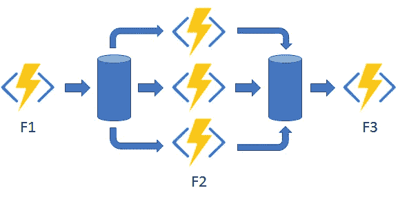
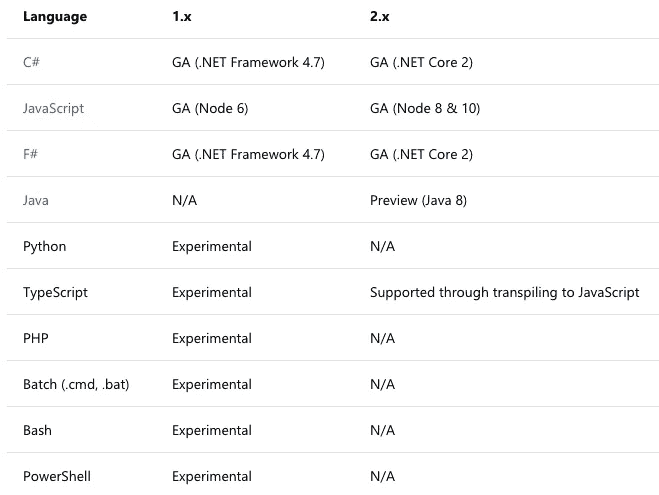

# 持久的功能——后端开发变得简单(而且便宜！)

> 原文：<https://medium.com/hackernoon/durable-functions-backend-development-made-easy-and-cheap-cbab7acc7050>

## 关于新型无服务器的思考。

[Fan-Out/Fan-In Pattern](https://docs.microsoft.com/en-us/azure/azure-functions/durable-functions-overview#pattern-2-fan-outfan-in)

一段时间以来，功能应用程序的无服务器化一直很有吸引力。不必为 24/7 基础架构付费，但获得完全的自动扩展是一个游戏规则改变者。但是从来没有感觉到无服务器功能可以取代你的堆栈。简单的 Slack app 好不好？当然可以。但不是复杂的后端。直到现在。

Azure 的持久功能扩展了他们已经建立的功能即服务(FaaS)平台。最后，无服务器函数有状态。您在代码中定义工作流，同时享受无服务器的诸多好处。

在许多方面，持久函数感觉就像无服务器函数本来的样子。Azure 是目前唯一提供这种工具的云提供商。持久函数允许您将函数链接在一起。您甚至可以并行运行它们，轻松跟踪工作流程进度。有强大的错误处理和重试机制，开箱即用。

在建立了一些概念证明之后，我被说服了。是时候重构一些生产应用程序，以及从头开始几个了。这是我目前发现的。

# 更多编码，更少管道

我曾经使用不同的用例开发过许多大型 Node.js 应用程序。但是似乎不管怎样，都需要某种队列处理，这也是我花费大部分时间的地方。

当然，有像 [Kue](https://github.com/Automattic/kue) 和 [Bull](https://github.com/OptimalBits/bull) 这样的优秀框架可以为你做很多繁重的工作。看看这些自述文件。有大量的设置，甚至更多的工作要排除故障和维护。

That’s Enough Plumbing for Me. ([Damon Lam](https://unsplash.com/photos/Md9UK7frBv0?utm_source=unsplash&utm_medium=referral&utm_content=creditCopyText) on [Unsplash](https://unsplash.com/search/photos/plumbing?utm_source=unsplash&utm_medium=referral&utm_content=creditCopyText))

持久功能使用了许多相同的机制，但都是为您处理的。这一开始有点吓人。尤其是在队列管理是我大部分问题的根源的世界里。但是 Azure 有一个更好的解决方案，不需要照看每一笔交易。

这大大增加了产量。我在几个小时内重建了自己需要几天才能完成的功能。重复任务、自动重试策略和计划作业都可以正常工作。如果您必须排除故障，表存储中的所有内容都是可查询的。不再需要解析 Redis 键。我可以专注于业务逻辑，而不是担心计划的工作。

# 超级简单的托管

当然，托管对于大型企业应用来说是轻而易举的事情。但是我不再用传统的主机来管理我的个人项目了。我再也不用纠结于免费主机层提供的土豆 CPU 和 128 字节的 RAM 了。或者每月支付费用来维持一个演示应用程序。

见鬼，如果你需要快速启动，你甚至不需要 GitHub 库或 IDE。我已经使用 Azure 中的在线代码编辑器托管了几个用于测试的演示函数。我现在有了自己的服务器，可以随时托管任何东西。我一毛钱也不用付。

# 仍然在最前沿

虽然开发持久的函数是一种很好的体验，但也存在一些问题。一切都还很新，有很多积极的发展正在进行。

## 工具问题

我花了大部分时间在 Mac 上开发耐用的功能。不要误解我的意思，作为一个多年的. NET 开发者，能够构建是一种享受。任何地方的网络应用。但是有些事情就是不对劲。

[Azure](https://github.com/azure/azurite)，Mac/Linux 的本地 Azure 存储模拟器，直接就不行了。有一种不同的 Windows 模拟器非常好用。但是蓝晶石还不耐用。这意味着我在进行本地开发时会产生(最小的)成本。我必须使用 Azure 存储。

建议将[函数扩展](https://marketplace.visualstudio.com/items?itemName=ms-azuretools.vscode-azurefunctions)用于 VS 代码。但这也不太持久。它没有以推荐的方式设置项目。而且它似乎甚至不知道耐用功能是一个东西。因此，我发现自己在从头开始创建函数，而不是像预期的那样使用工具。

## 语言选项

持久函数承诺支持 C#、JavaScript、F#、Java，甚至更多。这是个好消息。这意味着一旦你学会了持久函数模式，你就不会被语言选择所束缚。

不幸的是，我发现 C#是现在右*右*的唯一有效选项。它是唯一一种“普遍可用(GA)的语言——完全支持并被批准用于生产。”Azure 函数在 GA 中有更多的语言。所以可以说持久的功能支持即将到来。

Supported Languages for Azure *Functions, But Not Durable (*[*Source*](https://docs.microsoft.com/en-us/azure/azure-functions/supported-languages#languages-in-runtime-1x-and-2x)*)*

JavaScript 缺少使持久功能变得伟大的关键实现。仍然有许多东西不工作。并且文档甚至与它的 C#对应物相差甚远。我发现 JavaScript 的开发经历非常令人沮丧。C#则相反。

我怀疑每当 JavaScript 成为 GA 时，微软都会解决这些问题。然而，C#似乎将永远是首选。

> “JavaScript 支持通常依赖于我们的。NET 实现。- [Chris Gillum](https://github.com/MicrosoftDocs/azure-docs/issues/16118#issuecomment-427900886) ，耐用功能首席软件工程师。

这并不是说它不可用，而是在做语言决定时要记住的事情。即使在我使用持久函数重构的 JavaScript 应用中，C#也是语言选择。JS 只是还没到那一步。

# 成本大幅下降

总的来说，无服务器最明显的优势是节省成本。您只需在功能被使用时付费。这是巨大的，尤其是如果你不是 Twitter，并且没有一整天的流量。

持久功能增加了一点成本，因为它们大量使用 Azure 存储来保持所有东西的持久性。尽管如此，这一成本是最低的。这比托管自己的 Redis 实例来模拟功能要好得多。

我不确定 Azure 如何在这些东西上赚钱。普通的 web 应用程序永远不会有任何显著的成本。但我认为这是他们让开发者开始使用这个平台的一种方式。开始使用像 [CosmosDb](https://docs.microsoft.com/en-us/azure/azure-functions/functions-bindings-cosmosdb-v2) 这样有功能的东西*太*容易了，那就是*不*便宜。

# 试一试

总而言之，持久函数框架是一个不可思议的工具。它改变了我对后端开发如何工作的看法。所以试试吧！它是免费的，而且很容易上手。你甚至不需要一个 IDE，你可以直接从[门户网站](https://azure.microsoft.com/en-us/services/functions/)构建概念证明。