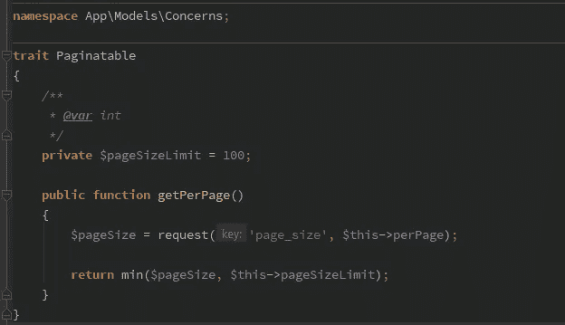

# 具有 Laravel 分页的动态(但有限)页面大小

> 原文：<https://medium.com/hackernoon/dynamic-but-limited-page-size-with-laravel-pagination-2826cab8b053>

## 让用户决定，但不要让用户滥用。

Laravel 使分页成为一个极其简单的过程，你只需在雄辩上调用`paginate()`就可以了。今天我收到了一个功能请求，我必须允许前端团队决定页面的大小。这也是一个简单的任务，你只需要给它一个参数`paginate($size);`。大概是这样的:

有时候这就是你所需要的，因为你的商业模式可以告诉你这个实体是否会无限增长。在这种情况下，我们按用户收费，一家公司不太可能购买 100 万用户。然而，我知道在接下来的几周内，我将会开发其他一些拥有数百万条记录的 API，这意味着我不能允许页面大小超过一个合理的数量。

太好了。现在我可以确保，如果有人将`page_size`设为 10 亿，我在互联网上公开的 API 不会降低我们的服务质量。但是感觉还是不太好，因为每次我写一个*可分页*端点时，我都要记住设置这个。

## 可分页特征

在幕后，Laravel 在雄辩模型上默认使用`getPerPage`，以防没有提供特定的页面大小。默认情况下，Laravel 每页附带`15`。有了一个*可分页的*特征，我们可以覆盖该方法并在模型上实现它，该模型应该允许*请求者*告诉我们他们想要每页多少项，同时验证他们是否请求太多。

只要在你的模型上使用这个特性，那么`Controller`就可以成为一个小的`paginate()`呼叫。这是一个非常简单和小的东西，但是如果你希望编写这种公共 API，它会非常强大和方便。