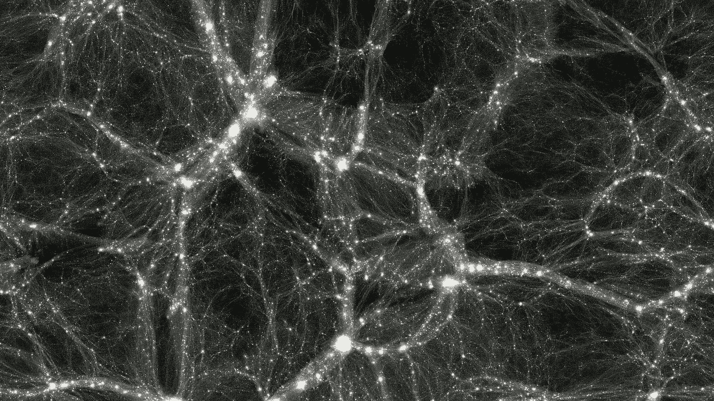
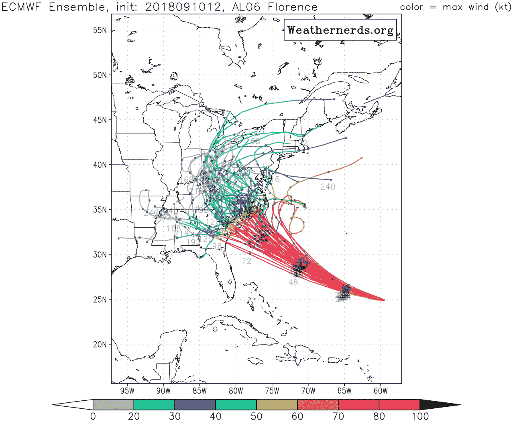
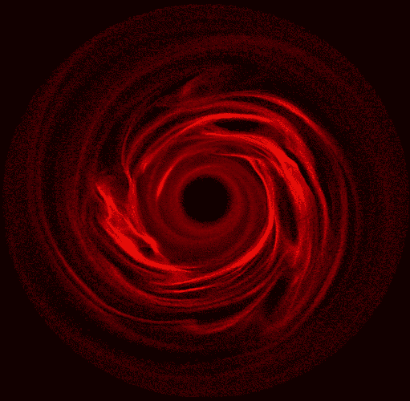
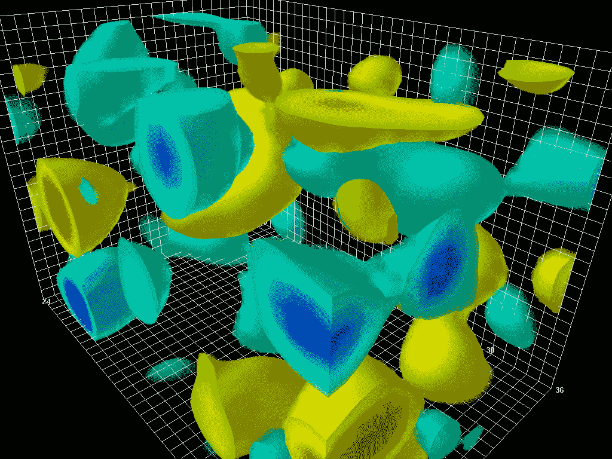
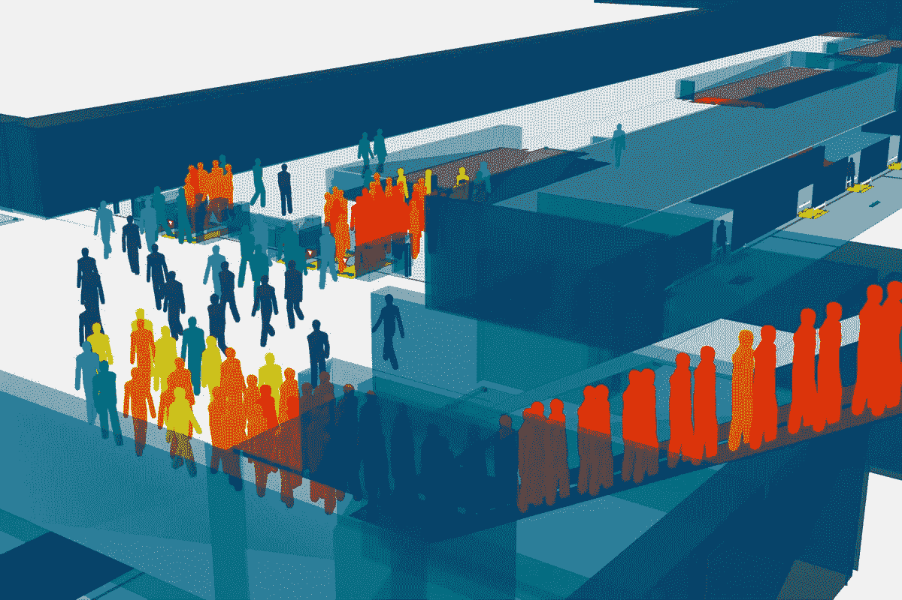

# 动态模型和仿真

> 原文：<https://medium.com/hackernoon/dynamic-models-and-simulation-d0d75c14ebb1>

## 对模拟技术和应用的概述，以及对一个你可能不熟悉的激动人心的理论的描述。

Galactic filaments take shape in a trillion-particle cosmological simulation. Credit: Dark Sky Simulations Collaboration

在[之前的文章](https://hackernoon.com/the-modeling-instinct-40a25a272c64)中，我们观察到模型是现实的某个方面的简化表示——*目标系统*——而动态模型是一个包含了控制目标系统如何随时间变化的法则的模型。那么，模拟就是运行动态模型的行为。

为了执行模拟，我们设置模型的初始状态，使其运动，并观察其进展。至关重要的是，通过提供一种方法让一个或多个人在模型运行时对其进行操作，从而改变其进程，可以使模拟成为*交互式的*。这样，人类参与者可以充当模型的组件。

和一般的模型一样，模拟可以根据目的分为三类——科学的、*实用的*或*经验的*。

**科学模拟**的目的是理解和解释自然过程，如分子的行为、星系的形成或经济衰退的起源。它提供了一种在不能直接操作的系统上进行虚拟实验的方法。

科学模拟通常模拟一般的系统，而不是特定的系统。例如，一个模拟的星系不需要代表一个实际观察到的星系来提供洞察，比如说，为什么一些星系发展出旋臂。

**实用模拟**的目的是辅助现实世界与目标系统的互动。有两大类:用于*预测*的模拟和用于*训练*的模拟。

当一个模拟为一个特定的现实世界系统建模时(相对于一个通用的系统)，它的进展相当于对现实世界系统本身将如何发展的*预测*。有些系统，比如太阳系，可以精确模拟未来几百万年的情况。其他因素，如天气，则更难预测，因为它们是混沌的，这意味着它们的发展方式严重依赖于它们的初始条件，而初始条件只能近似模拟。

既然模拟可以预测一个系统的演变，那么它也可以预测干预对该系统的影响。因此，模拟有助于干预措施的规划。例如，旨在减少大气中二氧化碳含量的干预措施可以在实际尝试之前进行模拟测试。

模拟也可以帮助设计工程系统，这也是一种预测。在这种情况下，我们使用模拟来预测，例如，建筑物是否会在地震中倒塌，电路是否会按预期运行，等等。这种模拟的独特之处在于，尽管目标系统是一个特定的系统，但它是一个尚不存在的系统。

交互式模拟提供了一种人工体验，因此对*培训*很有用。训练模拟提供了一种无风险的方法来获得复杂系统的经验，如车辆、战场和商业环境。

最后，**体验式模拟**的目的是为观众提供一种自身有价值的体验，而不考虑它在现实世界中的效用。虽然被动地观察模拟的展开可能很有趣，但大多数经验模拟是互动的——换句话说，它们是游戏。

经验模拟通常对通用系统建模，因为它们不需要做出预测，并且它们通常是程式化的，或者是非现实的，因为它们不需要帮助现实世界的活动(尽管没有什么阻止它们做这些事情)。他们的目标系统既有抽象的，如由纸牌游戏模拟的组合原理，也有具体的，如由许多计算机游戏模拟的物理环境。

## 计算机模似

物理模型是由木头或塑料等物理材料组成的，而**物理模拟**是让物理模型运动的行为。这可能需要打开风扇，打开阀门，或者吹一声口哨。相比之下，在**计算机模拟**中，模型是由符号——存储在内存中的数字——构建的，计算机程序从一个时间步到下一个时间步更新符号。

作为一个例子，考虑在给定火炮发射角、炮弹初速度和大气条件的情况下计算炮弹将行进多远的问题。虽然有精确描述抛射体在空气中运动的方程，但它们没有“解析解”。也就是说，没有一个公式可以仅仅通过插入发射角度和其他参数来给出我们行进的距离。相反，我们必须求助于“数值积分”——我们必须以小的时间步长沿着它的路径推进壳，在每一步更新它的位置和速度。当模拟的炮弹击中地面时，也就是说，当代表其高度的内存位置变为负值时，我们就有了答案。

第一台通用计算机 ENIAC(电子数字积分器和计算机)由美国陆军委托进行这种弹道模拟。这台机器于 1945 年完成——为时已晚，无法为战争做出贡献——但当时它的多功能性和非凡的速度吸引了洛斯阿拉莫斯的科学家们的注意，他们用它进行了一次模拟实验，以测试氢弹的可行性。(他们留下了深刻的印象，建造了自己的类似计算机——数学和数值积分器和计算机，或 MANIAC。)洛斯阿拉莫斯的科学家们感兴趣的不是炮弹的运动，而是中子的运动，ENIAC 的可编程性意味着它可以为此进行重新配置。

ENIAC was programmed by setting switches and plugging in cables. Credit: US Army Research Laboratory

就像它所启发的众多计算机一样，ENIAC 从根本上说是一台模拟机器。时至今日，计算机最显著的方面仍然是赋予动态模型生命的能力。现代模拟比 ENIAC 运行的模拟要详细得多，但核心思想是不变的:模拟真实世界的量和属性的值存储在内存中，并从一个时间步更新到下一个时间步。

## 计算机模拟技术

编写计算机模拟程序时，首先要考虑的是如何提前时间。时间究竟是*离散的*(意味着它以很小的增量前进)还是*连续的*(意味着它可以被无限分割成更小的片段)，这一点并不为人所知。不管怎样，大自然的时间步长小得令人难以置信。由此可见，程序员应该选择足够小的时间步长，以确保准确性(假设这是目标)，但又足够大，以确保可以在合理的(实际)时间内获得结果。

最简单的方法是确定一个*固定长度的时间步长*，它将应用于整个模拟过程。然而，实现*自适应时间步长*通常会更有效，在事物快速展开或力量强大的模拟区域，步长较短，但在相对较少发生的区域，步长较长。

**离散事件模拟**是一种将自适应时间步长的概念应用到其逻辑终点的技术。在这种方法中，我们计算下一个“事件”(无论我们如何定义它)将在何时发生，并直接将时钟提前到该事件。作为一个例子，考虑一个顾客在超市收银台排队的模拟。计算每个客户完成交易所需的时间，以及下一个客户排队到达之前的时间，比不断地等待这些事件发生要有效得多。此外，可以在存储器允许的情况下尽可能精确地指定事件时间；没有必要使它们适应任意的步长。

离散事件模拟在涉及重力等力的模拟中帮助较小，因为力在每个无穷小的时间点都能感觉到，就像一个连续的、正在进行的事件。在这种情况下，需要步进。相比之下，物体之间的碰撞确实可以称为离散事件。

很明显，在计算一个顾客在收银台要花多长时间以及下一个顾客排队要花多长时间时，存在很大程度的不确定性。由于没有办法预测这些时间跨度(除了模拟每个潜在客户的生活和思想)，它们必须随机产生。因此，我们的超市模拟将是非确定性的，或者说是随机的。

在**随机模拟**中，一定程度的随机性会影响模拟的进程。随机性有所帮助的一个原因是，没有模拟是绝对准确的，我们可以通过多次运行相同的模拟来管理这种不准确性。结果会有所不同(由于随机性)，这使我们能够确定一系列可能的结果。此外，我们可以通过计算发生的次数来估计给定结果的概率。当然，这种估计的质量取决于模拟的真实性及其随机过程。

A plot of the outcomes of multiple stochastic simulations to predict the path of Hurricane Florence. Credit: weathernerds.org

这种技术——多次运行随机模拟并计算结果——被称为**蒙特卡罗模拟**。它的使用是由征用 ENIAC 进行核研究的同一批科学家开创的；他们进行的模拟是第一次使用蒙特卡罗方法。

最近，一种叫做**蒙特卡罗树搜索**的技术已经被应用于回合制游戏，比如围棋和国际象棋。这个想法是从当前棋盘位置到游戏结束运行很多次模拟，记录模拟的赢和输，以估计最佳的棋步。

前面描述的弹道模拟描述了单个物体(炮弹)的行为，但是模拟可以包含计算资源允许的尽可能多的物体。一个 **N 体模拟**(或**基于粒子的模拟**)由许多位于空间的粒子以及控制粒子如何移动和相互作用的方程组成。

A particle-based simulation of the debris disk surrounding a star. Credit: NASA’s Goddard Space Flight Center

典型的例子是引力模拟，在每个时间步中，程序 1)计算每对粒子之间的引力；2)根据作用在其上的净力更新每个粒子的速度；以及 3)根据其速度更新每个粒子的位置。

这种算法可以通过一种称为*树码*的技术进行优化(加速)，这种技术可以识别粒子群，相对于其他遥远的粒子，这些粒子群可以被视为单个粒子。

基于粒子的模拟存储每个粒子的值(其位置、速度和其他属性)，而基于**场的模拟**通过将空间划分为单元网格并存储每个单元的值来工作。

A field-based simulation of quantum field fluctuations in a vacuum. Credit: Derek Leinweber

例如，在流体模拟中，单元包含表示流体密度、温度、压力等的值，流体动力学方程控制这些值如何从一个时间步长变化到下一个时间步长。

基于场的模拟可以通过一种称为*自适应网格细化*的技术进行优化，在这种技术中，细胞在特别活跃的区域被自动细分为更小的细胞。

虽然基于粒子和场的模拟对于模拟无生命物质和能量很有用，但基于**智能体的模拟**由许多在环境中活动的*自主智能体*组成。代理不是由全局方程控制，而是由它们自己的内部程序控制。他们观察当地环境，处理他们的观察，并决定下一步采取什么行动。

根据一组固定的 if/then 规则选择其行动的代理被描述为*反应型*，因为它们不能制定主动计划。采用更有能力的技术的代理，如神经网络，被描述为*认知*。具有可变内部状态的代理被认为拥有*记忆*(不管它有多小)，这些内部状态的变化构成了*学习*。如果一个代理与其他代理共享其内部状态，则称之为*通信*。

很明显，一个代理的内部程序可以用无数种方式实现。事实上，越来越多的人一致认为，人工智能领域是对智能代理的研究，该学科中采用的众多技术和算法同样可以很好地应用于模拟。

An agent-based simulation to analyze the flow of pedestrians through a proposed transit hub. Credit: Oasys Software

## 模拟和认知

模拟提供了一种预测未来的手段。这不仅本身是有用的(例如，当预测天气时)，而且也是进一步能力的基础——模拟可以用来指导自主代理的行动。

正如我们已经看到的，蒙特卡罗树搜索(MCTS)就是这样操作的。在 MCTS，许多模拟游戏从当前位置运行到结束，并记录模拟的赢和输，以确定最佳移动。这个过程可以被看作是一种基于代理的模拟，其中两个竞争的代理——对手代理和自己代理——充当实际玩家的模型。主要代理通过观察模拟玩家之间的比赛结果来“思考”。当使用神经网络来为玩家建模时，这种方法尤其有效。(这是游戏程序 AlphaZero 使用的方法，将在以后的文章中介绍。)

MCTS 可以应用于任何游戏，其中时间在离散的回合中前进，并且在每个回合中都有有限(最好是少量)的离散移动可用。但是，在连续、实时环境中运行的代理，如自动驾驶汽车、自着陆火箭和杂技机器人，情况又如何呢？

这是**控制理论**的领域，即研究机器的自动化控制。一个简单的例子是汽车的巡航控制，它感测汽车的速度，将其与所需的速度进行比较，并计算新的油门设置以减少差异。这个过程在一个永久的*反馈回路*中继续，只要巡航控制保持接合，就不断地重新计算油门设置。

特别是一种控制方法，**模型预测控制(MPC)** ，已经被证明对于由于其复杂的动力学而难以控制的代理是有效的。MPC 的工作原理是对智能体在其环境中的运动进行许多模拟，从当前时刻开始，持续一定数量的时间步到未来(所谓的*预测范围*)。在每次模拟中，假设不同的控制动作顺序；这些可能是方向盘位置的改变、致动器的操作等等。当一个模拟完成后，根据工程师设计的一些方案对控制序列进行评分。例如，如果模拟车辆偏离路线，或与某物碰撞，或翻倒，那么控制序列将得分很低。最后，一旦实际时间前进了相当于一个模拟时间步长的时间，就识别出得分最高的控制序列，并执行该序列中的第一个动作(后续动作被忽略，因为新的序列将在下一个时间步长中计算)。

显然，这种算法与 MCTS 非常相似。事实上，如果一个 MPC 模型包含了随机元素——也许是以随机阵风的形式，或者是其他主体的行为——那么它就是有效的蒙特卡罗模拟。对于 MPC 和 MCTS 来说，指导原则是相同的——代理*模拟自己*执行它正在考虑的动作。模拟可能包含也可能不包含其他代理(如 MCTS 的对手代理)，它可能是连续的(MPC)或离散的(MCTS)。

在认知神经科学领域，有令人信服的证据表明大脑遵循同样的原则。**认知模拟理论**提出，大脑中控制肌肉和处理感官数据的区域不仅用于现实世界的行动和感知，也用于想象。

这个想法是这样的:一个想象的动作在运动皮层中以与普通动作相同的方式编排，除了对肌肉的最终输出被抑制。这个想象的动作，连同相关的记忆，唤起了代表该动作可能如何展开的感觉数据。这些数据由感觉皮层像真实的感觉数据一样处理——也许会导致下一个想象的动作。据认为，这一过程不仅适用于简单的运动活动，也适用于一般的思维——想象场景、考虑假设、形成长期计划等等。有理由怀疑这也适用于做梦。

这种通过模拟来认知的想法的一个吸引人的方面是，它提供了一种可能产生意识的貌似合理的方法。模拟提供了构成有意识主体的“内心世界”的人工体验，同时也揭示了主体通过其行动可能带来的潜在未来，这可能表现为自由意志的印象。

意识的出现可能还需要第三个因素:模拟所基于的动态模型的不断完善和改进。一句话，学习。在生物大脑中，模型采取记忆的形式，例如指导简单行动的肌肉记忆或指导更多深思熟虑活动的显性记忆。当生物制剂与其环境相互作用时，新的记忆不断积累，并以某种方式与现有的记忆整合，从而进入控制回路。这究竟是如何运作的还不太清楚，但有一点是肯定的:每当一个行动以一种出乎意料的方式展开，就有一些东西需要学习。

与生物记忆不同，MCTS 和 MPC 中使用的模型通常是由工程师预先设计好的，因此是固定的。但是，通过结合机器学习，在使这些技术更具适应性——通常更有能力——方面取得了进展。如前所述，AlphaZero 使用神经网络对模拟的玩家代理进行建模(即选择他们的模拟移动)。这个网络是通过自我游戏来训练的——它仅仅通过在游戏环境中的直接体验来学习。另一个例子来自控制工程领域，机器人正在被制造，它们可以通过与环境互动和实验来改善模型，从而提高灵活性，就像儿童玩耍一样。

在这两个例子中，代理都是通过**强化学习**来训练的，这是一种机器学习，对生物大脑中的学习有着惊人的推论。这个简单而强大的学习过程将是以后文章的主题。

**:模拟是将动态模型在时间上向前步进的行为。模拟可以用来研究不可接近的系统，提供人工交互体验，以及预测未来。自主代理可以通过模拟自己执行它正在考虑的动作来预测其动作的结果，从而决定如何最好地行动。有强有力的证据表明生物大脑是以这种方式工作的，而且有迹象表明，这种交互模拟自己进入未来的过程可能有助于意识的出现。**

**

*感谢你的阅读！请看看我在 Steam 上的游戏[Thetaball](https://store.steampowered.com/app/770660/Thetaball)——这是我为在基于物理的环境中进化智能代理而开发的实验游戏引擎的第一个应用。*