# 蛮力者的动态编程

> 原文：<https://medium.com/hackernoon/dynamic-programming-for-brute-forcers-36f26c2466cf>

互联网上有大量关于这个话题的资料，但是我们(我和我的朋友)在很长一段时间内都无法理解，直到我们修改代码，跟踪输入的每一个变化。所以这篇文章正是为我们这样的人而写的，让从贪婪的 T2 到动态的 T4 编程变得更容易。这只是对动态编程的一个介绍，因此人们可以从这里开始学习。我添加了额外的练习资源和其他在线教程，我发现它们在最后有点帮助。它是为那些习惯于暴力的程序员准备的，可能不适合绝对的初学者。

# 定义

那么什么是动态编程呢？我们先来看一个更正式的定义。

动态规划(也称为动态优化)是一种解决复杂问题的方法，它将复杂问题分解为一系列更简单的子问题，每个子问题只解决一次，然后存储它们的解决方案。下一次出现相同的子问题时，不用重新计算它的解，只需查找先前计算的解，从而节省计算时间，代价是(希望)适度地消耗存储空间。(每个子问题解决方案都以某种方式被索引，通常基于其输入参数的值，以便于查找) [(Source-Wiki)](https://en.wikipedia.org/wiki/Dynamic_programming) 。

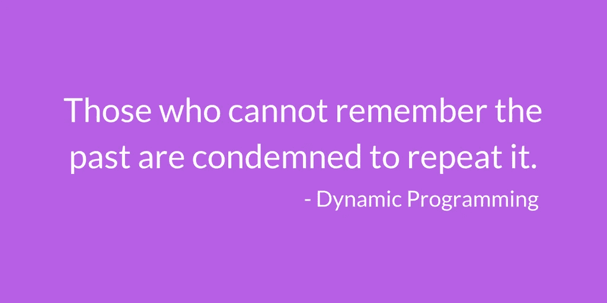

It’s that simple

或者更简单地说，它是一种以任何合适的格式保存计算中的中间结果的技术，以便该结果可以用于进一步的计算，而不是在附加输入到达时重新计算它。听起来够简单吧？是的，的确是这样，让我们来看一个例子来说明这一点。

在此之前，我们需要确定一个问题是否具有以下性质，以便通过动态规划(DP)来解决

1.  [重叠子问题](http://www.geeksforgeeks.org/dynamic-programming-set-1/)
2.  [最佳结构](http://www.geeksforgeeks.org/dynamic-programming-set-2-optimal-substructure-property/)

# 问题

1.  最小成本问题
2.  最长增长子序列

# 最小成本问题

给定一个成本矩阵 cost[][]和 cost[][]中的一个位置(m，n)，写一个函数，返回从(0，0)到达(m，n)的最小成本路径的成本。矩阵的每个单元代表穿过该单元的成本。到达(m，n)的路径的总成本是该路径上所有成本的总和(包括源和目的地)。您只能从给定的单元格向下、向右和斜下方遍历单元格，即从给定的单元格(I，j)开始，可以遍历单元格(i+1，j)、(I，j+1)和(i+1，j+1)。你可以假设所有的成本都是正整数。

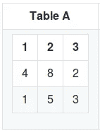

**解决方案:**

**我:**那你会如何继续解决这个问题呢？
**朋友:**哦，我看的《性质》讲的是把子问题保存起来，让计算更容易！
**我:**这里有哪些子问题？
**朋友:**哎呀，太彪悍了。
**我:**不，不是我们一起工作。

你通常如何解决它，暂时忘记代码。
你可能会查看所有的单元格，沿着路径添加成本，直到到达目的地。但是你不知道它是否是最小值，所以你通过遍历不同的方向重新开始加法。然后，也许在考虑了所有的途径之后，你会得出一个最低的成本。

差不多就是这样。

我的朋友打断，
**朋友:**但是上面的方法只解决了一个特定目的地的问题，如果我们要计算到达不同目的地的总成本呢？
**我:**说得好！
**朋友:**这就是为什么我们存储从第一个单元格到达数组中每个单元格的最小代价。这样，当我们填满所有单元格时，我们将得到每个单元格的溶液。
**朋友:**我在那里把你弄丢了。
**我:**哈哈，让我说完。

目前我们知道些什么？

*   这是一个数组，我们可以向右，向下，再向下移动。
*   我们需要打印穿越到给定目的地的最小成本。
*   我们从第一个细胞开始。

**分解问题:**

**我:**从[0，0]转移到[0，1]的简单成本是多少？
**朋友:**是`2 + 1 = 3`
**我:**从[0，0]移动到[0，1]的最小成本是多少？
**朋友:**还是 3，因为我们只能向右、向下或斜下方移动，所以没有其他方法可以到达[0，1]。我们只能**从【0，0】到达【0，1】。
**我:**优秀！那么从[0，1]到[0，2]的最小成本是多少呢？
**朋友:**哦等等，从 **[0，0]移动到【0，1】**的代价是 **3** ，因此**【0，1】到【0，2】**将是`3 + cost of getting to (0,1)`，也就是`3 + 3 = 6`。
**Me:** 现在我们要不要把这个获得的对应于每个单元格的代价存储在一个不同的数组里，这样当单元格是目的地的时候，我们就可以把它们返回来？
**朋友:**够公平。**

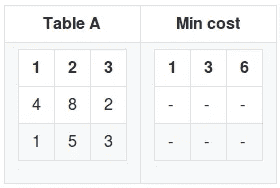

为什么不把它也编码起来？

```
minarr[0][0] = a[0][0];for(i=1;i<n;i++)
  minarr[0][i] = minarr[0][i-1] + a[0][i];
```

其中 n 是行数

我们将第一个元素原样转移到 min cost 表中，并计算该行中其他元素的成本。

朋友:为什么不是专栏？第一列中的单元格也只有一种到达它们的方式，即从第一个单元格向下。我:是的，那是我们的下一步。

类似地，我们通过将该列中的单元格与之前的单元格相加来计算到达每一列的成本。

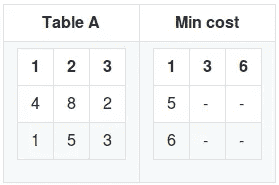

我们也会把它编码的！

```
for(i=1;i<m;i++)
  minarr[i][0] = minarr[i-1][0] + a[i][0];
```

其中 m 是列数

**朋友:**现在，我们如何计算到达 cell [1，1]的最小代价？
**Me:** 我们知道我们只能遍历左侧、下方或斜下方的单元格。因此，我们只能从单元格[0，0]或[0，1]或[1，0]到达单元格[1，1]。现在我们的表已经有了达到[0，0]，[0，1]和[1，0]的最小值，只需将这三个值的最小值加上达到单元格[1，1]的成本就可以得到我们的结果。

所以`cost to reach cell [1,1] = a[1,1] + min(minarr[0,0], minarr[0,1], minarr[1,0])`

`minarr[1,1] = 8 + min(1,3,5)`
如此，`minarr[1,1] = 9`

类似地，我们从 1，1 开始对所有单元格进行操作。

让我们重新编码，

```
for(i=1;i<n;i++)
  for(j=1;j<m;j++)
    minarr[i][j] = (a[i][j] + min(minarr[i-1][j-1],minarr[i][j-1],minarr[i-1][j]));
```

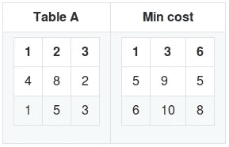

现在我们的表已经填满了，我们只需返回最小成本数组中给定目的地的单元格。完整的代码是[这里给出的](https://github.com/nobodyme/Dynamic-Programming/blob/master/minimum-cost-path.C)。这里有一个[类似的问题](http://practice.geeksforgeeks.org/problems/largest-zigzag-sequence/0)，自己试试[库中又增加了一个类似的问题](https://github.com/nobodyme/dynamic-programming/blob/master/Count-all-paths.C)。

因此，通过一个接一个地考虑元素，我们已经建立了我们的解决方案，或者用 DP 术语，我们已经以自下而上的方式(列表法)从子问题中获得了我们的解决方案。还有一种方法叫做记忆化。两者之间的区别在这里的[文章](http://www.geeksforgeeks.org/tabulation-vs-memoizatation/)中有解释。

# 最长增长子序列

最长递增子序列(LIS)问题是寻找给定序列的最长子序列的长度，使得该子序列的所有元素按递增顺序排序。例如，{10，12，32，2，22，23，25，30}的 LIS 长度是 6，LIS 是{10，12，22，23，25，30}

**解决方案:**

如何继续解决这个问题？为了使计算更容易，你会存储什么？简单地说，你如何使用**强力**解决上述问题，就像你如何执行[选择排序](https://en.wikipedia.org/wiki/Selection_sort)！

10 12 32 2 22 23 25 30 k，国际法院

**朋友:**我会将每个元素与其他每个元素进行比较，如果它大于当前元素，我会增加 count 变量并打印最大的计数，我得到。大致来说，我会把它编码成这样

***伪代码*** (我朋友的代码不懂也没关系)

```
for(i=0;i<n-1;i++)
{   
  count = 1;
  for(j=i+1,k=i;j<n,k<n-1;j++)
  {
    if(a[j] > a[k])
    {
      k=j;
  count++;
    }
    if(count>maxi)
      maxi = count;
  }
}
printf("\nMax-length = %d\n",maxi);
```

我:我们跑吧。
**朋友:**呃？好吧。
**我:**那么输出是多少？
**朋友:**程序返回，`max-length = 5`，我猜是{2，22，23，24，25}。但是我们知道是 6，LIS 是{10，12，22，23，25，30}。
为什么无法捕捉到上面的 lis？

**我:**因为在遍历{10，12，32，22，23，25，30}时，代码将如下运行，它将检查，
如果(10 > 12) yes → count 是 2，那么
如果(32 > 12) yes → count 是 3，那么
在这一点上 **count = 3** ，从那里开始 count 不会增加，因为下面的元素小于 32，因此条件像(1)

**朋友:**如果它知道通过**避开 32** 并遍历数组的其余部分，我们将实际获得结果`max-length = 6`就好了。
**Me:** 这正是我们使用 DP 为计算存储的信息。在蛮力术语中，我们在数组中存储所有可能的遍历选择的 count 变量，然后简单地找到它的最大值(注意:不是说蛮力不能解决问题，一种不同的方法可能但肯定是在指数时间内)。

**注意:**我的朋友最初设置了`count=1`而不是 0，因为当我们遇到数组中所有数字都相同的情况，即{2，2，2，2}时，我们必须返回 count 为 **1** ，因为一个元素仍然是更大元素的子数组，而更大的元素只是{ 2 },因此返回 0 是错误的。

**动力定位解决方案:**

我:那么你如何在 dp 中编写同样的代码呢，实际上这更简单。
**朋友:**既然你说我们存储所有变量的计数，那我们初始化一个对应计数大小相同的数组？我:确切地说，我们首先创建另一个数组来存储我们讨论过的数组中每个成员的计数，并将它们全部初始化为 **1** 。

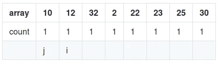

朋友:现在我们用类似的方法检查？我:是的，但是现在，让我们只考虑数组中存在的元素 **10** 。
**朋友:**为什么？
**我:**说简单点？！还能为什么？一起听。那么最长的增长序列是什么呢？
**朋友:** 1 当然和 LIS 是{10}。我:所以现在，比方说，我们加上 12，并把它的初始计数设为 1

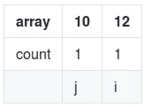

朋友:我们检查 **if(12 > 10)** 所以 12 的计数增加了？
**Me:** 是的，既然 12 > 10，12 的计数就变成了`count of 10 + 1`，因为计数 10 已经代表了用现有元素可以得到的最长的递增子序列。12 的计数现在表示{10} + {12} = {10，12}或者简单地表示为 2 的`count[i] = count[j]+1;`

**朋友:**让我澄清一下，当 10 是单独的时，列表是 1，现在添加了 12，我们发现{10，12}可以从 12 开始列出> 10，所以我们将 10 的计数添加到 12 的计数中，并加 1 以包括该数字本身。
**Me:** 没错而且数组变成了，

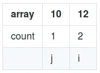

现在让我们考虑 32，将`i to 32 and j to 10`即 j 递增到数组的起始元素，并从头开始遍历，以查看**加上 32** 提供了更长的子序列。
阵列变成，

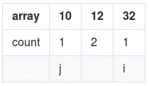

朋友:是的，它确实证明更长。由于 **(32 > 10)** 因此我们递增 32 的计数→count[I]= count[j]+1；

**我:**我们检查 32 之前的所有数字，看能不能和它相加形成一个序列，所以递增 j，继续填方框！

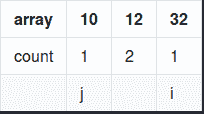

gif showing the 32’s count increment and increment on j

**朋友**:好的我会，所以 **if(32 > 12)** → 32 的计数= 12 的计数+ 1 = (2+1) = 3

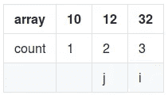

类似地，**考虑元素 2** 数组变成，

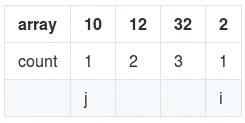

由于每次检查 **if(2 > 10)** 、 **if(2 > 12)** 或 **if(2 > 32)** 失败，数组保持不变，其计数变量保持不变。

现在，我添加下一个数字， **22** 并检查 10、12、32，与上一个类似，对于 10 和 12，计数 22 增加到 3，对于 32，它失败并保持为 3，j 增加到点 2。

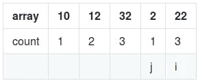

现在**如果(22>2)**→22 的计数变成`count[j]+1`即 2？
**我:**哈哈，很高兴你停下来问，总之**没有**，我们知道 count 反映的是最长的子序列。通过遍历数组中的其他元素，我们获得了 22 的最长子序列 3。那么为什么要降低到 2 呢？因此，在添加`count[i] = count[j]+1`时，要确保它有益于事业。因此，将`count[i] = max(count[j]+1,count[i])` ie 放置在两个数字中的最大值，以避免这种情况。

类似地，数组的其余部分被遍历，

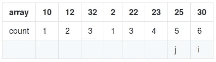

因为最大值是 6，这给出了最长的递增子序列，所以上面遍历的视频在这里是[链接的(不同的例子)](https://youtu.be/Ns4LCeeOFS4)。下面我们来看看相同的代码片段。正如我们所知，

*   我们将计数数组初始化为 1
*   然后计算每个元素的数量

```
for(i=0;i<n;i++)
count[i] = 1;for(i=1;i<n;i++)
{
 for(j=0;j<i;j++)
 {
 if(array[i] > array[j])
  count[i] = max(count[i],count[j]+1);
 }
}
```

然后我们找到计数数组的最大值并打印出来，[完整的代码片段在这里](https://github.com/nobodyme/Dynamic-Programming/blob/master/longest-increasing-sub-sequence.C)和一个看起来相似的问题，只是有一对[数字](https://github.com/nobodyme/dynamic-programming/blob/master/lis-pair.C)。

# 要记住的要点

*   动态编程就像任何其他类型的编程一样，你得到一些，你没有得到一些实践会使一切变得更好。我也有很多事要做。
*   根据我的经验，这类似于暴力，但不是探索整个输入空间，而是找到一种方法来存储输入产生的中间结果，并彻底探索所需的结果。
*   没错，的确是一种用空间换时间的方法。递归方法可能会占用较少的空间，但动态编程方法更快。

# 其他资源

*   [Hackerearth 文章解释了更多关于“为什么动态编程”的内容](https://www.hackerearth.com/practice/notes/dynamic-programming-i-1/)
*   [如何使用 Quora 上的 Paul Baltescu 的动态编程](https://www.quora.com/What-are-some-good-ways-to-approach-a-dynamic-programming-question/answer/Paul-Baltescu)
*   [极客帮极客教程](http://www.geeksforgeeks.org/fundamentals-of-algorithms/#DynamicProgramming)
*   [关于网格问题的黑客文章](https://www.hackerearth.com/practice/notes/dynamic-programming-problems-involving-grids/)

# 来自不同网站的问题列表

*   [练习题——极客给极客](http://practice.geeksforgeeks.org/topics/Dynamic-Programming/)
*   [问题列表—顶部编码器](https://apps.topcoder.com/forums/?module=Thread&start=0&threadID=674592)
*   [问题集——代码强制](http://codeforces.com/problemset/tags/dp?order=BY_SOLVED_DESC)
*   [Dp 挑战赛— Hackerrank](https://www.hackerrank.com/domains/algorithms/dynamic-programming)

你可以在我的 [github 链接这里](https://github.com/nobodyme/dynamic-programming)找到更多。希望对你有所帮助。把你的问题写在下面。如果有可以改进的地方，也许可以给我一个拉动请求。
欢迎[在推特上关注我](https://twitter.com/_nobodyme_)！
如果你觉得有用，也许[可以帮我买一台笔记本电脑](https://www.patreon.com/nobodyme)，干杯！

[](https://www.patreon.com/nobodyme)