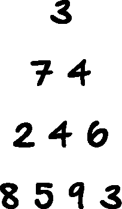
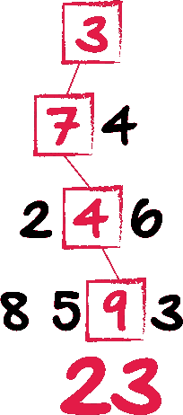
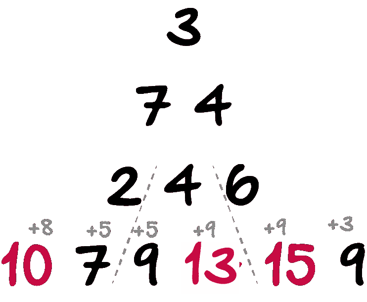
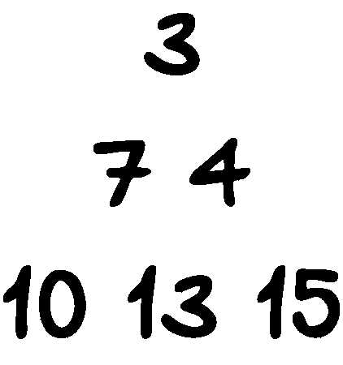
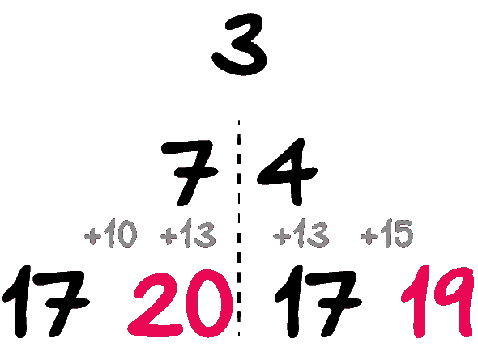
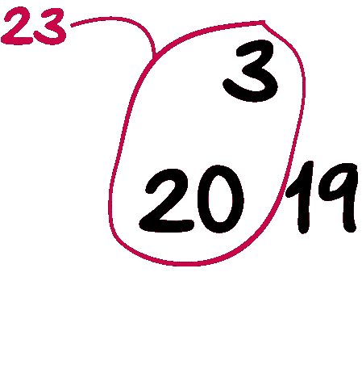
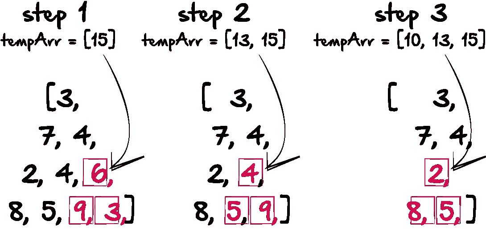
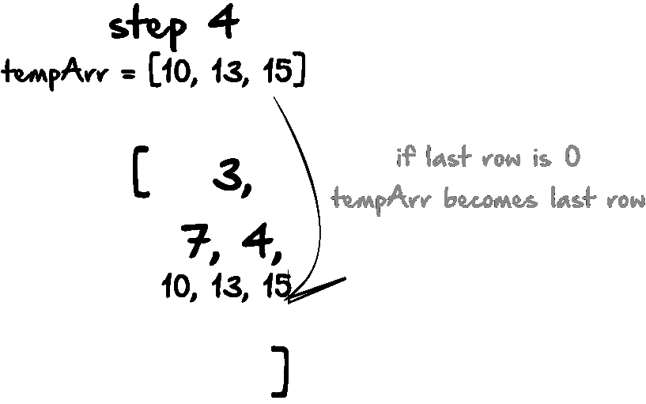

# 动态编程(Python)

> 原文：<https://medium.com/hackernoon/dynamic-programming-python-80f944aa6e6c>

我最近遇到了一个困难的编程挑战，它涉及在一个矩阵中获得最大或最小的和。这种类型的问题有几种变体，但是每一种都面临相似的挑战。以下面的三角形为例:



其中一些问题涉及网格，而不是三角形，但概念是相似的。在上面的例子中，从顶部(3)到底部，最大的路径和是什么？这个问题之所以如此具有挑战性，是因为对于较大的矩阵或三角形，暴力方法是不可能的。至少对我来说，本能是从最高层开始，然后一步步往下。基本上，你可以通过从上到下选择最佳路径来解决它，就像这样:



然而，这种方法不仅需要在每个交叉点选择最大的数字，还需要将这个选择与低于你当前位置的选择进行比较。例如，如果当前最大的选择是 7，但是沿着这条路径走到底部会消除相邻路径中更大的数字，那么我需要比较两条路径，看哪条路径的值更大。对于像这样的小三角形，这当然是可能的，但是对于大得多的三角形，就不那么容易了。例如，让我们设想三角形有 100 行，而不是 4 行。不可能尝试每一种途径来解决这个问题，因为将会有整个 2⁹⁹！如果你每秒能检查一万亿(10)条路线，那要花 200 多亿年才能全部检查完。所以我要做的是用一种对任何大小的三角形都适用的方法来解决三角形问题。即使有一个好的算法，硬编码一个 100 行的函数也是非常耗时的。但是我们不要想太多。

# 动态编程:

这种解决类似问题的方法的基本概念是从底层开始，一步步向上。

## 第一步:

我们将从最下面一行开始，将每个数字添加到上面一行，如下所示:



## 第二步:

现在，我们将用上一步中最大的总和替换倒数第二行，如下所示:



## 第三步:

现在，我们重复步骤 1，将底部的行添加到它上面的行。



## 第四步:

我们将重复步骤 2，用最后一行中最大的和替换第二行。



## 第五步:

现在我们只剩下三个数字，我们简单地从第 1 行和第 2 行中取最大的和，在这种情况下，我们得到 23。

现在，正如我前面提到的，我想写一个函数来解决这个问题，不管三角形的大小。以下是我如何做到这一点的思考过程:

如果我的三角形是一个数字数组，我只想处理最后一个数字，倒数第二个数字，然后是它上面一行的数字。我将算出该组的最大和，然后删除每一行末尾的最后两个数字。但是最大的和，我会放入一个临时数组，并从当前数组中删除。现在，我可以对一组新的三个数字重复相同的步骤，因为前面的数字已经被删除，现在结束的数组数字是新的。如果在任何时候，我的最后一行的长度为 0，我将用最后一行替换我创建的临时数组。这样，无论三角形的大小如何，函数都将一直循环。从视觉上看，这可能是这样的:



此时，在我得到 2 和 8 的和，以及 2 和 5 的和之后，我不再需要这个组了。我的最后一行的长度为零，所以第 4 步是用最后一行替换 tempArr:



我的想法是，开始时，我通常会有一个数组，但为了使它更简单，我希望每行在一个更大的数组容器中是它自己的数组。为了做到这一点，我首先创建了一个函数，它接受给定的任何三角形大小，并将其分解成单独的数组。在这种情况下，我知道我需要四行。因此，对于更大的数组，如果给我一个更大的三角形，我可以改变所需的行:

```
arr = [3, 7, 4, 2, 4, 6, 8, 5, 9, 3]
arr2 = []
start = 0
endVar = 1
end = 1
while len(arr2) is not 4:
    arr2.append(arr[start:end])
    start = end
    endVar = endVar + 1
    end = end + endVar
```

基本上，只要我的数组没有 4 行(子数组)，它就会继续执行 while 循环。它从零开始，以 1 结束，然后我把这个组放入数组。然后，新的开始组成为最后一个组的结尾。为了确定第二组的结尾，我有一个 endVar，每次循环都递增。每组的结尾都是 end 变量加上 endVar 变量。

执行后，我应该得到如下所示的结构:

```
[[3], [7, 4], [2, 4, 6], [8, 5, 9, 3]]
```

现在，我将循环这些并做一些魔术。首先:

```
tempArr = []
while len(arr2) is not 1:
      # --- Do stuff -----
```

打破 while 循环的条件是数组长度不为 1。如果它是 1，那么很明显，我已经找到了我的答案，循环将停止，因为这个数应该是最大和路径。tempArr 将存储每行的最大和。

首先要做的就是找出两个结束数组元素和中哪一个最大。我会这样做:

```
tempArr = []
while len(arr2) is not 1:
     if arr2[-2][-1] + arr2[-1][-1] > arr2[-2][-1] + arr2[-1][-2]:
        arr2[-2][-1] = arr2[-2][-1] + arr2[-1][-1]
    else:
        arr2[-2][-1] = arr2[-2][-1] + arr2[-1][-2]
```

此时，我已经设置了倒数第二行的数组元素的值。现在，我可以从每个数组的末尾删除这两个元素，并将总和放入 tempArr。

```
tempArr = []
while len(arr2) is not 1:
     if arr2[-2][-1] + arr2[-1][-1] > arr2[-2][-1] + arr2[-1][-2]:
        arr2[-2][-1] = arr2[-2][-1] + arr2[-1][-1]
    else:
        arr2[-2][-1] = arr2[-2][-1] + arr2[-1][-2]
    tempArr.insert(0, arr2[-2][-1])
    del arr2[-1][-1]
    del arr2[-2][-1]
```

现在，我们将在这里结束一个问题，最后倒数第二行将是一个空数组，并将破坏我们的函数。我们只是删除数组中的值，而不是数组本身。所以，我想添加一个条件，如果数组的长度达到零，这个条件将删除整个数组。

```
tempArr = []
while len(arr2) is not 1:
     if arr2[-2][-1] + arr2[-1][-1] > arr2[-2][-1] + arr2[-1][-2]:
        arr2[-2][-1] = arr2[-2][-1] + arr2[-1][-1]
    else:
        arr2[-2][-1] = arr2[-2][-1] + arr2[-1][-2]
    tempArr.insert(0, arr2[-2][-1])
    del arr2[-1][-1]
    del arr2[-2][-1]
    if len(arr2[-2]) == 0:
        arr2[-1] = tempArr
        del arr2[-2]
```

这个很好用。但是由于我缺乏数学技能，我遇到了一个问题。一旦数组长度变为 2，它就停止工作。我可以再花 30 分钟来处理它。但是我很懒。所以我在开头添加了一个 if 语句来捕捉错误。如果容器数组的长度是 2，它只取底部数组的最大值，并把它加到顶部数组。我把它保存为一个新变量，名为“total”。这应该是我的最大和路径。

```
total = 0
tempArr = []print arr2
while len(arr2) is not 1:
    if len(arr2) == 2:
        print max(arr2[-1])
        print arr2[0][0]
        total = max(arr2[-1]) + arr2[0][0]
    if arr2[-2][-1] + arr2[-1][-1] > arr2[-2][-1] + arr2[-1][-2]:
        arr2[-2][-1] = arr2[-2][-1] + arr2[-1][-1]
    else:
        arr2[-2][-1] = arr2[-2][-1] + arr2[-1][-2]
    tempArr.insert(0, arr2[-2][-1])
    del arr2[-1][-1]
    del arr2[-2][-1]
    if len(arr2[-2]) == 0:
        arr2[-1] = tempArr
        del arr2[-2]
    print arr2
    print tempArr
print total
```

下面是 python 如何执行 while 循环，以及在循环的每次迭代中每个数组中包含的内容:

```
arr2 (starting): [[3], [7, 4], [2, 4, 6], [8, 5, 9, 3]]
arr2 (after first pass): [[3], [7, 4], [2, 4], [8, 5, 9]]
tempArr: [15]
arr2 (after second pass): [[3], [7, 4], [2], [8, 5]]
tempArr: [13, 15]
arr2 (after third pass): [[3], [7, 4], [10, 13, 15]]
tempArr: [10, 13, 15]
arr2 (after fourth pass): [[3], [7], [19, 10, 13]]
tempArr: [19, 10, 13]
arr2 (after fifth pass): [[3], [20, 19, 10]]
tempArr: [20, 19, 10]
max value : 20
remaining array value: 3
total: 23
```

无论如何，我希望这有所帮助。如果你有任何反馈，请告诉我。谢谢！